# Risk and boundary cluster index

Cross-kind risk map for critical nodes and approval gates. This index is a navigation aid, not a replacement for the individual node files or source documents.

```mermaid
flowchart TD
  ROOT["Risk and boundary cluster index"]
  ROOT --> E_SCOUTFLOW["E-SCOUTFLOW<br/>ScoutFlow / 采集线"]
  E_SCOUTFLOW -.-> E_BRIDGE_THIN_API["E-BRIDGE-THIN-API"]
  E_SCOUTFLOW -.-> E_H5_CAPTURE_STATION["E-H5-CAPTURE-STATION"]
  ROOT --> E_RAW_VAULT["E-RAW-VAULT<br/>RAW vault / 长期知识 SoR"]
  E_RAW_VAULT -.-> E_DILOFLOW["E-DILOFLOW"]
  E_RAW_VAULT -.-> E_SCOUTFLOW["E-SCOUTFLOW"]
  ROOT --> E_USER_PROSUMER["E-USER-PROSUMER<br/>用户：single-user prosumer / 最大马力 owner"]
  E_USER_PROSUMER -.-> E_AI_AGENTS["E-AI-AGENTS"]
  E_USER_PROSUMER -.-> E_CONTENTFLOW["E-CONTENTFLOW"]
  ROOT --> E_TOPIC_CARD["E-TOPIC-CARD<br/>TopicCard / topic-card-lite"]
  E_TOPIC_CARD -.-> E_CAPTURE_PLAN["E-CAPTURE-PLAN"]
  E_TOPIC_CARD -.-> E_H5_CAPTURE_STATION["E-H5-CAPTURE-STATION"]
  ROOT --> E_BRIDGE_THIN_API["E-BRIDGE-THIN-API<br/>Bridge / Thin API boundary"]
  E_BRIDGE_THIN_API -.-> E_H5_CAPTURE_STATION["E-H5-CAPTURE-STATION"]
  E_BRIDGE_THIN_API -.-> E_SCOUTFLOW["E-SCOUTFLOW"]
  ROOT --> E_VAULTWRITER["E-VAULTWRITER<br/>VaultWriter / vault preview-write sp"]
  E_VAULTWRITER -.-> E_BRIDGE_THIN_API["E-BRIDGE-THIN-API"]
  E_VAULTWRITER -.-> E_RECEIPT_LEDGER["E-RECEIPT-LEDGER"]
  ROOT --> E_RECEIPT_LEDGER["E-RECEIPT-LEDGER<br/>Receipt ledger / artifact_assets"]
  E_RECEIPT_LEDGER -.-> E_SCOUTFLOW["E-SCOUTFLOW"]
  E_RECEIPT_LEDGER -.-> E_TRUST_TRACE["E-TRUST-TRACE"]
  ROOT --> T_AUTHORITY_FIRST["T-AUTHORITY-FIRST<br/>Authority-first 四层与 SoR discipline"]
  T_AUTHORITY_FIRST -.-> E_AI_AGENTS["E-AI-AGENTS"]
  T_AUTHORITY_FIRST -.-> E_BRIDGE_THIN_API["E-BRIDGE-THIN-API"]
  ROOT --> T_CANDIDATE_NOT_AUTHORITY["T-CANDIDATE-NOT-AUTHORITY<br/>candidate/not-authority discipline"]
  T_CANDIDATE_NOT_AUTHORITY -.-> E_BRIDGE_THIN_API["E-BRIDGE-THIN-API"]
  T_CANDIDATE_NOT_AUTHORITY -.-> E_RAW_VAULT["E-RAW-VAULT"]
  ROOT --> T_EXECUTION_GATES["T-EXECUTION-GATES<br/>runtime / migration / frontend / vis"]
  T_EXECUTION_GATES -.-> L_MIGRATION_DRIFT["L-MIGRATION-DRIFT"]
  T_EXECUTION_GATES -.-> L_RUNTIME_APPROVAL_DRIFT["L-RUNTIME-APPROVAL-DRIFT"]
  ROOT --> T_PRODUCT_PROOF_NOT_BREADTH["T-PRODUCT-PROOF-NOT-BREADTH<br/>post176 主线：proof not breadth"]
  T_PRODUCT_PROOF_NOT_BREADTH -.-> L_PRODUCT_CLOSURE_MISTAKE["L-PRODUCT-CLOSURE-MISTAKE"]
  T_PRODUCT_PROOF_NOT_BREADTH -.-> P_PROOF_PAIR_CANARY["P-PROOF-PAIR-CANARY"]
  ROOT --> T_SCOUTFLOW_RAW_BOUNDARY["T-SCOUTFLOW-RAW-BOUNDARY<br/>ScoutFlow ↔ RAW SoR boundary"]
  T_SCOUTFLOW_RAW_BOUNDARY -.-> E_RAW_VAULT["E-RAW-VAULT"]
  T_SCOUTFLOW_RAW_BOUNDARY -.-> E_TOPIC_CARD["E-TOPIC-CARD"]
  ROOT --> T_PARALLEL_LANES["T-PARALLEL-LANES<br/>3 product lanes + 1 authority writer"]
  T_PARALLEL_LANES -.-> E_AI_AGENTS["E-AI-AGENTS"]
  T_PARALLEL_LANES -.-> F_SAFE_PARALLEL["F-SAFE-PARALLEL"]
  ROOT --> T_PREVIEW_ONLY_VAULT["T-PREVIEW-ONLY-VAULT<br/>preview-only / write_enabled=False b"]
  T_PREVIEW_ONLY_VAULT -.-> L_VAULT_PREVIEW_AS_TRUE_WRITE["L-VAULT-PREVIEW-AS-TRUE-WRITE"]
  T_PREVIEW_ONLY_VAULT -.-> T_CANDIDATE_NOT_AUTHORITY["T-CANDIDATE-NOT-AUTHORITY"]
  ROOT --> T_THIN_API_BOUNDARY["T-THIN-API-BOUNDARY<br/>Thin API is the only write channel"]
  T_THIN_API_BOUNDARY -.-> E_BRIDGE_THIN_API["E-BRIDGE-THIN-API"]
  T_THIN_API_BOUNDARY -.-> E_VAULTWRITER["E-VAULTWRITER"]
  ROOT --> T_SECOND_KM_RISK["T-SECOND-KM-RISK<br/>第二知识库风险 / mirror drift"]
  T_SECOND_KM_RISK -.-> E_DILOFLOW["E-DILOFLOW"]
  T_SECOND_KM_RISK -.-> F_NOT_HEAVY_KM["F-NOT-HEAVY-KM"]
  ROOT --> T_FROZEN_DISPATCH_EVIDENCE["T-FROZEN-DISPATCH-EVIDENCE<br/>Dispatch126-176 frozen history, not "]
  T_FROZEN_DISPATCH_EVIDENCE -.-> F_DISPATCH_FROZEN_CORRECTION["F-DISPATCH-FROZEN-CORRECTION"]
  T_FROZEN_DISPATCH_EVIDENCE -.-> M_DISPATCH127_176_FROZEN["M-DISPATCH127-176-FROZEN"]
  ROOT --> P_AUTHORITY_READBACK_BEFORE_WORK["P-AUTHORITY-READBACK-BEFORE-WORK<br/>先读 authority，再开工"]
  P_AUTHORITY_READBACK_BEFORE_WORK -.-> P_FROZEN_DISPATCH_AS_EVIDENCE["P-FROZEN-DISPATCH-AS-EVIDENCE"]
  P_AUTHORITY_READBACK_BEFORE_WORK -.-> R_CURRENT_TASK_DECISION["R-CURRENT-TASK-DECISION"]
  ROOT --> P_FROZEN_DISPATCH_AS_EVIDENCE["P-FROZEN-DISPATCH-AS-EVIDENCE<br/>冻结 dispatch 作为 evidence layer"]
  P_FROZEN_DISPATCH_AS_EVIDENCE -.-> M_DISPATCH127_176_FROZEN["M-DISPATCH127-176-FROZEN"]
  P_FROZEN_DISPATCH_AS_EVIDENCE -.-> P_AUTHORITY_READBACK_BEFORE_WORK["P-AUTHORITY-READBACK-BEFORE-WORK"]
  ROOT --> P_PROOF_PAIR_CANARY["P-PROOF-PAIR-CANARY<br/>Topic-card proof pair canary"]
  P_PROOF_PAIR_CANARY -.-> E_TOPIC_CARD["E-TOPIC-CARD"]
  P_PROOF_PAIR_CANARY -.-> P_FROZEN_DISPATCH_AS_EVIDENCE["P-FROZEN-DISPATCH-AS-EVIDENCE"]
  ROOT --> P_API_AS_WRITE_BOUNDARY["P-API-AS-WRITE-BOUNDARY<br/>API-as-write-boundary"]
  P_API_AS_WRITE_BOUNDARY -.-> P_LOCAL_ONLY_AUTH_SAFETY["P-LOCAL-ONLY-AUTH-SAFETY"]
  P_API_AS_WRITE_BOUNDARY -.-> P_OBJECTS_AFTER_PROOF["P-OBJECTS-AFTER-PROOF"]
  ROOT --> P_LOCAL_ONLY_AUTH_SAFETY["P-LOCAL-ONLY-AUTH-SAFETY<br/>local-only auth / credential isolati"]
  P_LOCAL_ONLY_AUTH_SAFETY -.-> L_BILIBILI_CRED_RISK["L-BILIBILI-CRED-RISK"]
  P_LOCAL_ONLY_AUTH_SAFETY -.-> P_API_AS_WRITE_BOUNDARY["P-API-AS-WRITE-BOUNDARY"]
  ROOT --> P_DUAL_TRUTH_SEPARATION["P-DUAL-TRUTH-SEPARATION<br/>Zip truth / GitHub live truth / RAW "]
  P_DUAL_TRUTH_SEPARATION -.-> P_OVERFLOW_NOT_BLOCKER["P-OVERFLOW-NOT-BLOCKER"]
  P_DUAL_TRUTH_SEPARATION -.-> P_VISUAL_REVIEW_5_GATE["P-VISUAL-REVIEW-5-GATE"]
  ROOT --> P_SELF_AUDIT_CLAIM_LABELS["P-SELF-AUDIT-CLAIM-LABELS<br/>claim labels + self-audit as anti-dr"]
  P_SELF_AUDIT_CLAIM_LABELS -.-> E_CONTENTFLOW["E-CONTENTFLOW"]
  P_SELF_AUDIT_CLAIM_LABELS -.-> P_HANDOFF_COLD_START["P-HANDOFF-COLD-START"]
  ROOT --> L_AUTHORITY_DRIFT["L-AUTHORITY-DRIFT<br/>踩坑：authority drift"]
  L_AUTHORITY_DRIFT -.-> L_RUNTIME_APPROVAL_DRIFT["L-RUNTIME-APPROVAL-DRIFT"]
  L_AUTHORITY_DRIFT -.-> T_AUTHORITY_FIRST["T-AUTHORITY-FIRST"]
  ROOT --> L_RUNTIME_APPROVAL_DRIFT["L-RUNTIME-APPROVAL-DRIFT<br/>踩坑：runtime approval drift"]
  L_RUNTIME_APPROVAL_DRIFT -.-> L_AUTHORITY_DRIFT["L-AUTHORITY-DRIFT"]
  L_RUNTIME_APPROVAL_DRIFT -.-> L_MIGRATION_DRIFT["L-MIGRATION-DRIFT"]
  ROOT --> L_MIGRATION_DRIFT["L-MIGRATION-DRIFT<br/>踩坑：DB/migration 被 candidate 偷渡"]
  L_MIGRATION_DRIFT -.-> L_RUNTIME_APPROVAL_DRIFT["L-RUNTIME-APPROVAL-DRIFT"]
  L_MIGRATION_DRIFT -.-> L_VAULT_PREVIEW_AS_TRUE_WRITE["L-VAULT-PREVIEW-AS-TRUE-WRITE"]
  ROOT --> L_VAULT_PREVIEW_AS_TRUE_WRITE["L-VAULT-PREVIEW-AS-TRUE-WRITE<br/>踩坑：把 vault preview 当 true write"]
  L_VAULT_PREVIEW_AS_TRUE_WRITE -.-> L_MIGRATION_DRIFT["L-MIGRATION-DRIFT"]
  L_VAULT_PREVIEW_AS_TRUE_WRITE -.-> L_SECOND_KNOWLEDGE_BASE["L-SECOND-KNOWLEDGE-BASE"]
  ROOT --> L_SECOND_KNOWLEDGE_BASE["L-SECOND-KNOWLEDGE-BASE<br/>踩坑：第二知识库 / mirror truth"]
  L_SECOND_KNOWLEDGE_BASE -.-> L_HANDOFF_OVERLONG["L-HANDOFF-OVERLONG"]
  L_SECOND_KNOWLEDGE_BASE -.-> L_VAULT_PREVIEW_AS_TRUE_WRITE["L-VAULT-PREVIEW-AS-TRUE-WRITE"]
  ROOT --> L_CANDIDATE_PROMOTION["L-CANDIDATE-PROMOTION<br/>踩坑：candidate 漂移成 authority"]
  L_CANDIDATE_PROMOTION -.-> L_HANDOFF_OVERLONG["L-HANDOFF-OVERLONG"]
  L_CANDIDATE_PROMOTION -.-> L_MULTIWINDOW_RACE["L-MULTIWINDOW-RACE"]
```

## Node table

| node_id | title | risk | degree |
|---|---|---:|---:|
| `E-SCOUTFLOW` | ScoutFlow / 采集线 | critical | 8 |
| `E-RAW-VAULT` | RAW vault / 长期知识 SoR | critical | 5 |
| `E-USER-PROSUMER` | 用户：single-user prosumer / 最大马力 owner | critical | 7 |
| `E-TOPIC-CARD` | TopicCard / topic-card-lite | critical | 9 |
| `E-BRIDGE-THIN-API` | Bridge / Thin API boundary | critical | 7 |
| `E-VAULTWRITER` | VaultWriter / vault preview-write split | critical | 9 |
| `E-RECEIPT-LEDGER` | Receipt ledger / artifact_assets | critical | 6 |
| `T-AUTHORITY-FIRST` | Authority-first 四层与 SoR discipline | critical | 31 |
| `T-CANDIDATE-NOT-AUTHORITY` | candidate/not-authority discipline | critical | 45 |
| `T-EXECUTION-GATES` | runtime / migration / frontend / visual gates | critical | 6 |
| `T-PRODUCT-PROOF-NOT-BREADTH` | post176 主线：proof not breadth | critical | 6 |
| `T-SCOUTFLOW-RAW-BOUNDARY` | ScoutFlow ↔ RAW SoR boundary | critical | 12 |
| `T-PARALLEL-LANES` | 3 product lanes + 1 authority writer | critical | 7 |
| `T-PREVIEW-ONLY-VAULT` | preview-only / write_enabled=False boundary | critical | 6 |
| `T-THIN-API-BOUNDARY` | Thin API is the only write channel | critical | 12 |
| `T-SECOND-KM-RISK` | 第二知识库风险 / mirror drift | critical | 5 |
| `T-FROZEN-DISPATCH-EVIDENCE` | Dispatch126-176 frozen history, not reopening | critical | 7 |
| `P-AUTHORITY-READBACK-BEFORE-WORK` | 先读 authority，再开工 | critical | 4 |
| `P-FROZEN-DISPATCH-AS-EVIDENCE` | 冻结 dispatch 作为 evidence layer | critical | 5 |
| `P-PROOF-PAIR-CANARY` | Topic-card proof pair canary | critical | 6 |
| `P-API-AS-WRITE-BOUNDARY` | API-as-write-boundary | critical | 5 |
| `P-LOCAL-ONLY-AUTH-SAFETY` | local-only auth / credential isolation | critical | 4 |
| `P-DUAL-TRUTH-SEPARATION` | Zip truth / GitHub live truth / RAW truth separation | critical | 4 |
| `P-SELF-AUDIT-CLAIM-LABELS` | claim labels + self-audit as anti-drift | critical | 3 |
| `L-AUTHORITY-DRIFT` | 踩坑：authority drift | critical | 3 |
| `L-RUNTIME-APPROVAL-DRIFT` | 踩坑：runtime approval drift | critical | 4 |
| `L-MIGRATION-DRIFT` | 踩坑：DB/migration 被 candidate 偷渡 | critical | 4 |
| `L-VAULT-PREVIEW-AS-TRUE-WRITE` | 踩坑：把 vault preview 当 true write | critical | 6 |
| `L-SECOND-KNOWLEDGE-BASE` | 踩坑：第二知识库 / mirror truth | critical | 4 |
| `L-CANDIDATE-PROMOTION` | 踩坑：candidate 漂移成 authority | critical | 3 |

## Cluster reading guidance

Read this cluster with three questions. First, which nodes are canonical/promoted facts and which are candidate synthesis? Second, which nodes are approval gates rather than progress claims? Third, which nodes should be read before any new dispatch or implementation starts? For ScoutFlow, the answer almost always routes back through `R-CURRENT-TASK-DECISION`, `T-AUTHORITY-FIRST`, `T-CANDIDATE-NOT-AUTHORITY`, and `T-EXECUTION-GATES`.

The cluster is deliberately redundant with the master graph. Redundancy here is defensive: a cold-start reader may enter from entities, lessons, feedback, or risk. Every path should rediscover the same hard boundaries: frozen dispatch evidence, no runtime/migration/front-end/vault true-write approval by default, and no second knowledge base.

## Maintenance note

When a node is added or removed, regenerate this index from the adjacency JSON. Manual edits to cluster diagrams are discouraged because they are a common source of graph drift.
