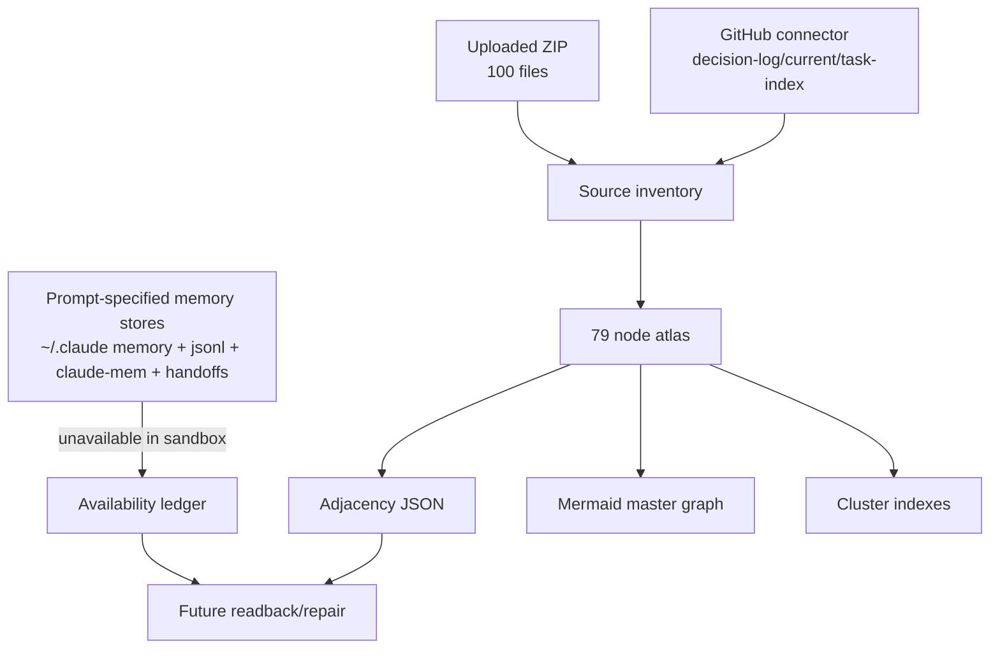

# Memory Evolution Timeline

## Inventory result

本轮可实际读取的 memory-like material 不是 `~/.claude` 原始 memory，而是上传 ZIP 与 GitHub connector readback。ZIP 内含 100 个实际文件，覆盖六份外部报告、repo snapshot、RAW source snapshot、Dispatch127-176 pack、post176 四份输出。U16 prompt 还指定了更多本机路径：`~/.claude/projects/.../memory/`、`bd735ce1*.jsonl`、claude-mem SQLite/ChromaDB、`~/workspace/ScoutFlow/plan/handoffs/`、ContentFlow/DiloFlow、全局规则等；这些路径在当前沙盒不可见。

## Evolution interpretation

1. **Memory-as-authority 阶段不可采用**：如果把 scattered memory 直接当 authority，跨 session 会把旧结论、候选结论、实时 current 混在一起。
2. **Memory-as-evidence 阶段可采用**：每个 memory fragment 只作为 evidence pointer，必须有 source_path、claim_label 和 availability。
3. **Memory-as-graph 阶段最适合本项目**：图谱不替代原文，只帮助冷启动找到该读什么、该停在哪里、哪些节点互相制衡。
4. **Memory-as-runbook 阶段需要未来本机补全**：若未来能访问真实 handoff trail 和 claude-mem observations，应补 ID、创建时间、更新频率、跨 session 命中数。

## Unavailable source treatment

本 atlas 对不可访问来源采用三条规则：不伪造、不删除、不升级。比如 DiloFlow/ContentFlow 节点保留，因为 prompt 明确要求；但它们的 source_path 标成 prompt/unavailable，而不是编造本机文件存在。jsonl transcript 抽样数为 0，因为当前没有可访问文件；这比“模拟抽样”更安全。claude-mem observations referenced 为 0，因为没有 SQLite/ChromaDB 可读入口。

## Future repair protocol

后续若在真实本机环境执行完整 U16，应按顺序补：memory inventory、frontmatter read、handoff chronological sort、claude-mem observation export、jsonl <=10 turn masked sampling、source-path existence check、edge repair、word-count audit、self-audit rerun。补完后不要覆盖本 atlas，而应生成 `v1-local-authority-backed` 版本，并在 README 写明 supersession。
