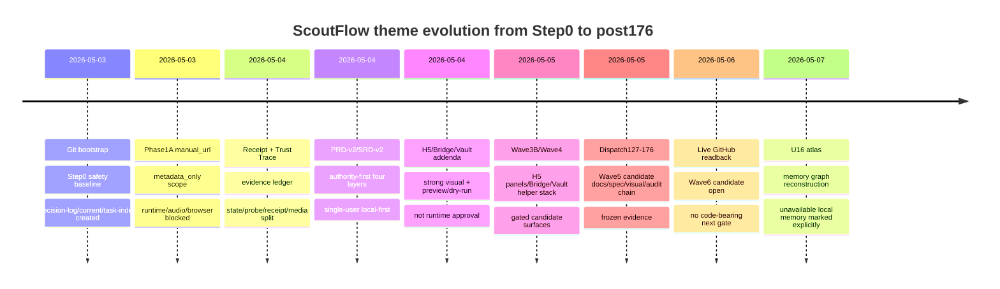

# Theme Evolution Timeline

## Narrative

主题演化的主轴不是“功能越来越多”，而是“authority boundary 越来越清楚”。早期 Step0 的中心是仓库、安全、文档入口和 task ledger；Phase1A 的中心是 manual_url metadata-only，快速建立最小采集闭环；随后 receipt ledger 与 Trust Trace 让 evidence 从散落文件变成 API 可追溯状态。PRD-v2/SRD-v2 将这些事实 forward-promote，变成后续所有 candidate 的仲裁链。

H5/Bridge/Vault addenda 把强视觉和 RAW 方向放进架构，但同时反复写明 not runtime approval、not frontend approval、not migration approval。Wave3B/Wave4 的价值是把 candidate surfaces、helper stack、5-Gate 和 visual harness 铺出来；它的风险是被误读为 product/UI/runtime 已完成。Dispatch127-176 的价值是把 Wave5 对象化、topic-card、visual reporting、handoff/overflow 全部形成冻结证据层；它的风险是被云端模型当作可重跑 pack。

post176 的主题收束应是：从 breadth 回到 proof。也就是将 `131-144` 的对象词汇变成 supporting vocabulary，把 `145/146` 的 topic-card proof pair 前置，把 `161/175` overflow 用作安全容器，把 `176` handoff 用作冷启动输入，而不是开更大的治理体系。这个时间线同时解释了为什么 U16 atlas 只能是 supplementary view：它聚合历史主题，但不改变任何 canonical authority。

## Theme cross-links

- `T-AUTHORITY-FIRST` → `P-AUTHORITY-READBACK-BEFORE-WORK` → `R-CURRENT-TASK-DECISION`
- `T-MAX-HORSEPOWER` → `T-PARALLEL-LANES` → `P-PR-FACTORY-LANE-SHAPING`
- `T-STRONG-VISUAL` → `P-VISUAL-REVIEW-5-GATE` → `E-H5-CAPTURE-STATION`
- `T-PRODUCT-PROOF-NOT-BREADTH` → `P-PROOF-PAIR-CANARY` → `E-TOPIC-CARD`
- `T-SCOUTFLOW-RAW-BOUNDARY` → `T-PREVIEW-ONLY-VAULT` → `L-SECOND-KNOWLEDGE-BASE`
- `T-FROZEN-DISPATCH-EVIDENCE` → `P-FROZEN-DISPATCH-AS-EVIDENCE` → `M-DISPATCH127-176-FROZEN`

## Readback implications

下一次执行前应先确认三件事：第一，GitHub current 是否仍为 Wave6 candidate open；第二，是否有用户新开 code-bearing next gate；第三，是否有视觉/RAW/runtime/migration 新证据改变了 post176 proof 顺序。没有这三项 readback，不应把本 timeline 当作当前 truth，只能作为历史压缩图。
