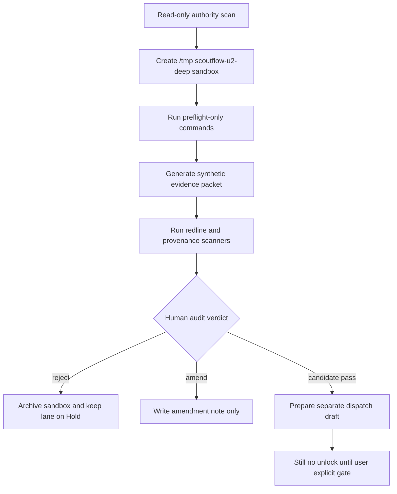

# LANE-1 true_vault_write Spike Commands Deep Supplement 2026-05-07

## §0 Source anchors / 输入锚点

[canonical-project-evidence] Overflow registry v0 keeps all five lanes in Hold and defines separate human gates: `true_write_approval`, `explicit_runtime_approval`, `visual_verdict`, `explicit_migration_approval`, and `usefulness_verdict`.

[canonical-project-evidence] T-P1A-021 says BBDown live metadata probe is only a future bounded dispatch; raw stdout, credentials, QR, auth sidecar, and URL parameters must stay local-only, and `PlatformResult` must not be emitted when preflight fails.

[canonical-project-evidence] T-P1A-022 says `audio_transcript`, ASR, ffmpeg, worker runtime, model download, and generated transcript artifacts remain blocked; future ASR must preserve raw evidence, segment provenance, timestamp integrity, and human review state.

[canonical-project-evidence] T-P1A-023 says every normalized claim / quote / topic must cite transcript segment provenance; LLM output without segment provenance is an untrusted draft, not a ScoutFlow knowledge artifact.

[canonical-project-evidence] T-P1A-025 says DB vNext is candidate-only, `artifact_assets` remains file authority, new structured tables must index / project artifacts rather than replace the ledger, and migration files remain out of scope.

[canonical-project-evidence] `services/api/scoutflow_api/bridge/config.py` returns `write_enabled=False` both when `SCOUTFLOW_VAULT_ROOT` is absent and when preview is available. This supplement preserves that invariant.

[limitation] Live web browsing is unavailable in this execution environment. The vendor refresh requested by the deep prompt is therefore not represented as live-verified evidence. All vendor status/cost scores are marked `[scoring-candidate]` or `[paste-time-unverified]` and require future live refresh before any dispatch.

## §0.1 Hard boundary restatement

[boundary] This file is candidate research only. It does not approve true vault write, runtime tools, browser automation, DB migration, or full signal workbench.

[boundary] Every command below is a future spike command candidate. It is meant to be pasted into a separately approved sandbox dispatch, not executed as part of this document.

[boundary] Commands intentionally write only to repo-external temp folders such as `/tmp/scoutflow-u2-deep/<lane>/...`; when a command references project files, it is read-only unless explicitly marked as synthetic temp-only.

[boundary] No command changes production code, no command writes `services/api/migrations/**`, and no command changes the Bridge invariant `write_enabled=False`.

## §1 Pass-1 delta from previous ZIP / 前轮浅处定位

[delta] 前轮 playbook 的 RAW handoff proof 条件清楚，但缺少可复制的 path-escape、frontmatter、dry-run commit evidence packet 命令。
[delta] 前轮 vendor matrix 对 Lane-1 不是 vendor-heavy，因此缺少本地文件系统、Obsidian/RAW、SQLite ledger 的三维评分。
[delta] 前轮 rollback 写了 force-disable 概念，但没有把 emergency freeze、tombstone、ledger diff、human checksum 串成命令序列。

## §2 Sandbox flow / Mermaid

[design-candidate] The future spike flow keeps `true_vault_write` inside a repo-external sandbox until an audit packet exists.



## §3 Spike command inventory / 命令清单

[command-policy] Each command is a spike candidate. The first line of every block sets the sandbox guard. Production writes remain forbidden.

```bash
# [command-candidate C01] declare sandbox and disabled true-write gate
export SF_SPIKE_ROOT=/tmp/scoutflow-u2-deep/lane1-true-vault-write && export SF_TRUE_WRITE_APPROVED=0 && mkdir -p "$SF_SPIKE_ROOT"
# [command-candidate C02] record host and guard context
uname -a > "$SF_SPIKE_ROOT/host.txt" && date -u > "$SF_SPIKE_ROOT/started_at.txt"
# [command-candidate C03] create sandbox-only RAW target
mkdir -p "$SF_SPIKE_ROOT/raw/00-Inbox" "$SF_SPIKE_ROOT/packet" "$SF_SPIKE_ROOT/logs"
# [command-candidate C04] write explicit no-unlock marker
printf '%s\n' 'candidate spike only; true vault write remains Hold' > "$SF_SPIKE_ROOT/NO_UNLOCK.txt"
# [command-candidate C05] read-only scan for bridge invariant
grep -R "write_enabled=False" -n services/api/scoutflow_api/bridge 2>/dev/null | tee "$SF_SPIKE_ROOT/logs/write-enabled-scan.log"
# [command-candidate C06] read-only scan for positive write methods
grep -R "vault-commit\|committed\|dry_run" -n services/api/scoutflow_api/bridge 2>/dev/null | tee "$SF_SPIKE_ROOT/logs/commit-contract-scan.log"
# [command-candidate C07] synthetic capture metadata fixture
cat > "$SF_SPIKE_ROOT/packet/capture-fixture.json" <<'JSON'
{"capture_id":"CAPTURE_SYNTHETIC_ONLY","platform":"bilibili","platform_item_id":"BV_SYNTHETIC","title":"Synthetic sandbox note","source":"candidate"}
JSON
# [command-candidate C08] synthetic RAW frontmatter fixture
cat > "$SF_SPIKE_ROOT/packet/frontmatter.yml" <<'YAML'
title: Synthetic sandbox note
date: 2026-05-07
tags: scoutflow,candidate,status-hold
status: candidate
YAML
# [command-candidate C09] render candidate note only in sandbox
python - <<'PY'
from pathlib import Path
root=Path('/tmp/scoutflow-u2-deep/lane1-true-vault-write')
front=(root/'packet/frontmatter.yml').read_text()
body='[candidate] This note is a sandbox render only. It does not write to real RAW.\n'
(root/'raw/00-Inbox/CAPTURE_SYNTHETIC_ONLY.md').write_text('---\n'+front+'---\n\n'+body)
PY
# [command-candidate C10] assert sandbox path is under spike root
python - <<'PY'
from pathlib import Path
root=Path('/tmp/scoutflow-u2-deep/lane1-true-vault-write').resolve()
target=(root/'raw/00-Inbox/CAPTURE_SYNTHETIC_ONLY.md').resolve()
assert root in target.parents, target
print({'path_escape_blocked': False, 'target': str(target)})
PY
# [command-candidate C11] negative path escape fixture
python - <<'PY'
from pathlib import Path
root=Path('/tmp/scoutflow-u2-deep/lane1-true-vault-write').resolve()
for raw in ['../escape.md','../../raw/evil.md','/tmp/outside.md']:
    candidate=(root/'raw/00-Inbox'/raw).resolve()
    print(raw, 'ALLOWED' if root in candidate.parents else 'BLOCKED')
PY
# [command-candidate C12] frontmatter 4-field validator
python - <<'PY'
from pathlib import Path
text=(Path('/tmp/scoutflow-u2-deep/lane1-true-vault-write/packet/frontmatter.yml')).read_text().splitlines()
keys={line.split(':',1)[0] for line in text if ':' in line}
print({'required':['title','date','tags','status'], 'present': sorted(keys), 'pass': {'title','date','tags','status'} <= keys})
PY
# [command-candidate C13] preview diff snapshot
sed -n '1,80p' "$SF_SPIKE_ROOT/raw/00-Inbox/CAPTURE_SYNTHETIC_ONLY.md" > "$SF_SPIKE_ROOT/packet/preview-excerpt.md"
# [command-candidate C14] hash rendered artifact
shasum -a 256 "$SF_SPIKE_ROOT/raw/00-Inbox/CAPTURE_SYNTHETIC_ONLY.md" > "$SF_SPIKE_ROOT/packet/sha256.txt" 2>/dev/null || sha256sum "$SF_SPIKE_ROOT/raw/00-Inbox/CAPTURE_SYNTHETIC_ONLY.md" > "$SF_SPIKE_ROOT/packet/sha256.txt"
# [command-candidate C15] emit dry-run commit response candidate
cat > "$SF_SPIKE_ROOT/packet/dry-run-commit-response.json" <<'JSON'
{"capture_id":"CAPTURE_SYNTHETIC_ONLY","committed":false,"dry_run":true,"write_enabled":false,"target_path":"raw/00-Inbox/CAPTURE_SYNTHETIC_ONLY.md","error":{"code":"write_disabled","message":"true vault write remains Hold"}}
JSON
# [command-candidate C16] validate dry-run response does not claim commit
python - <<'PY'
import json, pathlib
p=pathlib.Path('/tmp/scoutflow-u2-deep/lane1-true-vault-write/packet/dry-run-commit-response.json')
o=json.loads(p.read_text())
assert o['committed'] is False and o['dry_run'] is True and o['write_enabled'] is False
print('dry_run_contract_ok')
PY
# [command-candidate C17] create rollback tombstone candidate
cat > "$SF_SPIKE_ROOT/packet/rollback-tombstone.md" <<'MD'
[candidate] If true-write spike contaminates real RAW, freeze bridge route, preserve diff, remove only files listed in reviewed manifest, and record amendment ledger.
MD
# [command-candidate C18] list sandbox-only files
find "$SF_SPIKE_ROOT" -maxdepth 4 -type f | sort > "$SF_SPIKE_ROOT/packet/file-list.txt"
# [command-candidate C19] verify no home RAW path touched
find "$HOME/workspace/raw" -maxdepth 2 -type f -newer "$SF_SPIKE_ROOT/started_at.txt" 2>/dev/null | tee "$SF_SPIKE_ROOT/logs/home-raw-newer-check.log" || true
# [command-candidate C20] verify no repo path modified by this spike
git status --short 2>/dev/null | tee "$SF_SPIKE_ROOT/logs/git-status-readonly.log" || true
# [command-candidate C21] redline phrase scan in sandbox outputs
grep -R "Phase 2 .* unlocked\|vendor .* approved\|migration .* approved" -n "$SF_SPIKE_ROOT" || true
# [command-candidate C22] write evidence packet manifest
python - <<'PY'
from pathlib import Path
import json, time
root=Path('/tmp/scoutflow-u2-deep/lane1-true-vault-write')
files=sorted(str(p.relative_to(root)) for p in root.rglob('*') if p.is_file())
(root/'packet/packet.json').write_text(json.dumps({'lane':'true_vault_write','status':'candidate','write_enabled':'false-invariant-preserved','files':files},ensure_ascii=False,indent=2))
PY
# [command-candidate C23] simulate human approval absence
test "$SF_TRUE_WRITE_APPROVED" = 0 && echo 'human gate absent; stop before true write' | tee "$SF_SPIKE_ROOT/logs/gate.log"
# [command-candidate C24] generate audit handoff
cat > "$SF_SPIKE_ROOT/packet/audit-handoff.md" <<'MD'
[candidate] Audit asks: did the spike only render sandbox preview? did dry-run remain committed=false? did path escape tests block all unsafe paths?
MD
# [command-candidate C25] archive sandbox evidence
tar -C /tmp/scoutflow-u2-deep -czf /tmp/scoutflow-u2-deep/lane1-true-vault-write-evidence.tgz lane1-true-vault-write
# [command-candidate C26] hash archive
shasum -a 256 /tmp/scoutflow-u2-deep/lane1-true-vault-write-evidence.tgz 2>/dev/null || sha256sum /tmp/scoutflow-u2-deep/lane1-true-vault-write-evidence.tgz
# [command-candidate C27] cleanup drill without deleting real RAW
rm -rf "$SF_SPIKE_ROOT/raw" && test ! -e "$SF_SPIKE_ROOT/raw/00-Inbox/CAPTURE_SYNTHETIC_ONLY.md" && echo 'sandbox cleanup ok'
# [command-candidate C28] restore sandbox from archive for auditor
mkdir -p /tmp/scoutflow-u2-deep/restore-test && tar -C /tmp/scoutflow-u2-deep/restore-test -xzf /tmp/scoutflow-u2-deep/lane1-true-vault-write-evidence.tgz
# [command-candidate C29] compare restored manifest
diff -u "$SF_SPIKE_ROOT/packet/file-list.txt" /tmp/scoutflow-u2-deep/restore-test/lane1-true-vault-write/packet/file-list.txt || true
# [command-candidate C30] print final stop condition
printf '%s\n' '[boundary] stop here; prepare separate dispatch only after true_write_approval' | tee "$SF_SPIKE_ROOT/packet/final-stop.txt"
```

## §4 Evidence packet schema

[evidence-candidate] A future `true_vault_write` spike packet should contain `packet.json`, `commands.log`, `redactions.log`, `sha256.txt`, `diff-summary.md`, `failure-map.md`, and `audit-handoff.md`. The packet is useful only if every artifact is created under the sandbox and every referenced project file is read-only.

[evidence-candidate] Minimum fields for `packet.json`: `lane`, `spike_id`, `dispatch_id`, `operator`, `started_at`, `ended_at`, `sandbox_root`, `project_ref`, `commands_count`, `network_used`, `production_paths_touched`, `redline_scan_result`, `rollback_drill_result`, `human_review_required`.

[evidence-candidate] Acceptance threshold for moving from spike to audit: at least three independent evidence items, no production path writes, no secret material, no raw tool response leakage, and a clearly executable reverse path.

## §5 Review hooks

[audit-candidate] Reviewer should compare commands.log with the declared allowed paths. Any command that writes outside `/tmp/scoutflow-u2-deep` should immediately downgrade the claim to `REJECT` or `V-PASS_WITH_HEAVY_EDIT_REQUIRED`.

[audit-candidate] Reviewer should confirm that every positive result is phrased as “spike evidence exists”, not “lane can be unlocked”. The latter is a claim-label violation.

[audit-candidate] Reviewer should demand a fresh live web refresh before vendor-sensitive runtime/browser/scraper decisions, because this supplement could not browse live web.

## §6 Mini fail-mode linkage

[case-link] Full fail-mode cases are consolidated in `FAIL-MODE-CASE-STUDIES-2026-05-07.md`. This lane file only maps each command group to likely failures and rollback hooks.

[case-link] Command groups that touch path resolution map to `path_escape_blocked`, `artifact_escape`, `ledger_drift`, or `schema_projection_drift`.

[case-link] Command groups that touch external tools map to `tool_missing`, `version_drift`, `parser_drift`, `rate_limited`, `auth_required`, `oom_or_memory_pressure`, or `hallucination_suspected`.

## §7 Time/cost note

[estimate-candidate] The one-dev time estimates in `TIME-COST-ESTIMATION-CROSS-LANE-2026-05-07.md` assume a disciplined spike → audit → dispatch → amendment loop. They are not promises and do not imply any lane should be attempted first.

## §8 Lane-specific interpretation

[interpretation-candidate] Lane-1 is the most concrete bridge from ScoutFlow preview to user RAW, but it is also the most sensitive because a write bug can contaminate the user's knowledge store. The command set therefore treats the rendered note as a sandbox artifact, hashes it, creates a dry-run response, then destroys and restores only the sandbox copy.

[interpretation-candidate] A valid Lane-1 spike is not “can write to RAW”. A valid Lane-1 spike is “the project can produce a reviewed, deterministic, path-safe, frontmatter-valid markdown packet whose only missing step is a future human-approved true-write dispatch”.

[rollback-candidate] Reverse path must be rehearsed before any true-write dispatch: freeze Bridge route, keep `write_enabled=False`, list exactly which files would have been written, preserve content hashes, and require human confirmation before deleting or moving anything under real RAW.

[quality-bar] The strongest evidence item is a no-op dry-run response with `committed=false`, `dry_run=true`, `write_enabled=false`, and a deterministic target path under a sandbox RAW mirror. The second strongest evidence item is a negative path escape test. The third is a frontmatter validator that rejects missing `title/date/tags/status` fields.

## §9 Audit questions for this supplement file

[self-audit-candidate] Does every command line carry a command label and write to `/tmp/scoutflow-u2-deep` or read-only project files?

[self-audit-candidate] Does the command inventory avoid direct unlock language and avoid vendor preference language?

[self-audit-candidate] Does the file preserve the lane's current Hold state and require separate dispatch + explicit user gate?

[self-audit-candidate] Does the file include at least one rollback or cleanup drill, not only a forward path?


## §10 Command group rationale / 命令组理由

[rationale-candidate] Commands C01-C04 establish that the spike is a contained evidence exercise. The environment variable is intentionally negative (`SF_TRUE_WRITE_APPROVED=0`) so a later reviewer can verify that every command branch stopped before true write.

[rationale-candidate] Commands C05-C08 are read-only and fixture-only. They convert the abstract Bridge rule into concrete evidence: the code still exposes `write_enabled=False`, the commit contract is dry-run shaped, and the synthetic capture is deliberately not a real user capture.

[rationale-candidate] Commands C09-C13 focus on deterministic rendering and path defense. This is the core of Lane-1 because true vault write is only safe after the project can prove that every target path is predictable, normalized, and inside the intended RAW root.

[rationale-candidate] Commands C14-C19 convert the render into an audit packet. Hashes, excerpts, dry-run JSON, tombstone notes, and file lists allow a reviewer to reproduce the outcome without trusting an informal screenshot or chat summary.

[rationale-candidate] Commands C20-C30 are reverse-path and redline controls. A true-write lane that cannot cleanly archive, restore, and stop is not ready for unlock discussion.

## §11 Candidate acceptance bar

[acceptance-candidate] A Lane-1 supplement packet should be rejected if it contains any file path under real `~/workspace/raw` newer than the spike start marker.

[acceptance-candidate] It should be rejected if a dry-run response omits `committed=false` or `dry_run=true`, because ambiguity in write state is worse than an explicit failure.

[acceptance-candidate] It should be rejected if the target path is derived from unvalidated title text, because path injection can occur before any write command is visible.

[acceptance-candidate] It should be rejected if frontmatter is generated from a free-form model output. Frontmatter should be deterministic and schema-validated.

[acceptance-candidate] It should be rejected if the rollback tombstone does not list exact file paths and hashes. “Delete the generated note” is not an auditable rollback.

[acceptance-candidate] It can proceed to audit only when preview output, target path, frontmatter, dry-run response, redline scan, and cleanup drill all agree.

## §12 Reviewer adversarial probes

[audit-candidate] Ask whether a malicious capture title can escape the target folder, overwrite an existing RAW note, create duplicate titles, or inject YAML delimiters.

[audit-candidate] Ask whether a future dispatch could accidentally flip Bridge behavior through environment rather than explicit code review. The answer should remain no unless a separate authority change exists.

[audit-candidate] Ask whether the evidence packet proves “no write occurred”, not just “write was intended to be disabled”. The distinction matters because local artifacts can still be created accidentally.

[audit-candidate] Ask whether the reviewer can reproduce the note from fixture + command log. If not, the packet is too narrative-heavy and too evidence-light.


## §13 Operator notes / 操作者注意事项

[operator-note] Lane-1 的 spike 应该把“写入能力”和“写入意图”彻底拆开。命令可以证明系统知道应该生成什么 note、应该落在哪个相对路径、应该如何校验 frontmatter、应该如何生成 dry-run response；但命令不能证明用户已经授权真实写入。

[operator-note] 未来如果需要把此 spike 转成真实 dispatch，dispatch 的第一句也应该保留当前结论：Bridge 当前仍是 preview / dry-run，`write_enabled=False` 是安全闸，不是 bug。只有当 RAW handoff proof、独立 PR、外审和用户 true_write_approval 同时存在，才讨论替换 dry-run 语义。

[operator-note] 审计者应特别留意“看似无害”的路径：空标题、emoji 标题、重复标题、超长标题、中文标点、斜杠、冒号、换行、YAML delimiter、已有 RAW 文件同名。这些都应该进入后续 negative fixture，而不是依赖人工直觉。

[operator-note] 本 supplement 没有读取用户真实 RAW 结构，因此不判断实际 RAW 命名规范。它只给出最小可审计形态：sandbox RAW mirror、deterministic note、frontmatter validator、target path hash、dry-run response、rollback tombstone。

