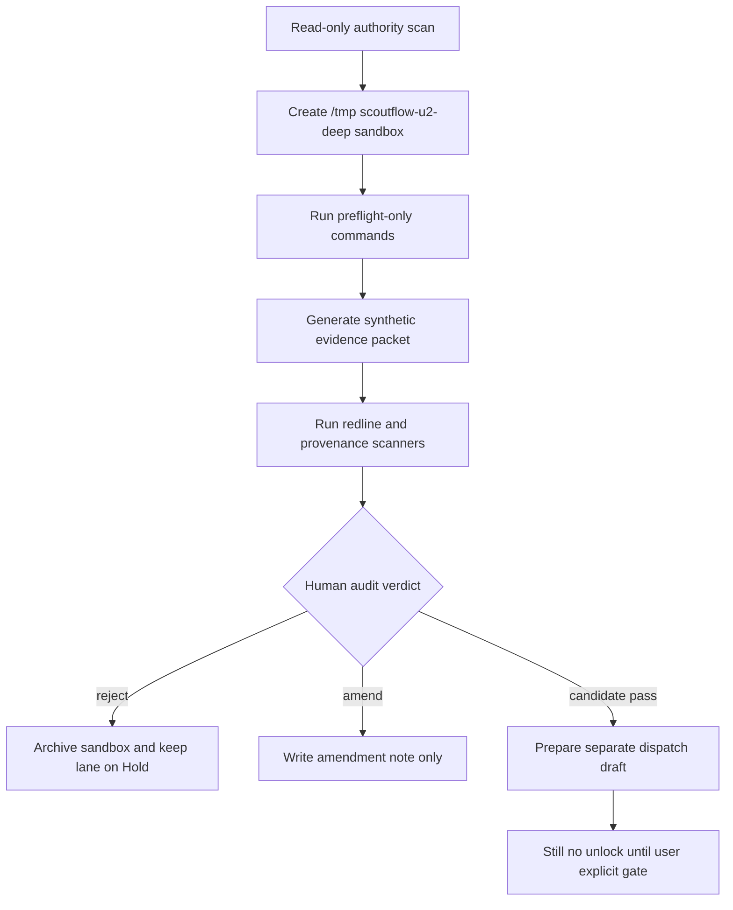
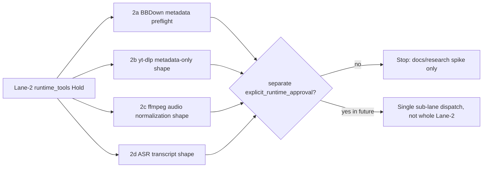

# LANE-2 runtime_tools Spike Commands Deep Supplement 2026-05-07

## §0 Source anchors / 输入锚点

[canonical-project-evidence] Overflow registry v0 keeps all five lanes in Hold and defines separate human gates: `true_write_approval`, `explicit_runtime_approval`, `visual_verdict`, `explicit_migration_approval`, and `usefulness_verdict`.

[canonical-project-evidence] T-P1A-021 says BBDown live metadata probe is only a future bounded dispatch; raw stdout, credentials, QR, auth sidecar, and URL parameters must stay local-only, and `PlatformResult` must not be emitted when preflight fails.

[canonical-project-evidence] T-P1A-022 says `audio_transcript`, ASR, ffmpeg, worker runtime, model download, and generated transcript artifacts remain blocked; future ASR must preserve raw evidence, segment provenance, timestamp integrity, and human review state.

[canonical-project-evidence] T-P1A-023 says every normalized claim / quote / topic must cite transcript segment provenance; LLM output without segment provenance is an untrusted draft, not a ScoutFlow knowledge artifact.

[canonical-project-evidence] T-P1A-025 says DB vNext is candidate-only, `artifact_assets` remains file authority, new structured tables must index / project artifacts rather than replace the ledger, and migration files remain out of scope.

[canonical-project-evidence] `services/api/scoutflow_api/bridge/config.py` returns `write_enabled=False` both when `SCOUTFLOW_VAULT_ROOT` is absent and when preview is available. This supplement preserves that invariant.

[limitation] Live web browsing is unavailable in this execution environment. The vendor refresh requested by the deep prompt is therefore not represented as live-verified evidence. All vendor status/cost scores are marked `[scoring-candidate]` or `[paste-time-unverified]` and require future live refresh before any dispatch.

## §0.1 Hard boundary restatement

[boundary] This file is candidate research only. It does not approve true vault write, runtime tools, browser automation, DB migration, or full signal workbench.

[boundary] Every command below is a future spike command candidate. It is meant to be pasted into a separately approved sandbox dispatch, not executed as part of this document.

[boundary] Commands intentionally write only to repo-external temp folders such as `/tmp/scoutflow-u2-deep/<lane>/...`; when a command references project files, it is read-only unless explicitly marked as synthetic temp-only.

[boundary] No command changes production code, no command writes `services/api/migrations/**`, and no command changes the Bridge invariant `write_enabled=False`.

## §1 Pass-1 delta from previous ZIP / 前轮浅处定位

[delta] 前轮 runtime_tools 已覆盖 BBDown、yt-dlp、ffmpeg、ASR vendor，但没有按 sub-lane 给出 preflight-only / metadata-only / audio-only / ASR-only 的隔离命令。
[delta] 前轮强调 Bilibili C&D 风险，但缺少 parser drift、rate limit、cookie leakage、OOM、hallucination 的可触发测试形态。
[delta] 前轮 ASR 部分有 vendor 比较，但缺少 Apple Silicon / CPU fallback / model cache / transcript validator 的沙盒命令骨架。

## §2 Sandbox flow / Mermaid

[design-candidate] The future spike flow keeps `runtime_tools` inside a repo-external sandbox until an audit packet exists.



## §3 Spike command inventory / 命令清单

[command-policy] Each command is a spike candidate. The first line of every block sets the sandbox guard. Production writes remain forbidden.

```bash
# [command-candidate C01] declare runtime sandbox and absent approval
export SF_SPIKE_ROOT=/tmp/scoutflow-u2-deep/lane2-runtime-tools && export SF_RUNTIME_APPROVED=0 && mkdir -p "$SF_SPIKE_ROOT"/{bbdown,ytdlp,ffmpeg,asr,logs,packet}
# [command-candidate C02] record runtime boundary
printf '%s\n' 'runtime tools remain blocked; preflight and command-shape only' > "$SF_SPIKE_ROOT/NO_RUNTIME_UNLOCK.txt"
# [command-candidate C03] read project runtime redline from API description
grep -R "BBDown / yt-dlp / ffmpeg / ASR runtime are not approved" -n services/api 2>/dev/null | tee "$SF_SPIKE_ROOT/logs/api-runtime-redline.log" || true
# [command-candidate C04] BBDown binary preflight without platform call
command -v BBDown 2>&1 | tee "$SF_SPIKE_ROOT/bbdown/command-v.log" || true
# [command-candidate C05] BBDown version preflight candidate
if [ "$SF_RUNTIME_APPROVED" = 1 ] && command -v BBDown >/dev/null; then BBDown --version | tee "$SF_SPIKE_ROOT/bbdown/version.log"; else echo 'skip BBDown execution; runtime gate absent'; fi
# [command-candidate C06] BBDown future -info command shape only
printf '%s\n' 'timeout 30 BBDown -info <USER_APPROVED_CANONICAL_URL> --no-debug # future, not executed' > "$SF_SPIKE_ROOT/bbdown/future-command-shape.txt"
# [command-candidate C07] BBDown stdout redaction regex dry test
python - <<'PY'
import re
sample='Title: demo\nSESSDATA=secret\nhttps://www.bilibili.com/video/BVxx?p=1&spm_id_from=333'
redacted=re.sub(r'(SESSDATA=)[^\\s]+', r'\\1<redacted>', sample)
redacted=re.sub(r'([?&]spm_id_from=)[^&\\s]+', r'\\1<redacted>', redacted)
print(redacted)
PY
# [command-candidate C08] classify BBDown preflight missing as no PlatformResult
python - <<'PY'
import shutil, json
found=bool(shutil.which('BBDown'))
print(json.dumps({'tool_preflight_result':'executable_found' if found else 'executable_not_found','platform_result': None if not found else 'not_emitted_in_preflight'}, indent=2))
PY
# [command-candidate C09] yt-dlp binary preflight only
command -v yt-dlp 2>&1 | tee "$SF_SPIKE_ROOT/ytdlp/command-v.log" || true
# [command-candidate C10] yt-dlp version preflight candidate
if [ "$SF_RUNTIME_APPROVED" = 1 ] && command -v yt-dlp >/dev/null; then yt-dlp --version | tee "$SF_SPIKE_ROOT/ytdlp/version.log"; else echo 'skip yt-dlp execution; runtime gate absent'; fi
# [command-candidate C11] yt-dlp metadata-only config fixture
cat > "$SF_SPIKE_ROOT/ytdlp/metadata-only-options.json" <<'JSON'
{"skip_download":true,"quiet":true,"no_warnings":true,"extract_flat":false,"socket_timeout":30}
JSON
# [command-candidate C12] yt-dlp Python command shape no execution
cat > "$SF_SPIKE_ROOT/ytdlp/future-extractor-shape.py" <<'PY'
from yt_dlp import YoutubeDL
opts={'skip_download': True, 'quiet': True, 'no_warnings': True}
# Future approved spike only: info = YoutubeDL(opts).extract_info(url, download=False)
PY
# [command-candidate C13] yt-dlp CVE check placeholder
printf '%s\n' '[limitation] live CVE lookup unavailable; future dispatch must refresh yt-dlp CVE/advisory status' > "$SF_SPIKE_ROOT/ytdlp/cve-refresh-required.txt"
# [command-candidate C14] ffmpeg binary preflight only
command -v ffmpeg 2>&1 | tee "$SF_SPIKE_ROOT/ffmpeg/command-v.log" || true
# [command-candidate C15] ffmpeg version preflight candidate
if [ "$SF_RUNTIME_APPROVED" = 1 ] && command -v ffmpeg >/dev/null; then ffmpeg -version | head -5 | tee "$SF_SPIKE_ROOT/ffmpeg/version.log"; else echo 'skip ffmpeg execution; runtime gate absent'; fi
# [command-candidate C16] ffmpeg normalization command shape only
printf '%s\n' 'ffmpeg -i media/input.m4a -ar 16000 -ac 1 media/audio.wav # future approved audio gate only' > "$SF_SPIKE_ROOT/ffmpeg/normalize-shape.txt"
# [command-candidate C17] audio artifact contract fixture
cat > "$SF_SPIKE_ROOT/ffmpeg/audio-artifact-candidate.json" <<'JSON'
{"relative_path":"media/audio.wav","sample_rate":16000,"channels":1,"sha256":"candidate","produced_by_job":"future_audio_extract"}
JSON
# [command-candidate C18] ASR package preflight: openai-whisper
python -m pip show openai-whisper 2>&1 | tee "$SF_SPIKE_ROOT/asr/pip-openai-whisper.log" || true
# [command-candidate C19] ASR package preflight: faster-whisper
python -m pip show faster-whisper 2>&1 | tee "$SF_SPIKE_ROOT/asr/pip-faster-whisper.log" || true
# [command-candidate C20] ASR executable preflight: whisper
command -v whisper 2>&1 | tee "$SF_SPIKE_ROOT/asr/command-v-whisper.log" || true
# [command-candidate C21] ASR model cache listing without download
find "$HOME/.cache/huggingface/hub" -maxdepth 2 -type d -name 'models--*whisper*' 2>/dev/null | tee "$SF_SPIKE_ROOT/asr/hf-whisper-cache.log" || true
# [command-candidate C22] ASR no-download guard file
printf '%s\n' 'no model download; use existing cache only if later approved' > "$SF_SPIKE_ROOT/asr/no-model-download.txt"
# [command-candidate C23] Whisper command shape only
printf '%s\n' 'whisper media/audio.wav --language zh --task transcribe --model large-v3 --output_format json # future approved ASR gate only' > "$SF_SPIKE_ROOT/asr/whisper-shape.txt"
# [command-candidate C24] faster-whisper command shape only
cat > "$SF_SPIKE_ROOT/asr/faster-whisper-shape.py" <<'PY'
# Future approved ASR gate only
# from faster_whisper import WhisperModel
# model = WhisperModel('large-v3', device='auto', compute_type='int8')
# segments, info = model.transcribe('media/audio.wav', language='zh', vad_filter=True, word_timestamps=True)
PY
# [command-candidate C25] Parakeet command shape only
printf '%s\n' 'parakeet-mlx transcribe media/audio.wav --language zh # future approved ASR gate only' > "$SF_SPIKE_ROOT/asr/parakeet-shape.txt"
# [command-candidate C26] Voxtral command shape only
printf '%s\n' 'voxtral realtime --input media/audio.wav # future approved ASR gate only; memory preflight required' > "$SF_SPIKE_ROOT/asr/voxtral-shape.txt"
# [command-candidate C27] transcript raw.json fixture
cat > "$SF_SPIKE_ROOT/asr/raw.candidate.json" <<'JSON'
{"schema":"scoutflow.asr.raw.v0.candidate","engine":{"name":"synthetic","version":"0"},"segments":[{"start_ms":0,"end_ms":1000,"text":"synthetic","confidence":0.9}]}
JSON
# [command-candidate C28] segments.jsonl fixture
cat > "$SF_SPIKE_ROOT/asr/segments.candidate.jsonl" <<'JSONL'
{"schema":"scoutflow.asr.segment.v0.candidate","segment_id":"seg_000001","start_ms":0,"end_ms":1000,"text":"synthetic","speaker":null,"confidence":0.9,"chunk_id":"chunk_000","review_state":"unreviewed","raw_refs":["raw.segments[0]"]}
JSONL
# [command-candidate C29] validate segments monotonicity
python - <<'PY'
import json, pathlib
rows=[json.loads(l) for l in pathlib.Path('/tmp/scoutflow-u2-deep/lane2-runtime-tools/asr/segments.candidate.jsonl').read_text().splitlines()]
assert all(r['start_ms'] < r['end_ms'] for r in rows)
print('segments_monotonic_ok')
PY
# [command-candidate C30] LLM normalization provenance dry check
python - <<'PY'
claim={'text':'synthetic claim','supporting_segments':['seg_000001']}
segments={'seg_000001'}
print({'claim_has_provenance': bool(set(claim['supporting_segments']) & segments)})
PY
# [command-candidate C31] rate-limit classification fixture
cat > "$SF_SPIKE_ROOT/bbdown/platform-result-examples.json" <<'JSON'
{"examples":["auth_required","vip_required","forbidden","region_blocked","not_found","unavailable","parser_drift","network_error","timeout","rate_limited","unknown_error"]}
JSON
# [command-candidate C32] parser drift synthetic detector
python - <<'PY'
stdout='unexpected layout with no title duration fields'
required=['Title','Duration']
print({'platform_result':'parser_drift' if not all(k in stdout for k in required) else 'ok'})
PY
# [command-candidate C33] credential leakage scanner
grep -R "SESSDATA\|bili_jct\|Authorization\|Cookie" -n "$SF_SPIKE_ROOT" | tee "$SF_SPIKE_ROOT/logs/secret-scan.log" || true
# [command-candidate C34] network use assertion
printf '%s\n' '{"network_used":false,"reason":"live probes not executed"}' > "$SF_SPIKE_ROOT/packet/network-use.json"
# [command-candidate C35] runtime evidence packet manifest
python - <<'PY'
from pathlib import Path
import json
root=Path('/tmp/scoutflow-u2-deep/lane2-runtime-tools')
files=sorted(str(p.relative_to(root)) for p in root.rglob('*') if p.is_file())
(root/'packet/packet.json').write_text(json.dumps({'lane':'runtime_tools','status':'candidate','runtime_approved':False,'files':files},indent=2))
PY
# [command-candidate C36] archive runtime packet
tar -C /tmp/scoutflow-u2-deep -czf /tmp/scoutflow-u2-deep/lane2-runtime-tools-evidence.tgz lane2-runtime-tools
# [command-candidate C37] final runtime stop
echo '[boundary] stop before BBDown live, yt-dlp extraction, ffmpeg, ASR, or audio_transcript until explicit_runtime_approval' | tee "$SF_SPIKE_ROOT/packet/final-stop.txt"
```

## §4 Evidence packet schema

[evidence-candidate] A future `runtime_tools` spike packet should contain `packet.json`, `commands.log`, `redactions.log`, `sha256.txt`, `diff-summary.md`, `failure-map.md`, and `audit-handoff.md`. The packet is useful only if every artifact is created under the sandbox and every referenced project file is read-only.

[evidence-candidate] Minimum fields for `packet.json`: `lane`, `spike_id`, `dispatch_id`, `operator`, `started_at`, `ended_at`, `sandbox_root`, `project_ref`, `commands_count`, `network_used`, `production_paths_touched`, `redline_scan_result`, `rollback_drill_result`, `human_review_required`.

[evidence-candidate] Acceptance threshold for moving from spike to audit: at least three independent evidence items, no production path writes, no secret material, no raw tool response leakage, and a clearly executable reverse path.

## §5 Review hooks

[audit-candidate] Reviewer should compare commands.log with the declared allowed paths. Any command that writes outside `/tmp/scoutflow-u2-deep` should immediately downgrade the claim to `REJECT` or `V-PASS_WITH_HEAVY_EDIT_REQUIRED`.

[audit-candidate] Reviewer should confirm that every positive result is phrased as “spike evidence exists”, not “lane can be unlocked”. The latter is a claim-label violation.

[audit-candidate] Reviewer should demand a fresh live web refresh before vendor-sensitive runtime/browser/scraper decisions, because this supplement could not browse live web.

## §6 Mini fail-mode linkage

[case-link] Full fail-mode cases are consolidated in `FAIL-MODE-CASE-STUDIES-2026-05-07.md`. This lane file only maps each command group to likely failures and rollback hooks.

[case-link] Command groups that touch path resolution map to `path_escape_blocked`, `artifact_escape`, `ledger_drift`, or `schema_projection_drift`.

[case-link] Command groups that touch external tools map to `tool_missing`, `version_drift`, `parser_drift`, `rate_limited`, `auth_required`, `oom_or_memory_pressure`, or `hallucination_suspected`.

## §7 Time/cost note

[estimate-candidate] The one-dev time estimates in `TIME-COST-ESTIMATION-CROSS-LANE-2026-05-07.md` assume a disciplined spike → audit → dispatch → amendment loop. They are not promises and do not imply any lane should be attempted first.

## §8 Sub-lane isolation map

[interpretation-candidate] Lane-2 is not one unlock. It is four sub-lanes with different blast radius: 2a BBDown live metadata, 2b yt-dlp metadata-only, 2c ffmpeg audio normalization, and 2d ASR transcript generation. A future spike should prove one sub-lane at a time and should not treat success in one as permission for another.

[boundary] BBDown / yt-dlp metadata-only evidence must never become media download evidence. ffmpeg normalization must never own media extraction unless a prior audio artifact gate exists. ASR must never download models automatically, and transcript artifacts remain candidate until human review.

[quality-bar] The strongest Lane-2 evidence packet has four independent preflight sections, one command-shape section, one no-network assertion, one secret scanner, and one `PlatformResult` mapping table that preserves `platform_result=null` for preflight failure.

[rollback-candidate] Runtime rollback must be immediate: disable job queue path, keep raw stdout local-only, halt parser queue on `parser_drift`, delete temp media after hashes are recorded, and route any suspected hallucination to `needs_check` rather than retries.

## §9 Runtime split Mermaid

[design-candidate] This second diagram prevents conflating sub-lanes.



## §9 Audit questions for this supplement file

[self-audit-candidate] Does every command line carry a command label and write to `/tmp/scoutflow-u2-deep` or read-only project files?

[self-audit-candidate] Does the command inventory avoid direct unlock language and avoid vendor preference language?

[self-audit-candidate] Does the file preserve the lane's current Hold state and require separate dispatch + explicit user gate?

[self-audit-candidate] Does the file include at least one rollback or cleanup drill, not only a forward path?


## §10 Sub-lane command group rationale

[rationale-candidate] Commands C01-C03 define the global runtime stop condition. They are intentionally shared across BBDown, yt-dlp, ffmpeg, and ASR because the most dangerous failure is a partial approval being misread as whole-lane approval.

[rationale-candidate] Commands C04-C08 isolate BBDown into preflight, version, future command-shape, redaction, and preflight classification. This mirrors T-P1A-021: no `PlatformResult` should exist when the tool preflight fails.

[rationale-candidate] Commands C09-C13 isolate yt-dlp metadata-only. The safest future candidate shape is `skip_download`, but this supplement does not assert current legal/CVE state because live web refresh is unavailable.

[rationale-candidate] Commands C14-C17 isolate ffmpeg. The key distinction is that ffmpeg can normalize a previously approved audio artifact, but it should not become a hidden media extraction step.

[rationale-candidate] Commands C18-C26 isolate ASR. The no-download guard is essential because a model cache miss should not silently become a network/model acquisition event.

[rationale-candidate] Commands C27-C31 validate transcript and normalization provenance. This keeps ASR output as raw evidence and prevents transcript-derived claims from entering Lane-5 without segment references.

[rationale-candidate] Commands C32-C37 build the cross-sub-lane audit packet. The packet should say exactly which sub-lane was tested, whether network was used, whether secrets were found, and why the run stopped.

## §11 Runtime acceptance bar

[acceptance-candidate] A BBDown metadata spike should be rejected if it uses `--debug`, preserves raw stdout in Git-tracked evidence, stores session paths, or retries rate limit immediately.

[acceptance-candidate] A yt-dlp spike should be rejected if any command shape includes media download semantics, even if the operator says the intent was metadata only.

[acceptance-candidate] A ffmpeg spike should be rejected if the input audio artifact has no prior receipt or if the output path is outside the temp capture root.

[acceptance-candidate] An ASR spike should be rejected if it downloads a model without an explicit model acquisition dispatch, hides low confidence, fabricates speaker labels, or normalizes hallucinated text as fact.

[acceptance-candidate] A combined Lane-2 packet should be rejected if it claims the whole runtime lane is ready because one sub-lane passed preflight.

[acceptance-candidate] A candidate pass requires one sub-lane scope, explicit no-network/no-secret evidence or approved-network evidence, exact command log, redaction proof, and reverse path.

## §12 Runtime fail-fast rules

[fail-fast] `parser_drift` must stop the probe queue. It is not a retryable transient because repeated probes can amplify platform pressure while producing invalid metadata.

[fail-fast] `auth_required`, `vip_required`, and `region_blocked` should not be hidden behind generic failure. They are user-facing source states and should be surfaced conservatively without storing credentials.

[fail-fast] `oom_or_memory_pressure` in ASR should lower model tier or batch size only after preserving the failed preflight metadata. It should not silently switch engine and compare outputs without trace.

[fail-fast] `hallucination_suspected` should mark transcript segments `needs_check`. LLM cleanup is not a substitute for source verification.

## §13 Vendor neutrality note

[vendor-neutrality] This file intentionally gives command shapes for multiple vendors and engines. It does not choose BBDown over yt-dlp, Whisper over Parakeet, or local ASR over cloud ASR.

[vendor-neutrality] The future user decision should be based on refreshed legal posture, local hardware, cost envelope, privacy boundary, and downstream usefulness, not on the order of commands in this file.


## §14 Sub-lane evidence ladders / 子车道证据阶梯

[evidence-ladder] 2a BBDown live metadata 的最低阶证据是 binary/version preflight；第二阶是 future command shape；第三阶是 synthetic stdout parser；第四阶才是单 URL bounded probe。当前 supplement 只覆盖前三阶，不触发第四阶。

[evidence-ladder] 2b yt-dlp 的最低阶证据是 package/version preflight；第二阶是 `skip_download` option fixture；第三阶是 extractor output schema design；第四阶才是真实 URL metadata-only probe。当前 supplement 不执行 extractor。

[evidence-ladder] 2c ffmpeg 的最低阶证据是 binary/version preflight；第二阶是 command shape；第三阶是 synthetic audio artifact contract；第四阶是对已授权音频 artifact 的 normalization。当前 supplement 不处理真实音频。

[evidence-ladder] 2d ASR 的最低阶证据是 package/model-cache preflight；第二阶是 no-download guard；第三阶是 raw.json / segments.jsonl synthetic validator；第四阶才是真实 audio.wav 转写。当前 supplement 不运行 ASR。

## §15 Redaction and receipt discipline

[redaction-candidate] Runtime evidence should be treated as contaminated until proven clean. Any stdout/stderr excerpt from a platform tool may contain title, URL, auth-adjacent tokens, region signals, cookie paths, or user-specific query parameters.

[redaction-candidate] The receipt ledger should receive only structured safe metadata. Raw tool output should be summarized, redacted, hashed if necessary, and kept local-only or deleted after extraction. This mirrors the project rule that raw stdout is not ledger evidence.

[redaction-candidate] A future ASR receipt should separate raw engine output from reviewed transcript. Raw transcript is evidence, not polished knowledge. Segment provenance is mandatory before normalization.

[redaction-candidate] A future LLM cleanup step should never invent speaker labels, timestamps, URLs, or external facts. Cleanup should repair punctuation and paragraphs, not create claims.

## §16 Hardware and model caveats

[hardware-candidate] Apple Silicon acceleration should be treated as a preflight result, not an assumption. A MacBook Air, a MacBook Pro, and a cloud CPU runner can produce very different memory pressure and latency.

[hardware-candidate] Model cache presence should not become a hidden dependency. If `large-v3` exists locally, record the snapshot and hash. If it does not exist, stop rather than downloading a model inside an ASR spike.

[hardware-candidate] Cloud ASR vendors may be attractive for Chinese content, but they introduce privacy, cost, retention, and regional compliance questions. This supplement scores them but does not choose them.

[hardware-candidate] The first ASR acceptance criterion should remain downstream usefulness and auditability, not leaderboard WER. A slightly worse transcript with clear provenance can be safer than a better transcript with opaque processing.


## §17 Case split by externality

[externality-candidate] BBDown and Bilibili-related wrappers create platform externality. Even a metadata-only request can touch rate limits, auth state, region policy, parser drift, and cease-and-desist sensitivity. Therefore the safest BBDown spike begins with synthetic stdout and command shape, not a platform call.

[externality-candidate] yt-dlp metadata-only has a different externality. It may be safer than media download, but it still needs current legal/CVE refresh, extractor version pinning, URL canonicalization, and no-download receipt proof. A future spike should record exact yt-dlp version and extractor name.

[externality-candidate] ffmpeg has local compute externality rather than platform externality. The key risk is scope creep: audio normalization can be valuable, but only after a prior gate created a legitimate audio input. It should not fetch, download, or infer media.

[externality-candidate] ASR has local hardware and epistemic externality. It can exhaust memory, produce hallucinations, and create text that looks authoritative. The transcript validator and human review queue are as important as model selection.

## §18 Evidence packet reviewer checklist

[review-checklist] Confirm the packet states exactly one target sub-lane. If it says “runtime_tools” without sub-lane scoping, ask for amendment.

[review-checklist] Confirm the packet records tool versions or explains why versions were not executed because runtime gate was absent.

[review-checklist] Confirm all command shapes are stored as text, not executed, unless the dispatch explicitly approved execution.

[review-checklist] Confirm no raw platform stdout, cookie path, model cache path with user identifier, or absolute media path enters the Git-tracked packet.

[review-checklist] Confirm `audio_transcript` remains blocked in wording. A transcript fixture is not a transcript runtime.

[review-checklist] Confirm any future live refresh covers Bilibili legal notices, yt-dlp security advisories, ASR model release notes, platform ToS, and commercial vendor pricing.


## §19 Final runtime non-goals

[non-goal] This supplement does not run BBDown against Bilibili, does not run yt-dlp against any URL, does not run ffmpeg on real media, and does not run Whisper/Parakeet/Voxtral on real audio.

[non-goal] This supplement does not choose between local ASR and cloud ASR. It only shows how the future evidence packet should separate engine preflight, input artifact proof, transcript raw evidence, segment validation, and human review.

[non-goal] This supplement does not relax Bilibili cease-and-desist sensitivity. The future metadata path must still treat Bilibili vendors as legally sensitive and must refresh live evidence before any platform call.


[non-goal] A future operator must also keep commercial scraper, proxy, and cloud ASR credentials outside the repo. Credential boundary is a separate gate, not an implementation detail.

[non-goal] Vendor choice remains user-reviewed and future-dated; no runtime vendor is selected by this supplement.

[non-goal] 它只提供审计形态。
