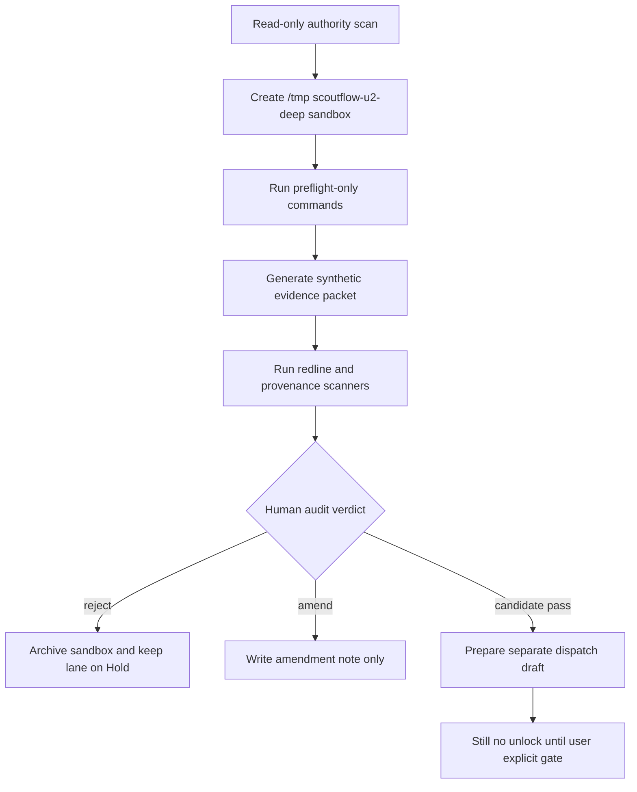

# LANE-3 browser_automation Spike Commands Deep Supplement 2026-05-07

## §0 Source anchors / 输入锚点

[canonical-project-evidence] Overflow registry v0 keeps all five lanes in Hold and defines separate human gates: `true_write_approval`, `explicit_runtime_approval`, `visual_verdict`, `explicit_migration_approval`, and `usefulness_verdict`.

[canonical-project-evidence] T-P1A-021 says BBDown live metadata probe is only a future bounded dispatch; raw stdout, credentials, QR, auth sidecar, and URL parameters must stay local-only, and `PlatformResult` must not be emitted when preflight fails.

[canonical-project-evidence] T-P1A-022 says `audio_transcript`, ASR, ffmpeg, worker runtime, model download, and generated transcript artifacts remain blocked; future ASR must preserve raw evidence, segment provenance, timestamp integrity, and human review state.

[canonical-project-evidence] T-P1A-023 says every normalized claim / quote / topic must cite transcript segment provenance; LLM output without segment provenance is an untrusted draft, not a ScoutFlow knowledge artifact.

[canonical-project-evidence] T-P1A-025 says DB vNext is candidate-only, `artifact_assets` remains file authority, new structured tables must index / project artifacts rather than replace the ledger, and migration files remain out of scope.

[canonical-project-evidence] `services/api/scoutflow_api/bridge/config.py` returns `write_enabled=False` both when `SCOUTFLOW_VAULT_ROOT` is absent and when preview is available. This supplement preserves that invariant.

[limitation] Live web browsing is unavailable in this execution environment. The vendor refresh requested by the deep prompt is therefore not represented as live-verified evidence. All vendor status/cost scores are marked `[scoring-candidate]` or `[paste-time-unverified]` and require future live refresh before any dispatch.

## §0.1 Hard boundary restatement

[boundary] This file is candidate research only. It does not approve true vault write, runtime tools, browser automation, DB migration, or full signal workbench.

[boundary] Every command below is a future spike command candidate. It is meant to be pasted into a separately approved sandbox dispatch, not executed as part of this document.

[boundary] Commands intentionally write only to repo-external temp folders such as `/tmp/scoutflow-u2-deep/<lane>/...`; when a command references project files, it is read-only unless explicitly marked as synthetic temp-only.

[boundary] No command changes production code, no command writes `services/api/migrations/**`, and no command changes the Bridge invariant `write_enabled=False`.

## §1 Pass-1 delta from previous ZIP / 前轮浅处定位

[delta] 前轮 browser_automation playbook 清楚说明 human-reviewed screenshot packet，但缺少 Playwright/Selenium/Puppeteer/Stagehand 的同构 smoke 命令。
[delta] 前轮没有把 screenshot diff threshold、trace archive、network egress denylist、browser profile isolation 写成可审计步骤。
[delta] 前轮没有区分 synthetic UAT、visual UAT、real browser automation unlock 三层证据。

## §2 Sandbox flow / Mermaid

[design-candidate] The future spike flow keeps `browser_automation` inside a repo-external sandbox until an audit packet exists.



## §3 Spike command inventory / 命令清单

[command-policy] Each command is a spike candidate. The first line of every block sets the sandbox guard. Production writes remain forbidden.

```bash
# [command-candidate C01] declare browser sandbox and absent visual verdict
export SF_SPIKE_ROOT=/tmp/scoutflow-u2-deep/lane3-browser-automation && export SF_BROWSER_AUTOMATION_APPROVED=0 && mkdir -p "$SF_SPIKE_ROOT"/{playwright,selenium,puppeteer,stagehand,screenshots,logs,packet}
# [command-candidate C02] record no automation unlock
printf '%s\n' 'browser automation remains Hold; screenshot packet only' > "$SF_SPIKE_ROOT/NO_BROWSER_UNLOCK.txt"
# [command-candidate C03] read-only scan for bridge and API routes
grep -R "summary=\|description=" -n services/api/scoutflow_api 2>/dev/null | head -50 | tee "$SF_SPIKE_ROOT/logs/api-summary-scan.log" || true
# [command-candidate C04] Playwright Python package preflight
python -m pip show playwright 2>&1 | tee "$SF_SPIKE_ROOT/playwright/pip-show.log" || true
# [command-candidate C05] Playwright CLI version preflight candidate
if [ "$SF_BROWSER_AUTOMATION_APPROVED" = 1 ]; then python -m playwright --version | tee "$SF_SPIKE_ROOT/playwright/version.log"; else echo 'skip Playwright execution; visual verdict absent'; fi
# [command-candidate C06] Playwright command shape only
cat > "$SF_SPIKE_ROOT/playwright/future-smoke-shape.py" <<'PY'
# Future approved visual gate only
# from playwright.sync_api import sync_playwright
# with sync_playwright() as p:
#   browser = p.chromium.launch(headless=True)
#   page = browser.new_page(record_video_dir='/tmp/scoutflow-u2-deep/lane3-browser-automation/screenshots')
#   page.goto('http://127.0.0.1:8000/docs')
#   page.screenshot(path='screenshots/api-docs.png')
PY
# [command-candidate C07] Selenium package preflight
python -m pip show selenium 2>&1 | tee "$SF_SPIKE_ROOT/selenium/pip-show.log" || true
# [command-candidate C08] Selenium command shape only
cat > "$SF_SPIKE_ROOT/selenium/future-smoke-shape.py" <<'PY'
# Future approved visual gate only
# from selenium import webdriver
# driver = webdriver.Chrome()
# driver.get('http://127.0.0.1:8000/docs')
# driver.save_screenshot('/tmp/scoutflow-u2-deep/lane3-browser-automation/screenshots/selenium-docs.png')
PY
# [command-candidate C09] Puppeteer npm preflight
node --version 2>&1 | tee "$SF_SPIKE_ROOT/puppeteer/node-version.log" || true; npm --version 2>&1 | tee "$SF_SPIKE_ROOT/puppeteer/npm-version.log" || true
# [command-candidate C10] Puppeteer command shape only
cat > "$SF_SPIKE_ROOT/puppeteer/future-smoke-shape.js" <<'JS'
// Future approved visual gate only
// const puppeteer = require('puppeteer');
// const browser = await puppeteer.launch({headless: true});
// const page = await browser.newPage();
// await page.goto('http://127.0.0.1:8000/docs');
// await page.screenshot({path:'/tmp/scoutflow-u2-deep/lane3-browser-automation/screenshots/puppeteer-docs.png'});
JS
# [command-candidate C11] Stagehand npm preflight placeholder
npm view @browserbasehq/stagehand version 2>/dev/null | tee "$SF_SPIKE_ROOT/stagehand/npm-view.log" || echo 'no live npm/network or package unavailable' | tee "$SF_SPIKE_ROOT/stagehand/npm-view.log"
# [command-candidate C12] Stagehand command shape only
cat > "$SF_SPIKE_ROOT/stagehand/future-shape.ts" <<'TS'
// Future approved visual gate only
// import { Stagehand } from '@browserbasehq/stagehand';
// const stagehand = new Stagehand({ env: 'LOCAL' });
// await stagehand.init();
TS
# [command-candidate C13] synthetic HTML fixture
cat > "$SF_SPIKE_ROOT/packet/synthetic-page.html" <<'HTML'
<!doctype html><title>ScoutFlow Synthetic Preview</title><main data-testid="trust-trace">metadata_only / preview</main>
HTML
# [command-candidate C14] screenshot manifest fixture
cat > "$SF_SPIKE_ROOT/packet/screenshot-manifest.json" <<'JSON'
{"screenshots":[],"human_review_required":true,"automation_executed":false,"synthetic_fixture":"packet/synthetic-page.html"}
JSON
# [command-candidate C15] visual assertion schema dry check
python - <<'PY'
assertions=[{'selector':'[data-testid=trust-trace]','expected_text':'metadata_only / preview'}]
print({'assertion_count':len(assertions),'mode':'synthetic-spec-only'})
PY
# [command-candidate C16] network allowlist candidate
cat > "$SF_SPIKE_ROOT/packet/network-allowlist.txt" <<'TXT'
127.0.0.1
localhost
TXT
# [command-candidate C17] network denylist candidate
cat > "$SF_SPIKE_ROOT/packet/network-denylist.txt" <<'TXT'
*.bilibili.com
*.xiaohongshu.com
*.youtube.com
TXT
# [command-candidate C18] browser profile isolation candidate
mkdir -p "$SF_SPIKE_ROOT/browser-profile" && chmod 700 "$SF_SPIKE_ROOT/browser-profile"
# [command-candidate C19] trace archive path candidate
mkdir -p "$SF_SPIKE_ROOT/traces" && printf '%s\n' 'trace files only after approved visual gate' > "$SF_SPIKE_ROOT/traces/README.txt"
# [command-candidate C20] screenshot hash placeholder
printf '%s\n' 'no screenshots captured; no browser automation executed' > "$SF_SPIKE_ROOT/screenshots/NO_SCREENSHOT.txt"
# [command-candidate C21] compare screenshot diff threshold fixture
cat > "$SF_SPIKE_ROOT/packet/visual-thresholds.json" <<'JSON'
{"pixel_diff_threshold":0.01,"text_assertions_required":true,"human_verdict_required":true}
JSON
# [command-candidate C22] validate human verdict field
python - <<'PY'
import json, pathlib
p=pathlib.Path('/tmp/scoutflow-u2-deep/lane3-browser-automation/packet/screenshot-manifest.json')
o=json.loads(p.read_text())
assert o['human_review_required'] is True and o['automation_executed'] is False
print('visual_gate_contract_ok')
PY
# [command-candidate C23] redline scan for accidental external URLs
grep -R "https://\|http://" -n "$SF_SPIKE_ROOT" | tee "$SF_SPIKE_ROOT/logs/url-scan.log" || true
# [command-candidate C24] classify synthetic vs visual UAT
cat > "$SF_SPIKE_ROOT/packet/uat-classification.md" <<'MD'
[candidate] synthetic fixture != visual UAT; visual UAT requires human-reviewed screenshot packet; browser automation remains Hold.
MD
# [command-candidate C25] browser command risk map
cat > "$SF_SPIKE_ROOT/packet/risk-map.json" <<'JSON'
{"risks":["profile_cookie_leak","external_network_call","flaky_selector","visual_threshold_masking","agent_overreach"]}
JSON
# [command-candidate C26] prepare reviewer checklist
cat > "$SF_SPIKE_ROOT/packet/reviewer-checklist.md" <<'MD'
- [ ] no external domains loaded
- [ ] no persistent profile reused
- [ ] screenshot packet has human verdict
- [ ] command log matches allowed paths
MD
# [command-candidate C27] write packet manifest
python - <<'PY'
from pathlib import Path
import json
root=Path('/tmp/scoutflow-u2-deep/lane3-browser-automation')
files=sorted(str(p.relative_to(root)) for p in root.rglob('*') if p.is_file())
(root/'packet/packet.json').write_text(json.dumps({'lane':'browser_automation','status':'candidate','browser_automation_approved':False,'files':files},indent=2))
PY
# [command-candidate C28] archive browser packet
tar -C /tmp/scoutflow-u2-deep -czf /tmp/scoutflow-u2-deep/lane3-browser-automation-evidence.tgz lane3-browser-automation
# [command-candidate C29] cleanup isolated profile
rm -rf "$SF_SPIKE_ROOT/browser-profile" && echo 'sandbox browser profile cleanup ok'
# [command-candidate C30] restore profile placeholder
mkdir -p "$SF_SPIKE_ROOT/browser-profile" && chmod 700 "$SF_SPIKE_ROOT/browser-profile"
# [command-candidate C31] final browser stop
echo '[boundary] stop before Playwright/Selenium/Puppeteer/Stagehand execution until visual_verdict + separate automation dispatch' | tee "$SF_SPIKE_ROOT/packet/final-stop.txt"
```

## §4 Evidence packet schema

[evidence-candidate] A future `browser_automation` spike packet should contain `packet.json`, `commands.log`, `redactions.log`, `sha256.txt`, `diff-summary.md`, `failure-map.md`, and `audit-handoff.md`. The packet is useful only if every artifact is created under the sandbox and every referenced project file is read-only.

[evidence-candidate] Minimum fields for `packet.json`: `lane`, `spike_id`, `dispatch_id`, `operator`, `started_at`, `ended_at`, `sandbox_root`, `project_ref`, `commands_count`, `network_used`, `production_paths_touched`, `redline_scan_result`, `rollback_drill_result`, `human_review_required`.

[evidence-candidate] Acceptance threshold for moving from spike to audit: at least three independent evidence items, no production path writes, no secret material, no raw tool response leakage, and a clearly executable reverse path.

## §5 Review hooks

[audit-candidate] Reviewer should compare commands.log with the declared allowed paths. Any command that writes outside `/tmp/scoutflow-u2-deep` should immediately downgrade the claim to `REJECT` or `V-PASS_WITH_HEAVY_EDIT_REQUIRED`.

[audit-candidate] Reviewer should confirm that every positive result is phrased as “spike evidence exists”, not “lane can be unlocked”. The latter is a claim-label violation.

[audit-candidate] Reviewer should demand a fresh live web refresh before vendor-sensitive runtime/browser/scraper decisions, because this supplement could not browse live web.

## §6 Mini fail-mode linkage

[case-link] Full fail-mode cases are consolidated in `FAIL-MODE-CASE-STUDIES-2026-05-07.md`. This lane file only maps each command group to likely failures and rollback hooks.

[case-link] Command groups that touch path resolution map to `path_escape_blocked`, `artifact_escape`, `ledger_drift`, or `schema_projection_drift`.

[case-link] Command groups that touch external tools map to `tool_missing`, `version_drift`, `parser_drift`, `rate_limited`, `auth_required`, `oom_or_memory_pressure`, or `hallucination_suspected`.

## §7 Time/cost note

[estimate-candidate] The one-dev time estimates in `TIME-COST-ESTIMATION-CROSS-LANE-2026-05-07.md` assume a disciplined spike → audit → dispatch → amendment loop. They are not promises and do not imply any lane should be attempted first.

## §8 Lane-specific interpretation

[interpretation-candidate] Lane-3 should start with a screenshot packet and human visual verdict, not with autonomous browser actions. The command inventory distinguishes package preflight, code-shape generation, synthetic fixture, network allowlist, trace archive location, screenshot manifest, and human reviewer checklist.

[boundary] Browser automation is uniquely risky because it can leak cookies from a reused profile, call external domains, or turn visual checks into action execution. Therefore every command either skips execution when `SF_BROWSER_AUTOMATION_APPROVED=0` or writes only command-shape files.

[quality-bar] Strong evidence includes: isolated browser profile path, localhost-only allowlist, external-domain denylist, screenshot manifest with `human_review_required=true`, trace path under sandbox, and no screenshots captured unless a separate visual verdict exists.

[rollback-candidate] Reverse path is to delete browser profiles, archive traces, disable automation route, keep human-reviewed screenshots as evidence, and downgrade automation claims to synthetic UAT if no real browser was executed.

## §9 Audit questions for this supplement file

[self-audit-candidate] Does every command line carry a command label and write to `/tmp/scoutflow-u2-deep` or read-only project files?

[self-audit-candidate] Does the command inventory avoid direct unlock language and avoid vendor preference language?

[self-audit-candidate] Does the file preserve the lane's current Hold state and require separate dispatch + explicit user gate?

[self-audit-candidate] Does the file include at least one rollback or cleanup drill, not only a forward path?


## §10 Command group rationale

[rationale-candidate] Commands C01-C04 establish that browser automation is held behind a visual verdict. The package preflight can be useful, but it is not a reason to launch a browser.

[rationale-candidate] Commands C05-C12 generate future code-shape files for Playwright, Selenium, Puppeteer, and Stagehand. They are stored as text so the reviewer can compare frameworks without executing agentic actions.

[rationale-candidate] Commands C13-C17 create a synthetic page, manifest, assertions, and network policy. This distinguishes synthetic UAT from real visual UAT.

[rationale-candidate] Commands C18-C24 define browser isolation and visual thresholds. A browser test without profile isolation and text assertions is not acceptable evidence.

[rationale-candidate] Commands C25-C31 create reviewer checklist, packet manifest, archive, cleanup, and final stop. The stop line is part of the evidence because it proves the automation boundary was not silently crossed.

## §11 Visual evidence acceptance bar

[acceptance-candidate] A screenshot packet is not valid unless it includes target URL, browser framework, browser version, profile path, screenshot hash, text assertions, trace archive, and human verdict.

[acceptance-candidate] Synthetic HTML proof can support UI contract review, but it cannot replace localhost visual proof. Localhost visual proof can support visual verdict, but it cannot replace full browser automation approval.

[acceptance-candidate] Any screenshot or trace that contains external platform domains should be rejected unless the separate dispatch explicitly approved that network surface.

[acceptance-candidate] Agentic frameworks should be evaluated last because they can transform passive visual checks into active operations.

## §12 Reviewer adversarial probes

[audit-candidate] Ask whether the browser profile is created under the sandbox and destroyed afterward.

[audit-candidate] Ask whether the test target is `localhost` or a synthetic file, not a real Bilibili/XHS/YouTube URL.

[audit-candidate] Ask whether screenshots prove text and state, not just pixels. Pixel diff can miss missing labels or wrong state words.

[audit-candidate] Ask whether Stagehand/browser-use/Claude computer use is actually needed for this lane, or whether Playwright screenshot packet is enough.


## §13 Browser evidence layering

[evidence-layer] Layer 0 is synthetic DOM contract: a static HTML fixture proves what selectors and text labels should exist. It is cheap and safe but not a real browser proof.

[evidence-layer] Layer 1 is localhost screenshot packet: a real browser renders local ScoutFlow UI or API docs, captures screenshots, and produces trace files. This needs human visual verdict but still avoids external platform calls.

[evidence-layer] Layer 2 is browser automation smoke: Playwright/Selenium/Puppeteer execute scripted flows. This requires a separate automation dispatch because scripts can click, submit, or persist state.

[evidence-layer] Layer 3 is agentic browser action: Stagehand/browser-use/computer-use interpret goals. This should be deferred until the project has strong allowlists, dry-run actions, and human intervention controls.

## §14 Visual audit details

[audit-candidate] A valid visual packet should include both pixel evidence and semantic evidence. Pixel evidence catches layout drift; semantic assertions catch missing state words such as `metadata_only`, `write_enabled=False`, `dry_run`, and `blocked`.

[audit-candidate] Browser traces should be treated like logs: they can include URLs, timing, headers, storage state, or screenshots. They should be archived only after redaction review.

[audit-candidate] A reused browser profile is never acceptable for a first spike. The profile must be temp, isolated, and destroyed or archived intentionally.

[audit-candidate] The first target should be localhost docs or a static synthetic page. External platform pages belong to Lane-2 runtime/scraper risk, not Lane-3 visual UAT.


## §15 Framework comparison in spike context

[framework-candidate] Playwright is the best fit for a future localhost screenshot packet because it has strong trace/screenshot ergonomics, but this statement is a technical fit observation, not adoption. A separate visual dispatch should still compare it with Selenium and Puppeteer.

[framework-candidate] Selenium is useful when legacy browser compatibility matters. For ScoutFlow's first visual packet, that breadth may be less important than stable fixtures and fast screenshots.

[framework-candidate] Puppeteer is useful for Chromium-only screenshots. It is narrower than Playwright but can be simpler for Node-oriented tooling.

[framework-candidate] Stagehand and other AI browser layers should be treated as product research, not first-gate visual proof. Their strength is goal-directed action; their risk is goal-directed action.

## §16 Evidence retention

[retention-candidate] Screenshot evidence should include hashes and manifest paths so reviewers can compare exact artifacts. If a screenshot is regenerated, it should get a new hash rather than silently replacing prior evidence.

[retention-candidate] Traces should be short-lived unless they have been reviewed for sensitive data. The safest first packet may include screenshots and text assertions but no persistent trace.

[retention-candidate] Human verdict should be explicit: pass, pass with amendments, heavy edit, or reject. A screenshot without verdict is observation, not gate evidence.


## §17 Final browser non-goals

[non-goal] This supplement does not install browsers, does not launch browsers, does not capture real screenshots, and does not connect to external websites.

[non-goal] This supplement does not approve Playwright, Selenium, Puppeteer, Stagehand, browser-use, or computer-use. It only makes their future command shapes comparable.

[non-goal] This supplement does not treat visual UAT as product approval. It only defines how a future screenshot packet could become credible audit evidence.

