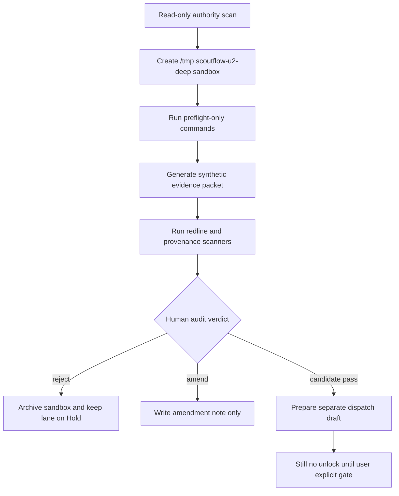

# LANE-4 dbvnext_migration Spike Commands Deep Supplement 2026-05-07

## §0 Source anchors / 输入锚点

[canonical-project-evidence] Overflow registry v0 keeps all five lanes in Hold and defines separate human gates: `true_write_approval`, `explicit_runtime_approval`, `visual_verdict`, `explicit_migration_approval`, and `usefulness_verdict`.

[canonical-project-evidence] T-P1A-021 says BBDown live metadata probe is only a future bounded dispatch; raw stdout, credentials, QR, auth sidecar, and URL parameters must stay local-only, and `PlatformResult` must not be emitted when preflight fails.

[canonical-project-evidence] T-P1A-022 says `audio_transcript`, ASR, ffmpeg, worker runtime, model download, and generated transcript artifacts remain blocked; future ASR must preserve raw evidence, segment provenance, timestamp integrity, and human review state.

[canonical-project-evidence] T-P1A-023 says every normalized claim / quote / topic must cite transcript segment provenance; LLM output without segment provenance is an untrusted draft, not a ScoutFlow knowledge artifact.

[canonical-project-evidence] T-P1A-025 says DB vNext is candidate-only, `artifact_assets` remains file authority, new structured tables must index / project artifacts rather than replace the ledger, and migration files remain out of scope.

[canonical-project-evidence] `services/api/scoutflow_api/bridge/config.py` returns `write_enabled=False` both when `SCOUTFLOW_VAULT_ROOT` is absent and when preview is available. This supplement preserves that invariant.

[limitation] Live web browsing is unavailable in this execution environment. The vendor refresh requested by the deep prompt is therefore not represented as live-verified evidence. All vendor status/cost scores are marked `[scoring-candidate]` or `[paste-time-unverified]` and require future live refresh before any dispatch.

## §0.1 Hard boundary restatement

[boundary] This file is candidate research only. It does not approve true vault write, runtime tools, browser automation, DB migration, or full signal workbench.

[boundary] Every command below is a future spike command candidate. It is meant to be pasted into a separately approved sandbox dispatch, not executed as part of this document.

[boundary] Commands intentionally write only to repo-external temp folders such as `/tmp/scoutflow-u2-deep/<lane>/...`; when a command references project files, it is read-only unless explicitly marked as synthetic temp-only.

[boundary] No command changes production code, no command writes `services/api/migrations/**`, and no command changes the Bridge invariant `write_enabled=False`.

## §1 Pass-1 delta from previous ZIP / 前轮浅处定位

[delta] 前轮 DB vNext playbook 说明 migration 需要独立 dispatch，但缺少 temp SQLite / Alembic dry-run / schema diff / rollback drill 命令。
[delta] 前轮未把 artifact_assets as file authority 与 transcript_segments / normalized_docs / claims / quotes / topic_candidates 的 temp projection 绑定成命令。
[delta] 前轮风险 register 提到 migration drift，但缺少 idempotency replay、supersession、purge tombstone 的具体 fail-mode。

## §2 Sandbox flow / Mermaid

[design-candidate] The future spike flow keeps `dbvnext_migration` inside a repo-external sandbox until an audit packet exists.



## §3 Spike command inventory / 命令清单

[command-policy] Each command is a spike candidate. The first line of every block sets the sandbox guard. Production writes remain forbidden.

```bash
# [command-candidate C01] declare DB sandbox and absent migration approval
export SF_SPIKE_ROOT=/tmp/scoutflow-u2-deep/lane4-dbvnext-migration && export SF_MIGRATION_APPROVED=0 && mkdir -p "$SF_SPIKE_ROOT"/{db,sql,logs,packet}
# [command-candidate C02] write no migration marker
printf '%s\n' 'DB vNext migration remains candidate; production migrations forbidden' > "$SF_SPIKE_ROOT/NO_MIGRATION_UNLOCK.txt"
# [command-candidate C03] read-only forbidden migration path scan
find services/api/migrations -maxdepth 2 -type f 2>/dev/null | sort | tee "$SF_SPIKE_ROOT/logs/existing-migrations-readonly.log" || true
# [command-candidate C04] create temp sqlite db only
sqlite3 "$SF_SPIKE_ROOT/db/spike.sqlite" 'PRAGMA user_version=0;'
# [command-candidate C05] capture temp baseline schema
sqlite3 "$SF_SPIKE_ROOT/db/spike.sqlite" '.schema' > "$SF_SPIKE_ROOT/db/baseline.schema.sql"
# [command-candidate C06] write candidate transcript_segments SQL in sandbox
cat > "$SF_SPIKE_ROOT/sql/001_candidate_transcript_segments.sql" <<'SQL'
CREATE TABLE transcript_segments_candidate (
  segment_id TEXT NOT NULL,
  capture_id TEXT NOT NULL,
  transcript_artifact_asset_id TEXT NOT NULL,
  segment_index INTEGER NOT NULL,
  start_ms INTEGER NOT NULL,
  end_ms INTEGER NOT NULL,
  text TEXT NOT NULL,
  confidence REAL,
  created_by_job TEXT NOT NULL,
  PRIMARY KEY (transcript_artifact_asset_id, segment_index),
  CHECK (start_ms < end_ms)
);
SQL
# [command-candidate C07] apply candidate SQL to temp db
sqlite3 "$SF_SPIKE_ROOT/db/spike.sqlite" < "$SF_SPIKE_ROOT/sql/001_candidate_transcript_segments.sql"
# [command-candidate C08] write candidate normalized_docs SQL in sandbox
cat > "$SF_SPIKE_ROOT/sql/002_candidate_normalized_docs.sql" <<'SQL'
CREATE TABLE normalized_docs_candidate (
  normalized_doc_id TEXT PRIMARY KEY,
  capture_id TEXT NOT NULL,
  source_artifact_asset_id TEXT NOT NULL,
  output_artifact_asset_id TEXT NOT NULL,
  schema_version TEXT NOT NULL,
  content_sha256 TEXT NOT NULL,
  created_by_job TEXT NOT NULL,
  supersedes_normalized_doc_id TEXT
);
SQL
# [command-candidate C09] apply normalized_docs SQL to temp db
sqlite3 "$SF_SPIKE_ROOT/db/spike.sqlite" < "$SF_SPIKE_ROOT/sql/002_candidate_normalized_docs.sql"
# [command-candidate C10] capture candidate schema
sqlite3 "$SF_SPIKE_ROOT/db/spike.sqlite" '.schema' > "$SF_SPIKE_ROOT/db/candidate.schema.sql"
# [command-candidate C11] schema diff against baseline
diff -u "$SF_SPIKE_ROOT/db/baseline.schema.sql" "$SF_SPIKE_ROOT/db/candidate.schema.sql" > "$SF_SPIKE_ROOT/db/schema.diff" || true
# [command-candidate C12] insert valid synthetic segment
sqlite3 "$SF_SPIKE_ROOT/db/spike.sqlite" "INSERT INTO transcript_segments_candidate VALUES ('seg_000001','CAPTURE_SYNTHETIC','asset_transcript_1',0,0,1000,'synthetic',0.9,'JOB_SYNTHETIC');"
# [command-candidate C13] negative timestamp test
sqlite3 "$SF_SPIKE_ROOT/db/spike.sqlite" "INSERT INTO transcript_segments_candidate VALUES ('seg_bad','CAPTURE_SYNTHETIC','asset_transcript_1',1,1000,0,'bad',0.1,'JOB_SYNTHETIC');" 2> "$SF_SPIKE_ROOT/logs/check-constraint-negative.log" || true
# [command-candidate C14] idempotency replay same row
sqlite3 "$SF_SPIKE_ROOT/db/spike.sqlite" "INSERT INTO transcript_segments_candidate VALUES ('seg_000001','CAPTURE_SYNTHETIC','asset_transcript_1',0,0,1000,'synthetic',0.9,'JOB_SYNTHETIC');" 2> "$SF_SPIKE_ROOT/logs/idempotency-conflict.log" || true
# [command-candidate C15] query projection rows
sqlite3 -json "$SF_SPIKE_ROOT/db/spike.sqlite" "SELECT segment_id,start_ms,end_ms,text FROM transcript_segments_candidate;" > "$SF_SPIKE_ROOT/packet/segment-query.json"
# [command-candidate C16] insert normalized doc synthetic
sqlite3 "$SF_SPIKE_ROOT/db/spike.sqlite" "INSERT INTO normalized_docs_candidate VALUES ('norm_1','CAPTURE_SYNTHETIC','asset_transcript_1','asset_norm_1','v0.candidate','sha256synthetic','JOB_SYNTHETIC',NULL);"
# [command-candidate C17] supersession synthetic row
sqlite3 "$SF_SPIKE_ROOT/db/spike.sqlite" "INSERT INTO normalized_docs_candidate VALUES ('norm_2','CAPTURE_SYNTHETIC','asset_transcript_1','asset_norm_2','v0.candidate','sha256synthetic2','JOB_SYNTHETIC','norm_1');"
# [command-candidate C18] query current normalized doc candidate
sqlite3 -json "$SF_SPIKE_ROOT/db/spike.sqlite" "SELECT * FROM normalized_docs_candidate WHERE normalized_doc_id NOT IN (SELECT supersedes_normalized_doc_id FROM normalized_docs_candidate WHERE supersedes_normalized_doc_id IS NOT NULL);" > "$SF_SPIKE_ROOT/packet/current-doc-query.json"
# [command-candidate C19] purge tombstone table candidate
cat > "$SF_SPIKE_ROOT/sql/003_candidate_purge_tombstone.sql" <<'SQL'
CREATE TABLE purge_tombstones_candidate (tombstone_id TEXT PRIMARY KEY, target_kind TEXT NOT NULL, target_id TEXT NOT NULL, reason TEXT NOT NULL, created_at TEXT NOT NULL);
SQL
# [command-candidate C20] apply purge tombstone temp SQL
sqlite3 "$SF_SPIKE_ROOT/db/spike.sqlite" < "$SF_SPIKE_ROOT/sql/003_candidate_purge_tombstone.sql"
# [command-candidate C21] insert purge tombstone synthetic
sqlite3 "$SF_SPIKE_ROOT/db/spike.sqlite" "INSERT INTO purge_tombstones_candidate VALUES ('tomb_1','artifact','asset_norm_1','synthetic purge drill',datetime('now'));"
# [command-candidate C22] dump temp db schema and data
sqlite3 "$SF_SPIKE_ROOT/db/spike.sqlite" '.dump' > "$SF_SPIKE_ROOT/db/spike.dump.sql"
# [command-candidate C23] restore temp dump into new db
sqlite3 "$SF_SPIKE_ROOT/db/restore.sqlite" < "$SF_SPIKE_ROOT/db/spike.dump.sql"
# [command-candidate C24] compare row counts after restore
sqlite3 -json "$SF_SPIKE_ROOT/db/restore.sqlite" "SELECT 'segments' AS table_name, count(*) AS n FROM transcript_segments_candidate UNION ALL SELECT 'docs', count(*) FROM normalized_docs_candidate;" > "$SF_SPIKE_ROOT/packet/restore-counts.json"
# [command-candidate C25] Alembic dry-run placeholder only
printf '%s\n' 'alembic revision --autogenerate # forbidden until explicit_migration_approval; do not run in repo' > "$SF_SPIKE_ROOT/sql/alembic-command-shape.txt"
# [command-candidate C26] sqlx/diesel placeholder only
printf '%s\n' 'sqlx migrate add dbvnext_candidate # forbidden in repo; temp sandbox only if later approved' > "$SF_SPIKE_ROOT/sql/sqlx-diesel-command-shapes.txt"
# [command-candidate C27] forbidden path post-check
git status --short services/api/migrations 2>/dev/null | tee "$SF_SPIKE_ROOT/logs/migration-path-git-status.log" || true
# [command-candidate C28] validate no production migration generated
test ! -e services/api/migrations/999_candidate_dbvnext.sql && echo 'no production migration generated' | tee "$SF_SPIKE_ROOT/logs/no-prod-migration.log"
# [command-candidate C29] write migration audit packet
python - <<'PY'
from pathlib import Path
import json
root=Path('/tmp/scoutflow-u2-deep/lane4-dbvnext-migration')
files=sorted(str(p.relative_to(root)) for p in root.rglob('*') if p.is_file())
(root/'packet/packet.json').write_text(json.dumps({'lane':'dbvnext_migration','status':'candidate','migration_approved':False,'temp_db':'db/spike.sqlite','files':files},indent=2))
PY
# [command-candidate C30] archive temp db packet
tar -C /tmp/scoutflow-u2-deep -czf /tmp/scoutflow-u2-deep/lane4-dbvnext-migration-evidence.tgz lane4-dbvnext-migration
# [command-candidate C31] cleanup temp restore db
rm -f "$SF_SPIKE_ROOT/db/restore.sqlite" && echo 'restore db cleanup ok'
# [command-candidate C32] final migration stop
echo '[boundary] stop before any services/api/migrations change until explicit_migration_approval + separate PR + external audit' | tee "$SF_SPIKE_ROOT/packet/final-stop.txt"
```

## §4 Evidence packet schema

[evidence-candidate] A future `dbvnext_migration` spike packet should contain `packet.json`, `commands.log`, `redactions.log`, `sha256.txt`, `diff-summary.md`, `failure-map.md`, and `audit-handoff.md`. The packet is useful only if every artifact is created under the sandbox and every referenced project file is read-only.

[evidence-candidate] Minimum fields for `packet.json`: `lane`, `spike_id`, `dispatch_id`, `operator`, `started_at`, `ended_at`, `sandbox_root`, `project_ref`, `commands_count`, `network_used`, `production_paths_touched`, `redline_scan_result`, `rollback_drill_result`, `human_review_required`.

[evidence-candidate] Acceptance threshold for moving from spike to audit: at least three independent evidence items, no production path writes, no secret material, no raw tool response leakage, and a clearly executable reverse path.

## §5 Review hooks

[audit-candidate] Reviewer should compare commands.log with the declared allowed paths. Any command that writes outside `/tmp/scoutflow-u2-deep` should immediately downgrade the claim to `REJECT` or `V-PASS_WITH_HEAVY_EDIT_REQUIRED`.

[audit-candidate] Reviewer should confirm that every positive result is phrased as “spike evidence exists”, not “lane can be unlocked”. The latter is a claim-label violation.

[audit-candidate] Reviewer should demand a fresh live web refresh before vendor-sensitive runtime/browser/scraper decisions, because this supplement could not browse live web.

## §6 Mini fail-mode linkage

[case-link] Full fail-mode cases are consolidated in `FAIL-MODE-CASE-STUDIES-2026-05-07.md`. This lane file only maps each command group to likely failures and rollback hooks.

[case-link] Command groups that touch path resolution map to `path_escape_blocked`, `artifact_escape`, `ledger_drift`, or `schema_projection_drift`.

[case-link] Command groups that touch external tools map to `tool_missing`, `version_drift`, `parser_drift`, `rate_limited`, `auth_required`, `oom_or_memory_pressure`, or `hallucination_suspected`.

## §7 Time/cost note

[estimate-candidate] The one-dev time estimates in `TIME-COST-ESTIMATION-CROSS-LANE-2026-05-07.md` assume a disciplined spike → audit → dispatch → amendment loop. They are not promises and do not imply any lane should be attempted first.

## §8 Lane-specific interpretation

[interpretation-candidate] Lane-4 must prove schema thinking in temp SQLite before any repository migration. The command inventory creates candidate tables, tests constraints, replays idempotency, dumps/restores, adds supersession, and drills purge tombstones — all inside `/tmp`.

[boundary] The most important command is not a migration generator; it is the forbidden-path post-check. The future dispatch should fail if `services/api/migrations/**` changes outside an explicitly approved migration PR.

[quality-bar] Strong evidence includes: schema diff, constraint negative test, idempotency conflict, restore count comparison, supersession query, purge tombstone row, and a manifest proving only temp DB files were written.

[rollback-candidate] Migration rollback must preserve append-friendly ledger facts where possible. If a bad migration ever reaches production in a future phase, recovery should prefer restore from backup + tombstone record + follow-up amendment, not silent deletion.

## §9 Audit questions for this supplement file

[self-audit-candidate] Does every command line carry a command label and write to `/tmp/scoutflow-u2-deep` or read-only project files?

[self-audit-candidate] Does the command inventory avoid direct unlock language and avoid vendor preference language?

[self-audit-candidate] Does the file preserve the lane's current Hold state and require separate dispatch + explicit user gate?

[self-audit-candidate] Does the file include at least one rollback or cleanup drill, not only a forward path?


## §10 Command group rationale

[rationale-candidate] Commands C01-C05 prove that the spike begins from a temp database and a read-only view of existing migration files. This separates schema thinking from production migration.

[rationale-candidate] Commands C06-C12 create candidate transcript and normalized-doc tables only in temp SQLite. This gives DB vNext something concrete to audit without changing authority.

[rationale-candidate] Commands C13-C18 test constraints, idempotency, query projection, and supersession. These are more important than generating migration files because DB vNext failures often arise from replay and versioning.

[rationale-candidate] Commands C19-C25 add purge tombstone and dump/restore drills. Destructive deletion should be exceptional; a tombstone and restore proof are safer evidence.

[rationale-candidate] Commands C26-C32 explicitly prevent migration-generator creep. Alembic/sqlx/diesel are only command shapes until explicit migration approval exists.

## §11 DB evidence acceptance bar

[acceptance-candidate] A Lane-4 spike should have a schema diff, but that diff should be between temp baseline and temp candidate schema, not between repo production migrations.

[acceptance-candidate] A candidate table should reference artifact authority rather than replacing it. `artifact_assets` remains the file authority; structured tables are query projections.

[acceptance-candidate] Idempotency replay must be tested before any migration is proposed. If the same artifact can create duplicates, the schema is not ready.

[acceptance-candidate] Supersession must be explicit. “Latest row wins” is too ambiguous for transcript and normalized document provenance.

[acceptance-candidate] Purge behavior must be designed even if destructive deletion is rare, because secrets/rights/PII events require a credible contingency path.

## §12 Reviewer adversarial probes

[audit-candidate] Ask whether every SQL file lives under `/tmp/scoutflow-u2-deep/lane4-dbvnext-migration/sql`.

[audit-candidate] Ask whether any command could create or modify `services/api/migrations/**`. If yes, reject the spike.

[audit-candidate] Ask whether the schema can replay the same receipt without duplicate derived rows.

[audit-candidate] Ask whether a bad normalized document can be superseded while preserving auditability.


## §13 Migration governance notes

[governance-candidate] DB vNext is dangerous because SQL is easy to write and hard to reverse after authority changes. The supplement therefore emphasizes temp DB proof, not migration generation.

[governance-candidate] A migration proposal should not start by asking “what tables do we want?” It should ask “what query pressure cannot be satisfied by `artifact_assets` plus files?” Only then should a structured projection table be considered.

[governance-candidate] The first real migration, if ever approved, should be narrow: one or two tables, explicit indexes, replay behavior, rollback plan, and tests. Claims, quotes, topics, embeddings, and vector search should not all land at once.

[governance-candidate] A schema that cannot explain supersession is not ready. Transcript and normalized artifacts will be rerun; the DB must preserve lineage rather than overwrite history.

## §14 Audit questions for schema authority

[audit-candidate] Does the proposed table store source authority or derived projection? If it stores source authority, it may be violating the artifact ledger principle.

[audit-candidate] Does every derived row point back to a verified artifact asset and producing job? If not, provenance is too weak.

[audit-candidate] Does replay produce identical rows, conflict safely, or create a new version? Silent overwrite is unacceptable.

[audit-candidate] Does physical purge have a tombstone and dangling-reference plan? If not, PII/rights removal remains underdesigned.


## §15 Table minimalism principle

[minimalism-candidate] A first DB vNext migration should not add every future entity. The better route is to add only the table that answers a proven query: usually transcript segment projection or normalized document projection.

[minimalism-candidate] Claims, quotes, topic candidates, embeddings, and score tables can remain JSONL artifacts until query pressure justifies columns. This keeps migrations smaller and avoids turning speculative product design into schema authority.

[minimalism-candidate] Indexes should be introduced with query examples. An index without a query is a maintenance cost; a query without an index can be measured in temp DB first.

[minimalism-candidate] Foreign keys should be evaluated carefully in SQLite. They can improve integrity, but artifact purge and supersession flows may need explicit tombstone handling to avoid dangling references.

## §16 Migration PR shape

[dispatch-candidate] A future migration PR should include one migration file, one rollback note, one schema diff, one temp replay proof, one test file, and one amendment ledger entry.

[dispatch-candidate] The PR should not combine runtime tools, ASR artifacts, browser automation, or signal UI. DB migration should be narrow enough for external audit.

[dispatch-candidate] If reviewer asks for product UI at the same time, split the work. Schema correctness and UI usefulness are related but not the same acceptance gate.


## §17 Final DB non-goals

[non-goal] This supplement does not create, edit, or approve any production migration. It does not change PRD, SRD, receipt schema, state words, or API models.

[non-goal] This supplement does not decide whether claims, quotes, or topic candidates deserve durable tables. It keeps them as optional projections until query pressure is demonstrated.

[non-goal] This supplement does not allow workers to write SQLite directly. The future design should preserve API-side validation and receipt ingestion.

