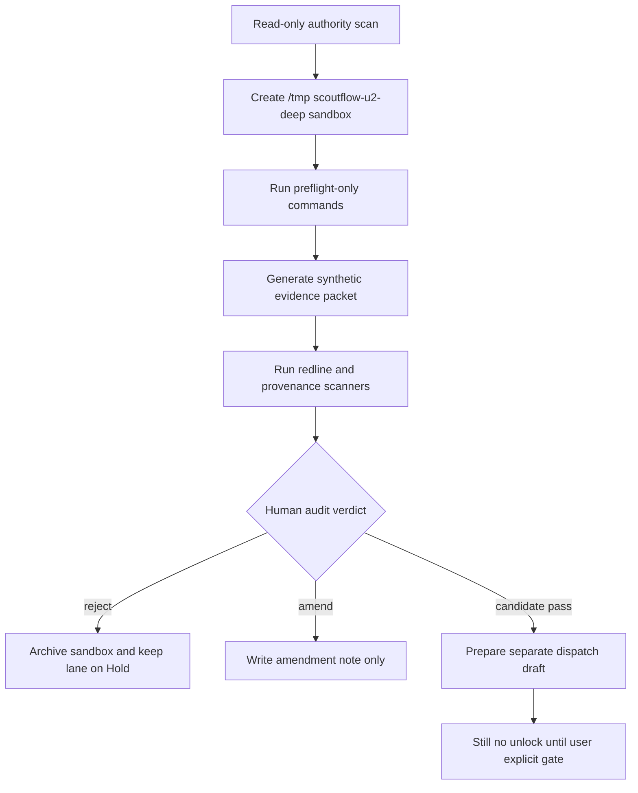

# LANE-5 signal_workbench Spike Commands Deep Supplement 2026-05-07

## §0 Source anchors / 输入锚点

[canonical-project-evidence] Overflow registry v0 keeps all five lanes in Hold and defines separate human gates: `true_write_approval`, `explicit_runtime_approval`, `visual_verdict`, `explicit_migration_approval`, and `usefulness_verdict`.

[canonical-project-evidence] T-P1A-021 says BBDown live metadata probe is only a future bounded dispatch; raw stdout, credentials, QR, auth sidecar, and URL parameters must stay local-only, and `PlatformResult` must not be emitted when preflight fails.

[canonical-project-evidence] T-P1A-022 says `audio_transcript`, ASR, ffmpeg, worker runtime, model download, and generated transcript artifacts remain blocked; future ASR must preserve raw evidence, segment provenance, timestamp integrity, and human review state.

[canonical-project-evidence] T-P1A-023 says every normalized claim / quote / topic must cite transcript segment provenance; LLM output without segment provenance is an untrusted draft, not a ScoutFlow knowledge artifact.

[canonical-project-evidence] T-P1A-025 says DB vNext is candidate-only, `artifact_assets` remains file authority, new structured tables must index / project artifacts rather than replace the ledger, and migration files remain out of scope.

[canonical-project-evidence] `services/api/scoutflow_api/bridge/config.py` returns `write_enabled=False` both when `SCOUTFLOW_VAULT_ROOT` is absent and when preview is available. This supplement preserves that invariant.

[limitation] Live web browsing is unavailable in this execution environment. The vendor refresh requested by the deep prompt is therefore not represented as live-verified evidence. All vendor status/cost scores are marked `[scoring-candidate]` or `[paste-time-unverified]` and require future live refresh before any dispatch.

## §0.1 Hard boundary restatement

[boundary] This file is candidate research only. It does not approve true vault write, runtime tools, browser automation, DB migration, or full signal workbench.

[boundary] Every command below is a future spike command candidate. It is meant to be pasted into a separately approved sandbox dispatch, not executed as part of this document.

[boundary] Commands intentionally write only to repo-external temp folders such as `/tmp/scoutflow-u2-deep/<lane>/...`; when a command references project files, it is read-only unless explicitly marked as synthetic temp-only.

[boundary] No command changes production code, no command writes `services/api/migrations/**`, and no command changes the Bridge invariant `write_enabled=False`.

## §1 Pass-1 delta from previous ZIP / 前轮浅处定位

[delta] 前轮 signal_workbench playbook 写了 product value，但缺少 topic-card-lite 到 full workbench 的 offline evaluator 命令。
[delta] 前轮没有把 ranking/scoring/recommendation 拆成 evidence density、novelty、actionability、source risk、creator fit 的本地评分 harness。
[delta] 前轮缺少与 DiloFlow / ContentFlow 的 non-coupled handoff schema 检查命令，容易误以为 downstream coupling 是 unlock 条件。

## §2 Sandbox flow / Mermaid

[design-candidate] The future spike flow keeps `signal_workbench` inside a repo-external sandbox until an audit packet exists.



## §3 Spike command inventory / 命令清单

[command-policy] Each command is a spike candidate. The first line of every block sets the sandbox guard. Production writes remain forbidden.

```bash
# [command-candidate C01] declare signal sandbox and absent usefulness verdict
export SF_SPIKE_ROOT=/tmp/scoutflow-u2-deep/lane5-signal-workbench && export SF_SIGNAL_WORKBENCH_APPROVED=0 && mkdir -p "$SF_SPIKE_ROOT"/{fixtures,scoring,logs,packet,graphs}
# [command-candidate C02] write no full workbench marker
printf '%s\n' 'full signal workbench remains future product lane; offline evaluator only' > "$SF_SPIKE_ROOT/NO_SIGNAL_UNLOCK.txt"
# [command-candidate C03] create synthetic topic candidates
cat > "$SF_SPIKE_ROOT/fixtures/topic_candidates.jsonl" <<'JSONL'
{"topic_id":"topic_001","title":"Synthetic topic A","source_segments":["seg_000001"],"supporting_claims":["claim_001"],"score":null,"status":"candidate"}
{"topic_id":"topic_002","title":"Synthetic topic B","source_segments":["seg_000002"],"supporting_claims":["claim_002"],"score":null,"status":"candidate"}
JSONL
# [command-candidate C04] create synthetic claims
cat > "$SF_SPIKE_ROOT/fixtures/claims.jsonl" <<'JSONL'
{"claim_id":"claim_001","text":"Synthetic claim with clear evidence","supporting_segments":["seg_000001"],"confidence":"high","risk_flags":[],"status":"candidate"}
{"claim_id":"claim_002","text":"Synthetic claim with weak evidence","supporting_segments":[],"confidence":"low","risk_flags":["weak_support"],"status":"candidate"}
JSONL
# [command-candidate C05] create synthetic quotes
cat > "$SF_SPIKE_ROOT/fixtures/quotes.jsonl" <<'JSONL'
{"quote_id":"quote_001","text":"synthetic quote","segment_ids":["seg_000001"],"start_ms":0,"end_ms":1000,"status":"candidate"}
JSONL
# [command-candidate C06] create segment fixture
cat > "$SF_SPIKE_ROOT/fixtures/segments.jsonl" <<'JSONL'
{"segment_id":"seg_000001","start_ms":0,"end_ms":1000,"text":"synthetic quote","confidence":0.9,"review_state":"unreviewed"}
{"segment_id":"seg_000002","start_ms":1000,"end_ms":2000,"text":"weak evidence text","confidence":0.4,"review_state":"needs_check"}
JSONL
# [command-candidate C07] provenance validator
python - <<'PY'
import json, pathlib
root=pathlib.Path('/tmp/scoutflow-u2-deep/lane5-signal-workbench')
segments={json.loads(l)['segment_id'] for l in (root/'fixtures/segments.jsonl').read_text().splitlines()}
for l in (root/'fixtures/claims.jsonl').read_text().splitlines():
    c=json.loads(l); print(c['claim_id'], bool(set(c.get('supporting_segments',[])) & segments))
PY
# [command-candidate C08] score evidence density
python - <<'PY'
import json, pathlib
root=pathlib.Path('/tmp/scoutflow-u2-deep/lane5-signal-workbench')
claims={json.loads(l)['claim_id']:json.loads(l) for l in (root/'fixtures/claims.jsonl').read_text().splitlines()}
for l in (root/'fixtures/topic_candidates.jsonl').read_text().splitlines():
    t=json.loads(l); density=sum(1 for cid in t['supporting_claims'] if claims.get(cid,{}).get('supporting_segments'))
    print(t['topic_id'], {'evidence_density': density})
PY
# [command-candidate C09] score source risk
python - <<'PY'
rows=[('topic_001',0.1),('topic_002',0.8)]
for tid,risk in rows: print(tid, {'source_risk': risk, 'candidate_action':'review' if risk>0.5 else 'follow_candidate'})
PY
# [command-candidate C10] score novelty placeholder
python - <<'PY'
# offline placeholder; no embeddings or live corpus
for tid in ['topic_001','topic_002']: print(tid, {'novelty_score_candidate': 0.5})
PY
# [command-candidate C11] score actionability
python - <<'PY'
for tid,claims in [('topic_001',1),('topic_002',0)]: print(tid, {'actionability': min(1, claims/2)})
PY
# [command-candidate C12] score creator fit placeholder
python - <<'PY'
for tid in ['topic_001','topic_002']: print(tid, {'creator_fit_candidate': 'unknown_until_user_profile_authorized'})
PY
# [command-candidate C13] combine scores into candidate table
python - <<'PY' > /tmp/scoutflow-u2-deep/lane5-signal-workbench/scoring/combined-scores.jsonl
import json
scores=[{'topic_id':'topic_001','evidence_density':1,'source_risk':0.1,'novelty':0.5,'actionability':0.5,'recommendation':'follow_candidate'}, {'topic_id':'topic_002','evidence_density':0,'source_risk':0.8,'novelty':0.5,'actionability':0.0,'recommendation':'park_candidate'}]
for s in scores: print(json.dumps(s))
PY
# [command-candidate C14] guard recommendation label
grep -R "follow_candidate\|park_candidate\|reject_candidate" -n "$SF_SPIKE_ROOT/scoring" | tee "$SF_SPIKE_ROOT/logs/recommendation-labels.log"
# [command-candidate C15] verify no final recommendation words
grep -R "recommendation.*approved\|final recommendation" -n "$SF_SPIKE_ROOT" || true
# [command-candidate C16] create temp SQLite FTS index
sqlite3 "$SF_SPIKE_ROOT/scoring/signal.sqlite" "CREATE VIRTUAL TABLE topic_fts USING fts5(topic_id, title, body);"
# [command-candidate C17] insert topic FTS rows
sqlite3 "$SF_SPIKE_ROOT/scoring/signal.sqlite" "INSERT INTO topic_fts VALUES ('topic_001','Synthetic topic A','synthetic quote clear evidence'); INSERT INTO topic_fts VALUES ('topic_002','Synthetic topic B','weak evidence text');"
# [command-candidate C18] query FTS candidate
sqlite3 -json "$SF_SPIKE_ROOT/scoring/signal.sqlite" "SELECT topic_id,title FROM topic_fts WHERE topic_fts MATCH 'synthetic';" > "$SF_SPIKE_ROOT/scoring/fts-query.json"
# [command-candidate C19] local embeddings command shape only
printf '%s\n' 'python embed_local.py --input topic_candidates.jsonl --model local-only # future indexing dispatch only' > "$SF_SPIKE_ROOT/scoring/embedding-command-shape.txt"
# [command-candidate C20] MCP command shape only
printf '%s\n' 'mcp serve signal-workbench --db signal.sqlite # future local-first dispatch only' > "$SF_SPIKE_ROOT/scoring/mcp-command-shape.txt"
# [command-candidate C21] DiloFlow handoff shape fixture
cat > "$SF_SPIKE_ROOT/packet/diloflow-handoff-shape.json" <<'JSON'
{"schema":"scoutflow.signal.handoff.v0.candidate","topic_id":"topic_001","title":"Synthetic topic A","evidence_refs":["claim_001","quote_001"],"status":"candidate"}
JSON
# [command-candidate C22] ContentFlow non-coupling note
printf '%s\n' '[candidate] ContentFlow is reference only; no import, no direct dependency, no production coupling.' > "$SF_SPIKE_ROOT/packet/contentflow-noncoupling.md"
# [command-candidate C23] graph candidate topic relations
cat > "$SF_SPIKE_ROOT/graphs/topic-graph.mmd" <<'MMD'
graph LR
  seg_000001 --> claim_001 --> topic_001
  quote_001 --> topic_001
  seg_000002 --> topic_002
MMD
# [command-candidate C24] detect weak support topics
python - <<'PY'
import json, pathlib
root=pathlib.Path('/tmp/scoutflow-u2-deep/lane5-signal-workbench')
claims={json.loads(l)['claim_id']:json.loads(l) for l in (root/'fixtures/claims.jsonl').read_text().splitlines()}
for l in (root/'fixtures/topic_candidates.jsonl').read_text().splitlines():
    t=json.loads(l); weak=[cid for cid in t['supporting_claims'] if not claims.get(cid,{}).get('supporting_segments')]
    print(t['topic_id'], {'weak_support_claims':weak})
PY
# [command-candidate C25] human review queue fixture
cat > "$SF_SPIKE_ROOT/packet/human-review-queue.jsonl" <<'JSONL'
{"topic_id":"topic_001","review_question":"Is this useful enough to follow?","state":"needs_human_verdict"}
{"topic_id":"topic_002","review_question":"Is weak evidence acceptable?","state":"needs_human_verdict"}
JSONL
# [command-candidate C26] LLM normalization dependency check
python - <<'PY'
print({'requires_segment_provenance': True, 'llm_output_without_segments': 'reject_as_untrusted_draft'})
PY
# [command-candidate C27] risk threshold config fixture
cat > "$SF_SPIKE_ROOT/scoring/risk-thresholds.yml" <<'YAML'
evidence_density_min: 1
source_risk_max: 0.5
novelty_min: 0.2
actionability_min: 0.3
requires_human_verdict: true
YAML
# [command-candidate C28] validate every topic has review state
python - <<'PY'
import json, pathlib
root=pathlib.Path('/tmp/scoutflow-u2-deep/lane5-signal-workbench')
queue=[json.loads(l)['topic_id'] for l in (root/'packet/human-review-queue.jsonl').read_text().splitlines()]
topics=[json.loads(l)['topic_id'] for l in (root/'fixtures/topic_candidates.jsonl').read_text().splitlines()]
assert set(topics)<=set(queue)
print('human_review_queue_ok')
PY
# [command-candidate C29] archive scoring outputs
tar -C /tmp/scoutflow-u2-deep -czf /tmp/scoutflow-u2-deep/lane5-signal-workbench-evidence.tgz lane5-signal-workbench
# [command-candidate C30] hash scoring archive
shasum -a 256 /tmp/scoutflow-u2-deep/lane5-signal-workbench-evidence.tgz 2>/dev/null || sha256sum /tmp/scoutflow-u2-deep/lane5-signal-workbench-evidence.tgz
# [command-candidate C31] write signal packet manifest
python - <<'PY'
from pathlib import Path
import json
root=Path('/tmp/scoutflow-u2-deep/lane5-signal-workbench')
files=sorted(str(p.relative_to(root)) for p in root.rglob('*') if p.is_file())
(root/'packet/packet.json').write_text(json.dumps({'lane':'signal_workbench','status':'candidate','full_workbench_approved':False,'files':files},indent=2))
PY
# [command-candidate C32] cleanup temp SQLite db drill
cp "$SF_SPIKE_ROOT/scoring/signal.sqlite" "$SF_SPIKE_ROOT/scoring/signal.sqlite.backup" && rm "$SF_SPIKE_ROOT/scoring/signal.sqlite" && test -f "$SF_SPIKE_ROOT/scoring/signal.sqlite.backup" && echo 'rollback backup retained'
# [command-candidate C33] final signal stop
echo '[boundary] stop before full ranking/scoring/recommendation product lane until usefulness_verdict + dedicated downstream package' | tee "$SF_SPIKE_ROOT/packet/final-stop.txt"
```

## §4 Evidence packet schema

[evidence-candidate] A future `signal_workbench` spike packet should contain `packet.json`, `commands.log`, `redactions.log`, `sha256.txt`, `diff-summary.md`, `failure-map.md`, and `audit-handoff.md`. The packet is useful only if every artifact is created under the sandbox and every referenced project file is read-only.

[evidence-candidate] Minimum fields for `packet.json`: `lane`, `spike_id`, `dispatch_id`, `operator`, `started_at`, `ended_at`, `sandbox_root`, `project_ref`, `commands_count`, `network_used`, `production_paths_touched`, `redline_scan_result`, `rollback_drill_result`, `human_review_required`.

[evidence-candidate] Acceptance threshold for moving from spike to audit: at least three independent evidence items, no production path writes, no secret material, no raw tool response leakage, and a clearly executable reverse path.

## §5 Review hooks

[audit-candidate] Reviewer should compare commands.log with the declared allowed paths. Any command that writes outside `/tmp/scoutflow-u2-deep` should immediately downgrade the claim to `REJECT` or `V-PASS_WITH_HEAVY_EDIT_REQUIRED`.

[audit-candidate] Reviewer should confirm that every positive result is phrased as “spike evidence exists”, not “lane can be unlocked”. The latter is a claim-label violation.

[audit-candidate] Reviewer should demand a fresh live web refresh before vendor-sensitive runtime/browser/scraper decisions, because this supplement could not browse live web.

## §6 Mini fail-mode linkage

[case-link] Full fail-mode cases are consolidated in `FAIL-MODE-CASE-STUDIES-2026-05-07.md`. This lane file only maps each command group to likely failures and rollback hooks.

[case-link] Command groups that touch path resolution map to `path_escape_blocked`, `artifact_escape`, `ledger_drift`, or `schema_projection_drift`.

[case-link] Command groups that touch external tools map to `tool_missing`, `version_drift`, `parser_drift`, `rate_limited`, `auth_required`, `oom_or_memory_pressure`, or `hallucination_suspected`.

## §7 Time/cost note

[estimate-candidate] The one-dev time estimates in `TIME-COST-ESTIMATION-CROSS-LANE-2026-05-07.md` assume a disciplined spike → audit → dispatch → amendment loop. They are not promises and do not imply any lane should be attempted first.

## §8 Lane-specific interpretation

[interpretation-candidate] Lane-5 is product-value heavy, so its spike should be offline, evidence-grounded, and reversible. The command inventory creates synthetic claims, quotes, segments, topic candidates, and a local scoring harness without claiming any recommendation is final.

[boundary] A score is not an unlock. A `follow_candidate` label is not user instruction. Every candidate action remains queued for human usefulness verdict, and every topic must carry segment / claim / quote provenance.

[quality-bar] Strong evidence includes: provenance validator, weak-support detector, configurable risk thresholds, human review queue, FTS proof in temp SQLite, and a non-coupling note for ContentFlow / DiloFlow style downstream handoff.

[rollback-candidate] Reverse path is simple because outputs are planning artifacts: archive scoring packet, remove temp DB, downgrade all recommendations to `needs_human_verdict`, and keep only the validated evidence references.

## §9 Audit questions for this supplement file

[self-audit-candidate] Does every command line carry a command label and write to `/tmp/scoutflow-u2-deep` or read-only project files?

[self-audit-candidate] Does the command inventory avoid direct unlock language and avoid vendor preference language?

[self-audit-candidate] Does the file preserve the lane's current Hold state and require separate dispatch + explicit user gate?

[self-audit-candidate] Does the file include at least one rollback or cleanup drill, not only a forward path?


## §10 Command group rationale

[rationale-candidate] Commands C01-C06 create a fully synthetic evidence universe: segments, claims, quotes, and topics. This prevents product scoring from depending on live capture or runtime tools.

[rationale-candidate] Commands C07-C13 compute evidence density, source risk, novelty placeholder, actionability, creator fit placeholder, and combined scores. These are separate dimensions so the reviewer can see which dimension caused a recommendation candidate.

[rationale-candidate] Commands C14-C19 guard language and create local-first search. Recommendation labels are deliberately suffixed `_candidate` and FTS runs only in temp SQLite.

[rationale-candidate] Commands C20-C25 define handoff and graph shape without coupling to sibling projects. This lets DiloFlow/ContentFlow remain downstream references rather than hard dependencies.

[rationale-candidate] Commands C26-C33 add weak-support detection, human review queue, thresholds, archive, backup, and final stop. The workbench remains a candidate usefulness loop.

## §11 Signal evidence acceptance bar

[acceptance-candidate] A topic without supporting segments, claims, or quotes should not receive a confident recommendation label.

[acceptance-candidate] A score without `score_basis` should be treated as unreviewable. The user should see evidence density, source risk, novelty, actionability, and fit separately.

[acceptance-candidate] A local-first signal packet should run without external platform calls, without sibling project imports, and without production DB writes.

[acceptance-candidate] The first useful signal workbench does not need perfect ranking. It needs visible uncertainty and a human verdict loop.

## §12 Reviewer adversarial probes

[audit-candidate] Ask whether the workbench can explain why a topic was parked or followed.

[audit-candidate] Ask whether weak evidence can still produce a high score. If yes, thresholds need amendment.

[audit-candidate] Ask whether any source claim is unsupported by segment provenance. If yes, reject that topic.

[audit-candidate] Ask whether downstream handoff is optional JSON rather than direct project coupling.


## §13 Product usefulness guardrails

[usefulness-candidate] The signal workbench should be judged by whether the user can make a better follow/park/reject decision faster. It should not be judged by how sophisticated the scoring model looks.

[usefulness-candidate] A useful first score is transparent and boring: evidence density, source risk, novelty, actionability, and creator fit. A clever opaque score is less useful because it cannot be audited.

[usefulness-candidate] The workbench should avoid creating new capture tasks automatically. Recommendation should end at a human decision queue until a later capture-plan lane is separately approved.

[usefulness-candidate] Weak evidence should be visible. If every topic looks equally confident, the workbench is hiding risk rather than helping the user decide.

## §14 Downstream handoff constraints

[handoff-candidate] DiloFlow can consume a topic only through a simple handoff artifact with title, angle, evidence refs, and status. ScoutFlow should not import DiloFlow code or assume DiloFlow schema authority.

[handoff-candidate] ContentFlow can inspire dimensions such as creator fit or topic engine patterns, but this supplement treats it as reference only. Direct coupling would violate local-first and single-writer discipline.

[handoff-candidate] hermes-agent may later host orchestration or LLM normalization, but Lane-5 should not depend on that sidecar until a separate provider/runtime dispatch exists.

[handoff-candidate] The safest first workbench output is a markdown/JSONL packet that a human can inspect, not a dashboard that hides scoring basis behind UI polish.

