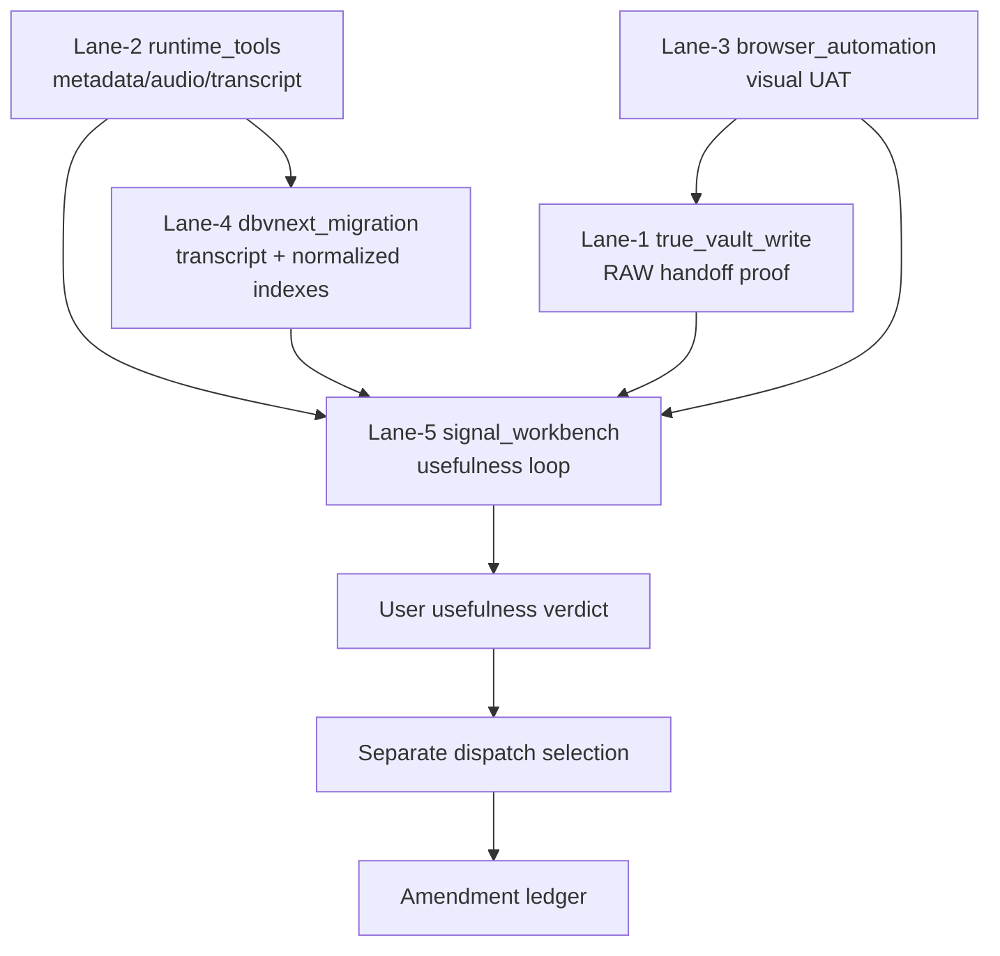

# TIME-COST-ESTIMATION-CROSS-LANE-2026-05-07

## §0 Source anchors / 输入锚点

[canonical-project-evidence] Overflow registry v0 keeps all five lanes in Hold and defines separate human gates: `true_write_approval`, `explicit_runtime_approval`, `visual_verdict`, `explicit_migration_approval`, and `usefulness_verdict`.

[canonical-project-evidence] T-P1A-021 says BBDown live metadata probe is only a future bounded dispatch; raw stdout, credentials, QR, auth sidecar, and URL parameters must stay local-only, and `PlatformResult` must not be emitted when preflight fails.

[canonical-project-evidence] T-P1A-022 says `audio_transcript`, ASR, ffmpeg, worker runtime, model download, and generated transcript artifacts remain blocked; future ASR must preserve raw evidence, segment provenance, timestamp integrity, and human review state.

[canonical-project-evidence] T-P1A-023 says every normalized claim / quote / topic must cite transcript segment provenance; LLM output without segment provenance is an untrusted draft, not a ScoutFlow knowledge artifact.

[canonical-project-evidence] T-P1A-025 says DB vNext is candidate-only, `artifact_assets` remains file authority, new structured tables must index / project artifacts rather than replace the ledger, and migration files remain out of scope.

[canonical-project-evidence] `services/api/scoutflow_api/bridge/config.py` returns `write_enabled=False` both when `SCOUTFLOW_VAULT_ROOT` is absent and when preview is available. This supplement preserves that invariant.

[limitation] Live web browsing is unavailable in this execution environment. The vendor refresh requested by the deep prompt is therefore not represented as live-verified evidence. All vendor status/cost scores are marked `[scoring-candidate]` or `[paste-time-unverified]` and require future live refresh before any dispatch.

## §1 Cross-lane dependency graph

[design-candidate] The graph is a planning model only. It does not mean downstream lanes are blocked forever; it means evidence quality increases when upstream contracts are proven first.

## §2 One-dev time estimates

[estimate-policy] Estimates assume one focused developer, no background async work, no team parallelism, no production migration, no runtime unlock, and no live web refresh available in this environment. Future execution must refresh vendor pricing and legal posture.

| Lane | Spike design | Sandbox spike | Evidence packet | 3-window audit | Dispatch drafting | Amendment/cleanup | Total working days | Claude+GPT budget envelope | Notes |
|---|---:|---:|---:|---:|---:|---:|---:|---:|---|
| Lane-1 true_vault_write | 0.5d | 1.0d | 0.5d | 1.0d | 0.5d | 0.5d | 4.0d | $10-$40 | Path safety and dry-run contract are the core. |
| Lane-2 runtime_tools 2a metadata | 0.5d | 1.5d | 0.5d | 1.0d | 0.5d | 0.5d | 4.5d | $20-$80 | Legal/ToS refresh can dominate. |
| Lane-2 runtime_tools 2c/2d ASR | 1.0d | 2.0d | 1.0d | 1.0d | 0.5d | 0.5d | 6.0d | $30-$120 | Model cache, OOM, hallucination, and review workflow add time. |
| Lane-3 browser_automation | 0.5d | 1.0d | 0.5d | 1.0d | 0.5d | 0.5d | 4.0d | $10-$50 | Keep localhost and screenshot packet first. |
| Lane-4 dbvnext_migration | 1.0d | 1.5d | 1.0d | 1.5d | 1.0d | 0.5d | 6.5d | $20-$80 | Schema and rollback audit matter more than coding speed. |
| Lane-5 signal_workbench | 1.0d | 2.0d | 1.0d | 1.0d | 1.0d | 0.5d | 6.5d | $30-$150 | Product usefulness verdict is the bottleneck. |

## §3 Default sequencing options

[decision-candidate] Risk-low order: Lane-3 screenshot packet → Lane-1 sandbox RAW proof → Lane-5 offline scoring harness → Lane-4 temp DB projection → Lane-2 runtime sub-lane. This minimizes external platform and migration risk.

[decision-candidate] Value-first order: Lane-1 RAW proof → Lane-2 metadata-only → Lane-5 signal harness → Lane-4 projection → Lane-3 visual UAT. This produces a more tangible user workflow faster but has higher external-tool dependency.

[decision-candidate] Evidence-first order: Lane-4 temp DB projection → Lane-5 offline scoring → Lane-1 dry-run RAW → Lane-3 visual packet → Lane-2 runtime. This emphasizes schema/provenance before tool execution.

[default-candidate] The default recommended order for audit discussion is risk-low order because it preserves the current project discipline: no runtime by default, no migration by default, no true write by default.

## §4 Cost model caveats

[limitation] The dollar envelopes are model-assistance budgets, not vendor bills. They do not include commercial scraper subscriptions, cloud ASR pricing, proxy bandwidth, legal review, or the opportunity cost of platform drift.

[limitation] Live pricing could change after the prior prompt evidence. Future dispatch must refresh price pages and archive date-stamped snapshots before picking any commercial vendor.

[limitation] The estimates assume a single developer can focus for whole days. Fragmented attention increases context-switch cost, especially for Lane-2 and Lane-4.

## §5 Cross-lane synergy and conflict

[synergy-candidate] Lane-1 plus Lane-5 creates the clearest user-facing loop: capture preview becomes RAW candidate note, and signal workbench decides follow/park/reject. However, signal output without provenance can pollute RAW, so Lane-5 should not feed real RAW until Lane-1 reverse path is proven.

[synergy-candidate] Lane-2 plus Lane-4 improves transcript and normalized artifact indexing, but it also couples runtime volatility to schema authority. The safer path is to use synthetic ASR artifacts in Lane-4 before live runtime artifacts exist.

[synergy-candidate] Lane-3 reduces blind frontend confidence. It is useful before Lane-1 true write because it can verify the user sees dry-run and Hold states correctly.

[conflict-candidate] Lane-2 browser/platform scraping and Lane-3 browser automation can conflict if both touch external sites. They should not be combined in one dispatch. Browser automation should remain localhost visual proof unless separately approved.

[conflict-candidate] Lane-4 migration and Lane-5 workbench can conflict if product scoring demands premature schema columns. Lane-5 should first use JSONL/temp SQLite so Lane-4 can remain narrow and auditable.

## §6 Lane-by-lane estimate detail

### Lane-1 true_vault_write

[estimate-candidate] Lane-1 can be relatively short because the future spike is mostly deterministic file rendering, path normalization, frontmatter validation, dry-run response verification, and rollback rehearsal. The hard part is not coding; it is proving that no real RAW contamination can occur.

[estimate-candidate] Main uncertainty: whether the future RAW SoR expects naming, tags, or frontmatter variants not represented by `raw_4_field`. If the RAW format changes, add 0.5-1 day for schema reconciliation.

### Lane-2 runtime_tools

[estimate-candidate] Lane-2 is the widest lane. A metadata-only spike can be 4-5 working days, but an audio + ASR chain can easily become 6-8 working days because it needs media artifact receipt, ffmpeg normalization, ASR preflight, model cache, timestamp validation, hallucination review, and cleanup prompt design.

[estimate-candidate] Main uncertainty: live legal/ToS/CVE refresh. Because live web was unavailable here, the future operator must budget time for evidence gathering before running any real platform probe.

### Lane-3 browser_automation

[estimate-candidate] Lane-3 can be short if it remains a localhost screenshot packet. It becomes much larger if agentic browser tools are introduced because action safety, profile isolation, and external network policy must be audited.

[estimate-candidate] Main uncertainty: UI stability. If selectors are unstable or visual state labels are unclear, the screenshot packet may need a UI contract amendment before automation is useful.

### Lane-4 dbvnext_migration

[estimate-candidate] Lane-4 is governance-heavy. The temp SQLite spike can be quick, but migration approval requires schema authority reconciliation, external audit, a single PR, and rollback plan. This is why its estimate is larger than the amount of SQL suggests.

[estimate-candidate] Main uncertainty: whether `claims`, `quotes`, and `topic_candidates` should be tables or derived views. Choosing too many tables early increases migration burden.

### Lane-5 signal_workbench

[estimate-candidate] Lane-5 is product-proof heavy. The scoring harness can be built quickly, but usefulness verdict takes time because the user must inspect whether follow/park/reject outputs actually reduce decision friction.

[estimate-candidate] Main uncertainty: whether transcript/runtime evidence exists. Without Lane-2 transcripts, Lane-5 can still use synthetic or metadata-only evidence, but its product value is lower.

## §7 Budget guardrails

[budget-candidate] Keep the first supplement-to-spike cycle under a small model-assistance budget by using synthetic fixtures and local validators. Spend model calls on audit reasoning, not generating large ungrounded recommendations.

[budget-candidate] Do not pay for commercial scraper/ASR/proxy services during a research spike unless a separate dispatch explicitly scopes the spend, retention policy, credentials, and evidence storage.

[budget-candidate] If a lane estimate exceeds 8 working days for one developer, split the lane into a narrower dispatch. Lane-2 especially should be split by sub-lane.

## §8 Decision checkpoint templates

[decision-candidate] After Lane-1 spike: “Did we prove deterministic sandbox RAW rendering and rollback?” If yes, next best step may be human-reviewed RAW handoff proof, not true write.

[decision-candidate] After Lane-2 metadata spike: “Did metadata-only evidence arrive without raw stdout, credentials, or media?” If yes, decide whether transcript value is worth the extra ASR complexity.

[decision-candidate] After Lane-3 screenshot spike: “Did visual evidence catch state labels and Trust Trace?” If yes, decide whether browser automation adds enough value beyond manual screenshot packet.

[decision-candidate] After Lane-4 temp DB spike: “Did derived tables improve queryability without replacing artifact authority?” If yes, draft a narrow migration dispatch.

[decision-candidate] After Lane-5 scoring spike: “Did the user make faster follow/park/reject decisions?” If no, do not unlock a larger workbench regardless of technical success.

## §9 Practical planning calendar

[calendar-candidate] A conservative two-week plan could run Lane-3 screenshot packet in days 1-2, Lane-1 sandbox RAW proof in days 3-5, and Lane-5 offline scoring in days 6-10. Lane-2 and Lane-4 would stay in research until the first three packets are audited.

[calendar-candidate] A value-first two-week plan could run Lane-1 in days 1-4, Lane-2 metadata-only in days 5-8, and Lane-5 in days 9-10 as a narrow metadata-derived signal demo. This plan has higher legal/vendor uncertainty because Lane-2 needs live refresh.

[calendar-candidate] A schema-first two-week plan could run Lane-4 temp DB in days 1-5 and Lane-5 synthetic scoring in days 6-10. This creates strong provenance discipline but delays user-visible RAW value.

[calendar-candidate] None of these plans should combine browser automation, runtime probing, and migration in one PR. Combining lanes makes audit harder and increases the chance that a Hold lane is unlocked by implication.

## §10 Go/no-go metrics

[metric-candidate] Lane-1 go/no-go: zero path escapes, deterministic target path, dry-run false commit state, successful cleanup restore, and human acceptance of RAW note shape.

[metric-candidate] Lane-2 go/no-go: one sub-lane only, no raw stdout leakage, no credentials, no media download unless explicitly scoped, and current live vendor/legal refresh.

[metric-candidate] Lane-3 go/no-go: localhost-only target, isolated profile, text assertions, screenshot hash, trace archive, and human visual verdict.

[metric-candidate] Lane-4 go/no-go: temp DB only, replay-safe keys, explicit supersession, dump/restore proof, and no production migration file.

[metric-candidate] Lane-5 go/no-go: every recommendation candidate has provenance, score basis is visible, weak support is flagged, and user usefulness verdict is recorded.

## §11 Cost of delay

[opportunity-cost] Deferring Lane-1 delays real RAW intake and downstream DiloFlow handoff. The cost is product friction, not runtime risk.

[opportunity-cost] Deferring Lane-2 delays transcript depth and rich content understanding. The cost is weaker signal quality, but the benefit is lower platform/legal exposure.

[opportunity-cost] Deferring Lane-3 delays visual confidence. The cost is continued reliance on manual or synthetic UAT.

[opportunity-cost] Deferring Lane-4 delays queryable structured artifacts. The cost is weaker search/ranking infrastructure, but the benefit is avoiding premature schema lock-in.

[opportunity-cost] Deferring Lane-5 delays the product payoff. The cost is that ScoutFlow remains capture-heavy and decision-light; the benefit is avoiding unsupported recommendations.

## §12 Dispatch splitting rule

[planning-candidate] If the next step is Lane-2, split by sub-lane: BBDown metadata-only, yt-dlp metadata-only, ffmpeg audio normalization, and ASR transcript should each have separate proof packets. Combining them creates a false sense of “runtime lane ready”.

[planning-candidate] If the next step is Lane-4, split by table family: transcript projection first, normalized docs second, claims/quotes/topics later. This reduces migration blast radius.

[planning-candidate] If the next step is Lane-5, split product proof from persistence. An offline scoring packet can prove usefulness before any DB columns or UI routes are added.

[planning-candidate] If the next step is Lane-3, split screenshot packet from automation. Screenshot packet can use a real browser in a tightly scoped way; automation flows and agentic actions require a higher bar.

## §13 Minimum audit meeting agenda

[audit-agenda] Minute 0-5: confirm the lane remains Hold and list the exact human gate required.

[audit-agenda] Minute 5-10: review allowed paths and command log. Any production write outside scope ends the audit.

[audit-agenda] Minute 10-15: review evidence packet, hashes, redactions, and negative fixtures.

[audit-agenda] Minute 15-20: review fail-mode case coverage and rollback drills.

[audit-agenda] Minute 20-25: decide verdict level: pass, pass with amendments, heavy edit, or reject.

[audit-agenda] Minute 25-30: write amendment ledger entry and next dispatch recommendation, if any.

## §14 Estimate confidence

[confidence-candidate] Lane-1 estimate confidence is medium-high because the work is deterministic and local.

[confidence-candidate] Lane-2 estimate confidence is low-medium because live vendor/legal evidence is missing and platform behavior can drift.

[confidence-candidate] Lane-3 estimate confidence is medium because localhost visual proof is bounded, but framework setup can vary by machine.

[confidence-candidate] Lane-4 estimate confidence is medium because temp DB proof is easy but authority review is strict.

[confidence-candidate] Lane-5 estimate confidence is medium-low because product usefulness depends on user judgment, not only technical completion.

## §15 Final planning note

[planning-candidate] The most realistic near-term move is not to “unlock Phase 2”. It is to choose one small evidence packet whose failure is safe: Lane-1 sandbox RAW proof, Lane-3 screenshot packet, or Lane-5 offline scoring. Each can produce learning without touching runtime vendors, migrations, or real external platforms.

[planning-candidate] Lane-2 and Lane-4 can still be researched in parallel on paper, but they should not be the first live execution unless the user explicitly prioritizes transcript depth or schema authority over risk minimization.

[planning-candidate] The safest portfolio is one lane per dispatch, one evidence packet per lane, and one amendment ledger entry per verdict.
