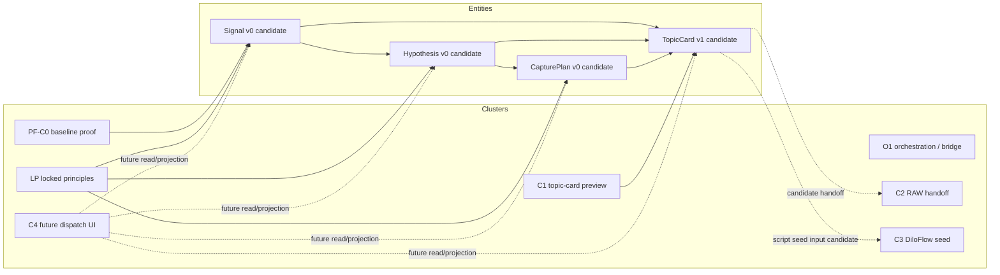

# CLUSTER-ENTITY-TRACE-MAP-2026-05-07

[canonical] This trace map links the four candidate entities to seven work clusters: PF-C0, O1, LP, C1, C2, C3, and C4. It is a coordination artifact, not an execution plan.
[candidate] Trace verbs are produce, read, mutate, archive, or block. A cluster can read a candidate entity without owning it. Authority remains unresolved until a future amendment and unlock.

## §1 4 entity × 7 cluster trace table

| Entity | Cluster | Produce / read / mutate / archive trace | Boundary |
|---|---|---|---|
| [candidate] Signal | [candidate] PF-C0 | [candidate] read metadata-only proof; may produce observation fixtures from capture/trust trace | [canonical] not-authority / not-runtime / not-migration |
| [candidate] Signal | [candidate] O1 | [candidate] read bridge/vault preview warnings as process signals; no worker mutation | [canonical] not-authority / not-runtime / not-migration |
| [candidate] Signal | [candidate] LP | [candidate] blocked from direct capture expansion by LP-001; single writer by LP-006 | [canonical] not-authority / not-runtime / not-migration |
| [candidate] Signal | [candidate] C1 | [candidate] read by topic-card preview to explain evidence/counter-evidence | [canonical] not-authority / not-runtime / not-migration |
| [candidate] Signal | [candidate] C2 | [candidate] project into RAW note candidate only as source observation summary | [canonical] not-authority / not-runtime / not-migration |
| [candidate] Signal | [candidate] C3 | [candidate] read indirectly through TopicCard; no DiloFlow write | [canonical] not-authority / not-runtime / not-migration |
| [candidate] Signal | [candidate] C4 | [candidate] future workbench projection candidate; archive allowed only by user review | [canonical] not-authority / not-runtime / not-migration |
| [candidate] Hypothesis | [candidate] PF-C0 | [candidate] not produced by baseline, but can read evidence from PF-C0 artifacts | [canonical] not-authority / not-runtime / not-migration |
| [candidate] Hypothesis | [candidate] O1 | [candidate] may be proposed by orchestration candidate, but prompt logic is not API authority | [canonical] not-authority / not-runtime / not-migration |
| [candidate] Hypothesis | [candidate] LP | [candidate] must pass user verdict before plan; cannot create capture directly | [canonical] not-authority / not-runtime / not-migration |
| [candidate] Hypothesis | [candidate] C1 | [candidate] topic-card preview uses hypothesisSummary, needs_edit, and counterNote | [canonical] not-authority / not-runtime / not-migration |
| [candidate] Hypothesis | [candidate] C2 | [candidate] RAW receives only candidate claim posture; RAW compile decides knowledge acceptance | [canonical] not-authority / not-runtime / not-migration |
| [candidate] Hypothesis | [candidate] C3 | [candidate] DiloFlow may consume as script angle candidate after TopicCard handoff | [canonical] not-authority / not-runtime / not-migration |
| [candidate] Hypothesis | [candidate] C4 | [candidate] future comparison UX reads support/counter/neutral; reject triggers cascade suspend | [canonical] not-authority / not-runtime / not-migration |
| [candidate] CapturePlan | [candidate] PF-C0 | [candidate] not produced by PF-C0; references metadata-only capture constraints | [canonical] not-authority / not-runtime / not-migration |
| [candidate] CapturePlan | [candidate] O1 | [candidate] orchestration may draft schedule policy but no scheduler is approved | [canonical] not-authority / not-runtime / not-migration |
| [candidate] CapturePlan | [candidate] LP | [candidate] LP-001 is the main gate; raw_gap/recommendation/keyword cannot direct capture | [canonical] not-authority / not-runtime / not-migration |
| [candidate] CapturePlan | [candidate] C1 | [candidate] read by TopicCard v1 as future active capture context | [canonical] not-authority / not-runtime / not-migration |
| [candidate] CapturePlan | [candidate] C2 | [candidate] RAW can see next_action but cannot treat plan as ScoutFlow job | [canonical] not-authority / not-runtime / not-migration |
| [candidate] CapturePlan | [candidate] C3 | [candidate] DiloFlow can receive capture_plan output as story pipeline context only | [canonical] not-authority / not-runtime / not-migration |
| [candidate] CapturePlan | [candidate] C4 | [candidate] future dispatch UI may mutate state if and only if authority lane unlocks | [canonical] not-authority / not-runtime / not-migration |
| [candidate] TopicCard | [candidate] PF-C0 | [candidate] derived from capture and preview proof; not produced by baseline capture API | [canonical] not-authority / not-runtime / not-migration |
| [candidate] TopicCard | [candidate] O1 | [candidate] bridge/vault preview contributes target_path/frontmatter; write remains disabled | [canonical] not-authority / not-runtime / not-migration |
| [candidate] TopicCard | [candidate] LP | [candidate] must preserve single-writer/SoR and no true RAW write | [canonical] not-authority / not-runtime / not-migration |
| [candidate] TopicCard | [candidate] C1 | [candidate] primary produce/read surface: lite v0 and v1 review card | [canonical] not-authority / not-runtime / not-migration |
| [candidate] TopicCard | [candidate] C2 | [candidate] ScoutFlow→RAW handoff candidate; RAW owns intake/compile | [canonical] not-authority / not-runtime / not-migration |
| [candidate] TopicCard | [candidate] C3 | [candidate] ScoutFlow→DiloFlow script_seed input candidate; execution not approved | [canonical] not-authority / not-runtime / not-migration |
| [candidate] TopicCard | [candidate] C4 | [candidate] future dispatch dashboard reads cards and archives/returns for edit | [canonical] not-authority / not-runtime / not-migration |

## §2 Cross-cluster invariants

[candidate] PF-C0 owns the narrow metadata proof baseline; it does not own Phase 2 entity promotion.
[candidate] O1 can coordinate preview shape but cannot become a hidden writer or prompt authority.
[candidate] LP rules apply before every cluster-specific enthusiasm; LP-001 and LP-006 are the dominant safety constraints.
[candidate] C1 is the strongest TopicCard producer surface, but C1 proof also showed all three useful cards still needed edit, so usefulness inflation remains a live risk.
[candidate] C2 receives candidate material only. RAW intake, compile, and script expansion remain RAW-side decisions.
[candidate] C3 receives candidate script seed context only. DiloFlow execution and channel production are not approved by these contracts.
[candidate] C4 is a future UI/read projection cluster. It may read all four entities, but mutation requires a future authority lane.

## §3 Entity-specific trace conclusion

[candidate] Signal: the safest current stance is fixture-rich, relation-aware, and lifecycle-explicit, while still refusing DB authority. The trace map indicates where Signal can be read today as design input and where mutation must remain blocked.
[candidate] Hypothesis: the safest current stance is fixture-rich, relation-aware, and lifecycle-explicit, while still refusing DB authority. The trace map indicates where Hypothesis can be read today as design input and where mutation must remain blocked.
[candidate] CapturePlan: the safest current stance is fixture-rich, relation-aware, and lifecycle-explicit, while still refusing DB authority. The trace map indicates where CapturePlan can be read today as design input and where mutation must remain blocked.
[candidate] TopicCard: the safest current stance is fixture-rich, relation-aware, and lifecycle-explicit, while still refusing DB authority. The trace map indicates where TopicCard can be read today as design input and where mutation must remain blocked.

## §4 Narrative trace expansion

[candidate] Trace narrative Signal × PF-C0: this cell should be read as a coordination hint, not ownership. The cluster may contribute vocabulary, fixtures, or read projections, but it does not gain authority to mutate Signal unless a future lane explicitly unlocks that mutation. This wording prevents a cluster map from becoming a hidden roadmap commitment.
[candidate] Trace narrative Signal × O1: this cell should be read as a coordination hint, not ownership. The cluster may contribute vocabulary, fixtures, or read projections, but it does not gain authority to mutate Signal unless a future lane explicitly unlocks that mutation. This wording prevents a cluster map from becoming a hidden roadmap commitment.
[candidate] Trace narrative Signal × LP: this cell should be read as a coordination hint, not ownership. The cluster may contribute vocabulary, fixtures, or read projections, but it does not gain authority to mutate Signal unless a future lane explicitly unlocks that mutation. This wording prevents a cluster map from becoming a hidden roadmap commitment.
[candidate] Trace narrative Signal × C1: this cell should be read as a coordination hint, not ownership. The cluster may contribute vocabulary, fixtures, or read projections, but it does not gain authority to mutate Signal unless a future lane explicitly unlocks that mutation. This wording prevents a cluster map from becoming a hidden roadmap commitment.
[candidate] Trace narrative Signal × C2: this cell should be read as a coordination hint, not ownership. The cluster may contribute vocabulary, fixtures, or read projections, but it does not gain authority to mutate Signal unless a future lane explicitly unlocks that mutation. This wording prevents a cluster map from becoming a hidden roadmap commitment.
[candidate] Trace narrative Signal × C3: this cell should be read as a coordination hint, not ownership. The cluster may contribute vocabulary, fixtures, or read projections, but it does not gain authority to mutate Signal unless a future lane explicitly unlocks that mutation. This wording prevents a cluster map from becoming a hidden roadmap commitment.
[candidate] Trace narrative Signal × C4: this cell should be read as a coordination hint, not ownership. The cluster may contribute vocabulary, fixtures, or read projections, but it does not gain authority to mutate Signal unless a future lane explicitly unlocks that mutation. This wording prevents a cluster map from becoming a hidden roadmap commitment.
[candidate] Trace narrative Hypothesis × PF-C0: this cell should be read as a coordination hint, not ownership. The cluster may contribute vocabulary, fixtures, or read projections, but it does not gain authority to mutate Hypothesis unless a future lane explicitly unlocks that mutation. This wording prevents a cluster map from becoming a hidden roadmap commitment.
[candidate] Trace narrative Hypothesis × O1: this cell should be read as a coordination hint, not ownership. The cluster may contribute vocabulary, fixtures, or read projections, but it does not gain authority to mutate Hypothesis unless a future lane explicitly unlocks that mutation. This wording prevents a cluster map from becoming a hidden roadmap commitment.
[candidate] Trace narrative Hypothesis × LP: this cell should be read as a coordination hint, not ownership. The cluster may contribute vocabulary, fixtures, or read projections, but it does not gain authority to mutate Hypothesis unless a future lane explicitly unlocks that mutation. This wording prevents a cluster map from becoming a hidden roadmap commitment.
[candidate] Trace narrative Hypothesis × C1: this cell should be read as a coordination hint, not ownership. The cluster may contribute vocabulary, fixtures, or read projections, but it does not gain authority to mutate Hypothesis unless a future lane explicitly unlocks that mutation. This wording prevents a cluster map from becoming a hidden roadmap commitment.
[candidate] Trace narrative Hypothesis × C2: this cell should be read as a coordination hint, not ownership. The cluster may contribute vocabulary, fixtures, or read projections, but it does not gain authority to mutate Hypothesis unless a future lane explicitly unlocks that mutation. This wording prevents a cluster map from becoming a hidden roadmap commitment.
[candidate] Trace narrative Hypothesis × C3: this cell should be read as a coordination hint, not ownership. The cluster may contribute vocabulary, fixtures, or read projections, but it does not gain authority to mutate Hypothesis unless a future lane explicitly unlocks that mutation. This wording prevents a cluster map from becoming a hidden roadmap commitment.
[candidate] Trace narrative Hypothesis × C4: this cell should be read as a coordination hint, not ownership. The cluster may contribute vocabulary, fixtures, or read projections, but it does not gain authority to mutate Hypothesis unless a future lane explicitly unlocks that mutation. This wording prevents a cluster map from becoming a hidden roadmap commitment.
[candidate] Trace narrative CapturePlan × PF-C0: this cell should be read as a coordination hint, not ownership. The cluster may contribute vocabulary, fixtures, or read projections, but it does not gain authority to mutate CapturePlan unless a future lane explicitly unlocks that mutation. This wording prevents a cluster map from becoming a hidden roadmap commitment.
[candidate] Trace narrative CapturePlan × O1: this cell should be read as a coordination hint, not ownership. The cluster may contribute vocabulary, fixtures, or read projections, but it does not gain authority to mutate CapturePlan unless a future lane explicitly unlocks that mutation. This wording prevents a cluster map from becoming a hidden roadmap commitment.
[candidate] Trace narrative CapturePlan × LP: this cell should be read as a coordination hint, not ownership. The cluster may contribute vocabulary, fixtures, or read projections, but it does not gain authority to mutate CapturePlan unless a future lane explicitly unlocks that mutation. This wording prevents a cluster map from becoming a hidden roadmap commitment.
[candidate] Trace narrative CapturePlan × C1: this cell should be read as a coordination hint, not ownership. The cluster may contribute vocabulary, fixtures, or read projections, but it does not gain authority to mutate CapturePlan unless a future lane explicitly unlocks that mutation. This wording prevents a cluster map from becoming a hidden roadmap commitment.
[candidate] Trace narrative CapturePlan × C2: this cell should be read as a coordination hint, not ownership. The cluster may contribute vocabulary, fixtures, or read projections, but it does not gain authority to mutate CapturePlan unless a future lane explicitly unlocks that mutation. This wording prevents a cluster map from becoming a hidden roadmap commitment.
[candidate] Trace narrative CapturePlan × C3: this cell should be read as a coordination hint, not ownership. The cluster may contribute vocabulary, fixtures, or read projections, but it does not gain authority to mutate CapturePlan unless a future lane explicitly unlocks that mutation. This wording prevents a cluster map from becoming a hidden roadmap commitment.
[candidate] Trace narrative CapturePlan × C4: this cell should be read as a coordination hint, not ownership. The cluster may contribute vocabulary, fixtures, or read projections, but it does not gain authority to mutate CapturePlan unless a future lane explicitly unlocks that mutation. This wording prevents a cluster map from becoming a hidden roadmap commitment.
[candidate] Trace narrative TopicCard × PF-C0: this cell should be read as a coordination hint, not ownership. The cluster may contribute vocabulary, fixtures, or read projections, but it does not gain authority to mutate TopicCard unless a future lane explicitly unlocks that mutation. This wording prevents a cluster map from becoming a hidden roadmap commitment.
[candidate] Trace narrative TopicCard × O1: this cell should be read as a coordination hint, not ownership. The cluster may contribute vocabulary, fixtures, or read projections, but it does not gain authority to mutate TopicCard unless a future lane explicitly unlocks that mutation. This wording prevents a cluster map from becoming a hidden roadmap commitment.
[candidate] Trace narrative TopicCard × LP: this cell should be read as a coordination hint, not ownership. The cluster may contribute vocabulary, fixtures, or read projections, but it does not gain authority to mutate TopicCard unless a future lane explicitly unlocks that mutation. This wording prevents a cluster map from becoming a hidden roadmap commitment.
[candidate] Trace narrative TopicCard × C1: this cell should be read as a coordination hint, not ownership. The cluster may contribute vocabulary, fixtures, or read projections, but it does not gain authority to mutate TopicCard unless a future lane explicitly unlocks that mutation. This wording prevents a cluster map from becoming a hidden roadmap commitment.
[candidate] Trace narrative TopicCard × C2: this cell should be read as a coordination hint, not ownership. The cluster may contribute vocabulary, fixtures, or read projections, but it does not gain authority to mutate TopicCard unless a future lane explicitly unlocks that mutation. This wording prevents a cluster map from becoming a hidden roadmap commitment.
[candidate] Trace narrative TopicCard × C3: this cell should be read as a coordination hint, not ownership. The cluster may contribute vocabulary, fixtures, or read projections, but it does not gain authority to mutate TopicCard unless a future lane explicitly unlocks that mutation. This wording prevents a cluster map from becoming a hidden roadmap commitment.
[candidate] Trace narrative TopicCard × C4: this cell should be read as a coordination hint, not ownership. The cluster may contribute vocabulary, fixtures, or read projections, but it does not gain authority to mutate TopicCard unless a future lane explicitly unlocks that mutation. This wording prevents a cluster map from becoming a hidden roadmap commitment.

## §5 Cluster risk notes

[candidate] PF-C0 risk note: the cluster becomes unsafe if it turns candidate read access into writer authority. The mitigation is to keep produce/read/mutate/archive verbs explicit, require user verdict gates for hypothesis-to-plan transitions, and preserve RAW/DiloFlow as downstream consumers rather than ScoutFlow-owned write targets.
[candidate] O1 risk note: the cluster becomes unsafe if it turns candidate read access into writer authority. The mitigation is to keep produce/read/mutate/archive verbs explicit, require user verdict gates for hypothesis-to-plan transitions, and preserve RAW/DiloFlow as downstream consumers rather than ScoutFlow-owned write targets.
[candidate] LP risk note: the cluster becomes unsafe if it turns candidate read access into writer authority. The mitigation is to keep produce/read/mutate/archive verbs explicit, require user verdict gates for hypothesis-to-plan transitions, and preserve RAW/DiloFlow as downstream consumers rather than ScoutFlow-owned write targets.
[candidate] C1 risk note: the cluster becomes unsafe if it turns candidate read access into writer authority. The mitigation is to keep produce/read/mutate/archive verbs explicit, require user verdict gates for hypothesis-to-plan transitions, and preserve RAW/DiloFlow as downstream consumers rather than ScoutFlow-owned write targets.
[candidate] C2 risk note: the cluster becomes unsafe if it turns candidate read access into writer authority. The mitigation is to keep produce/read/mutate/archive verbs explicit, require user verdict gates for hypothesis-to-plan transitions, and preserve RAW/DiloFlow as downstream consumers rather than ScoutFlow-owned write targets.
[candidate] C3 risk note: the cluster becomes unsafe if it turns candidate read access into writer authority. The mitigation is to keep produce/read/mutate/archive verbs explicit, require user verdict gates for hypothesis-to-plan transitions, and preserve RAW/DiloFlow as downstream consumers rather than ScoutFlow-owned write targets.
[candidate] C4 risk note: the cluster becomes unsafe if it turns candidate read access into writer authority. The mitigation is to keep produce/read/mutate/archive verbs explicit, require user verdict gates for hypothesis-to-plan transitions, and preserve RAW/DiloFlow as downstream consumers rather than ScoutFlow-owned write targets.
