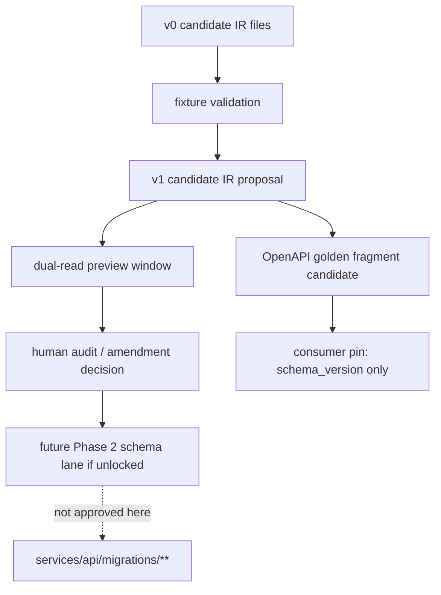
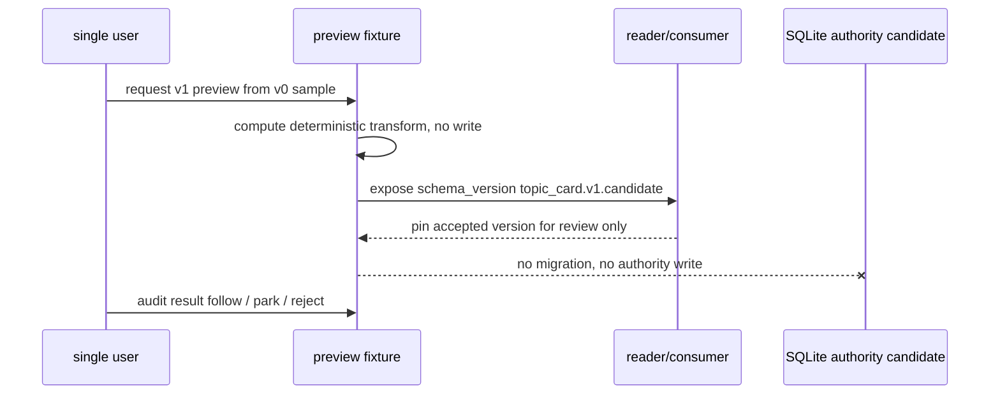

# MIGRATION-V0-TO-V1-WORKED-EXAMPLES-2026-05-07

[canonical] This file is a worked-example supplement only. It describes how a reviewer could reason about v0 to v1 shape evolution for Signal, Hypothesis, CapturePlan, and TopicCard without approving a database migration.
[candidate] The PRD/SRD base keeps these entities in Phase 2+ outline; therefore every SQL block below is candidate DDL for design review, not a migration file and not a services/api/migrations/** instruction.
[candidate] The single-user simplification is intentional: instead of enterprise dual-write with many services, the safer path is a dual-read preview window inside one local application, with consumer pins expressed as local config or fixture version fields.
[candidate] The migration goal is not to make the entities authoritative. It is to reduce ambiguity for future amendment drafting, OpenAPI examples, and referential integrity tests.

## §1 Two-level migration mental model


[candidate] The important gate is between candidate IR and future Phase 2 schema lane. This supplement never crosses that gate. A reviewer may accept the worked example as design input while rejecting any runtime or migration action.


## §2 Signal v0 → v1 worked example

[candidate] Signal v0 already has id, source_capture_id, canonical_url, observation fields, lifecycle state, and claim labels. The weakness is that validation provenance and duplicate semantics are too distributed. Signal v1 candidate would make source identity, validation verdict, and dedupe version first-class IR fields.
```json
{
  "before_signal_v0": {
    "id": "sig_01HR7S6A7F3Z9N2X4M8Q1V0A01",
    "source_capture_id": "cap_u3_01_sEah",
    "canonical_url": "https://www.bilibili.com/video/BV16ooQBsEah/",
    "observation_kind": "preview_usefulness",
    "observation_text": "metadata-only preview is present but needs edit",
    "lifecycle_state": "observed"
  },
  "after_signal_v1_candidate": {
    "id": "sig_01HR7S6A7F3Z9N2X4M8Q1V0A01",
    "schema_version": "signal.v1.candidate",
    "source": {
      "capture_id": "cap_u3_01_sEah",
      "platform": "bilibili",
      "platform_item_id": "BV16ooQBsEah",
      "canonical_url": "https://www.bilibili.com/video/BV16ooQBsEah/",
      "author_display_name": "UNKNOWN_NOT_LIVE_VERIFIED"
    },
    "observation": {
      "kind": "preview_usefulness",
      "text": "metadata-only preview is present but needs edit",
      "value": "needs_edit",
      "unit": "human_verdict_label"
    },
    "validation": {
      "verdict": "not_live_verified",
      "validated_by": "single_user_or_fixture",
      "validated_at": null
    },
    "dedupe": {
      "dedupe_key": "bilibili:BV16ooQBsEah:signal:preview_usefulness",
      "dedupe_key_version": "v1"
    },
    "lifecycle_state": "observed"
  }
}
```
```sql
-- [candidate] Signal v1 design input only; migration_approval: not-approved.
-- [candidate] Do not place this under services/api/migrations/** without a future unlock.
ALTER TABLE candidate_signals ADD COLUMN source_json TEXT;            -- candidate only
ALTER TABLE candidate_signals ADD COLUMN observation_json TEXT;       -- candidate only
ALTER TABLE candidate_signals ADD COLUMN validation_json TEXT;        -- candidate only
ALTER TABLE candidate_signals ADD COLUMN dedupe_key_version TEXT;     -- candidate only
CREATE UNIQUE INDEX IF NOT EXISTS idx_candidate_signals_dedupe_v1
  ON candidate_signals(dedupe_key, dedupe_key_version);
```
[candidate] Signal dual-read window: a preview reader first checks `source_json` and `observation_json`; if absent, it falls back to v0 flat fields. The consumer pin is `signal.v0.candidate` or `signal.v1.candidate`, stored in fixture metadata rather than DB authority.

## §3 Hypothesis v0 → v1 worked example

[candidate] Hypothesis v0 expresses a testable claim and relation arrays. Hypothesis v1 candidate should strengthen conflict handling and user verdict history so that a rejected hypothesis can suspend linked capture plans without deleting evidence.
```json
{
  "before_hypothesis_v0": {
    "id": "hyp_01HR7S6A7F3Z9N2X4M8Q1V0A01",
    "claim_text": "Preview usefulness is plausible only if counter evidence stays visible.",
    "support_signal_ids": [
      "sig_A",
      "sig_B"
    ],
    "counter_signal_ids": [
      "sig_C"
    ],
    "user_verdict": "needs_edit"
  },
  "after_hypothesis_v1_candidate": {
    "id": "hyp_01HR7S6A7F3Z9N2X4M8Q1V0A01",
    "schema_version": "hypothesis.v1.candidate",
    "claim": {
      "text": "Preview usefulness is plausible only if counter evidence stays visible.",
      "test_method": "human_usefulness_verdict_plus_edit_cost"
    },
    "evidence_balance": {
      "support": [
        "sig_A",
        "sig_B"
      ],
      "counter": [
        "sig_C"
      ],
      "neutral": [],
      "conflict_policy": "surface_before_plan"
    },
    "verdict": {
      "current": "needs_edit",
      "history": [
        {
          "verdict": "needs_edit",
          "reason": "title/tags too thin",
          "at": "2026-05-07T00:00:00+08:00"
        }
      ]
    },
    "plan_cascade": {
      "on_reject": "suspend_linked_capture_plans",
      "on_archive": "keep_read_projection"
    }
  }
}
```
```sql
-- [candidate] Hypothesis v1 design input only; migration_approval: not-approved.
ALTER TABLE candidate_hypotheses ADD COLUMN claim_json TEXT;
ALTER TABLE candidate_hypotheses ADD COLUMN evidence_balance_json TEXT;
ALTER TABLE candidate_hypotheses ADD COLUMN verdict_json TEXT;
ALTER TABLE candidate_hypotheses ADD COLUMN plan_cascade_json TEXT;
CREATE INDEX IF NOT EXISTS idx_candidate_hypotheses_verdict
  ON candidate_hypotheses(lifecycle_state, user_verdict);
```
[candidate] Hypothesis dual-read window: v1 readers compute support/counter/neutral from `evidence_balance_json`; v0 readers retain flat relation arrays. No writer should update both shapes as separate truth; the transform must be deterministic and preview-only until an authority lane is unlocked.

## §4 CapturePlan v0 → v1 worked example

[candidate] CapturePlan v0 contains future capture orchestration. The risky area is that a plan can sound executable. CapturePlan v1 candidate therefore separates `intent`, `scope_guard`, `schedule_policy`, and `rollback_snapshot` and repeats `runtime_approval: not-approved` inside the sample object.
```json
{
  "before_capture_plan_v0": {
    "id": "plan_01HR7S6A7F3Z9N2X4M8Q1V0A01",
    "planned_urls": [
      "https://www.bilibili.com/video/BV16ooQBsEah/"
    ],
    "frequency_policy": "manual_only",
    "enrichment_level": "metadata_only",
    "lifecycle_state": "scoped"
  },
  "after_capture_plan_v1_candidate": {
    "id": "plan_01HR7S6A7F3Z9N2X4M8Q1V0A01",
    "schema_version": "capture_plan.v1.candidate",
    "intent": {
      "reason": "follow hypothesis after human review",
      "source_hypothesis_ids": [
        "hyp_01HR7..."
      ]
    },
    "scope_guard": {
      "lp_001_checked": true,
      "source_kind": "manual_url",
      "blocked_expansions": [
        "recommendation",
        "keyword",
        "raw_gap",
        "playlist",
        "comments"
      ]
    },
    "schedule_policy": {
      "mode": "manual_only",
      "frequency": null,
      "next_run_at": null
    },
    "capture_request_template": {
      "platform": "bilibili",
      "preset": "metadata_only",
      "url": "https://www.bilibili.com/video/BV16ooQBsEah/"
    },
    "rollback_snapshot": {
      "on_capture_failure": "suspended",
      "on_hypothesis_reject": "cascade_suspend"
    },
    "runtime_approval": "not-approved"
  }
}
```
```sql
-- [candidate] CapturePlan v1 design input only; migration_approval: not-approved.
ALTER TABLE candidate_capture_plans ADD COLUMN intent_json TEXT;
ALTER TABLE candidate_capture_plans ADD COLUMN scope_guard_json TEXT;
ALTER TABLE candidate_capture_plans ADD COLUMN schedule_policy_json TEXT;
ALTER TABLE candidate_capture_plans ADD COLUMN capture_request_template_json TEXT;
ALTER TABLE candidate_capture_plans ADD COLUMN rollback_snapshot_json TEXT;
CREATE INDEX IF NOT EXISTS idx_candidate_capture_plans_state
  ON candidate_capture_plans(lifecycle_state, runtime_gate_state);
```
[candidate] CapturePlan dual-read window: v0 clients can still read `planned_urls` and `frequency_policy`; v1 clients read the structured `capture_request_template_json`. The single-user consumer pin is simply `capture_plan_schema_version`, not a multi-service rollout flag.

## §5 TopicCard lite v0 → TopicCard v1 worked example

[canonical] TopicCard lite v0 carries exactly six fields: title, platform_item_id, canonical_url, capture_id, export_posture, target_path. The previous ZIP used this as a stable carry-over surface. The supplement expands a concrete before/after example with evidence relations while preserving write-disabled posture.
```json
{
  "before_topic_card_lite_v0": {
    "title": "ScoutFlow BV16ooQBsEah",
    "platform_item_id": "BV16ooQBsEah",
    "canonical_url": "https://www.bilibili.com/video/BV16ooQBsEah/",
    "capture_id": "cap_u3_01_sEah",
    "export_posture": "handoff_candidate",
    "target_path": "/tmp/scoutflow-vault/00-Inbox/topic-card-cap_u3_01_sEah.md"
  },
  "after_topic_card_v1_candidate": {
    "id": "card_01HR7S6A7F3Z9N2X4M8Q1V0A01",
    "schema_version": "topic_card.v1.candidate",
    "title": "ScoutFlow BV16ooQBsEah review card",
    "platform_item_id": "BV16ooQBsEah",
    "canonical_url": "https://www.bilibili.com/video/BV16ooQBsEah/",
    "capture_id": "cap_u3_01_sEah",
    "export_posture": "handoff_candidate",
    "target_path": "/tmp/scoutflow-vault/00-Inbox/topic-card-cap_u3_01_sEah.md",
    "signal_refs": [
      "sig_01HR7...A01",
      "sig_01HR7...A02"
    ],
    "hypothesis_refs": [
      "hyp_01HR7...A01"
    ],
    "capture_plan_refs": [
      "plan_01HR7...A01"
    ],
    "evidence_balance": {
      "support": "capture truth preserved",
      "counter": "author and semantic richness not live verified"
    },
    "raw_handoff": {
      "true_write": "not-approved",
      "posture": "candidate_only"
    },
    "diloflow_handoff": {
      "execution": "not-approved",
      "posture": "script_seed_input_candidate"
    }
  }
}
```
```sql
-- [candidate] TopicCard v1 design input only; migration_approval: not-approved.
ALTER TABLE candidate_topic_cards ADD COLUMN signal_refs_json TEXT;
ALTER TABLE candidate_topic_cards ADD COLUMN hypothesis_refs_json TEXT;
ALTER TABLE candidate_topic_cards ADD COLUMN capture_plan_refs_json TEXT;
ALTER TABLE candidate_topic_cards ADD COLUMN evidence_balance_json TEXT;
ALTER TABLE candidate_topic_cards ADD COLUMN raw_handoff_json TEXT;
ALTER TABLE candidate_topic_cards ADD COLUMN diloflow_handoff_json TEXT;
CREATE INDEX IF NOT EXISTS idx_candidate_topic_cards_capture
  ON candidate_topic_cards(capture_id, export_posture);
```
[candidate] TopicCard dual-read window: the six lite fields remain readable by C1-era preview consumers. v1-only relation fields are optional and must not cause RAW true write, DiloFlow execution, or topic-card publish readiness.

## §6 Consumer-pin simplified plan

[candidate] Consumer-pin step 1: Add `schema_version` to every fixture and OpenAPI example, not to production routes.
[candidate] Consumer-pin step 2: Allow a local preview renderer to select v0 or v1 shape by explicit fixture pin.
[candidate] Consumer-pin step 3: Run referential integrity tests against both shapes; failures become broken_reference or suspended state, never delete.
[candidate] Consumer-pin step 4: Keep bridge/vault write_enabled false; a v1 card can be reviewable without being committed.
[candidate] Consumer-pin step 5: After user audit, promote only language into PRD/SRD amendment drafts if desired; do not auto-generate migrations.

## §7 Redlines and rollback

[canonical] No services/api/migrations/** path is authorized.
[canonical] No endpoint in the OpenAPI fragment is exposed by this supplement.
[canonical] No ScoutFlow to RAW true write is authorized.
[canonical] No DiloFlow execution or script production is authorized.
[canonical] No author metadata is claimed live-verified.


## §8 Migration decision table for future reviewers

| Candidate addition | Why it helps | Safe use | Redline |
|---|---|---|---|
| [candidate] Signal validation_json | [candidate] Adds structured provenance for observed vs validated vs AI-generated signals | [candidate] Use only when fixture tests show ambiguous unknown metadata | [candidate] Do not add if it encourages live platform probing without a gate |
| [candidate] Signal dedupe_key_version | [candidate] Makes duplicate behavior auditable across versions | [candidate] Use when same capture produces multiple observation kinds | [candidate] Do not use to merge semantically different observations |
| [candidate] Hypothesis evidence_balance_json | [candidate] Makes support/counter/neutral explicit | [candidate] Use before any capture_plan relation becomes active | [candidate] Do not collapse conflict into one confidence score |
| [candidate] Hypothesis verdict_json | [candidate] Keeps user verdict history inspectable | [candidate] Use when reject/park/follow decisions affect downstream plans | [candidate] Do not use as a hidden automation trigger |
| [candidate] CapturePlan scope_guard_json | [candidate] Prevents LP-001 drift | [candidate] Use for every plan involving non-manual context | [candidate] Do not let scope_guard become a capture permission bypass |
| [candidate] CapturePlan rollback_snapshot_json | [candidate] Makes failed capture and rejected hypothesis reversible | [candidate] Use before any future scheduler work | [candidate] Do not hard-delete linked evidence |
| [candidate] TopicCard evidence_balance_json | [candidate] Prevents usefulness inflation | [candidate] Use when v1 cards display support/counter/process lanes | [candidate] Do not present as final knowledge quality score |
| [candidate] TopicCard raw_handoff_json | [candidate] Separates ScoutFlow preview from RAW intake | [candidate] Use for PF-C2 candidate handoff only | [candidate] Do not write into RAW from ScoutFlow |
| [candidate] TopicCard diloflow_handoff_json | [candidate] Documents script-seed candidate posture | [candidate] Use as DiloFlow design input only | [candidate] Do not launch DiloFlow execution |

## §9 Worked rollback story

[candidate] Rollback step 1: A Signal is derived from a metadata-only capture and remains observed_pending_human because author metadata is unknown. This is the preferred single-user local-first path because it preserves proof lineage while keeping future active work quiet.
[candidate] Rollback step 2: A Hypothesis references the Signal and one counter-signal, then receives user verdict needs_edit rather than follow. This is the preferred single-user local-first path because it preserves proof lineage while keeping future active work quiet.
[candidate] Rollback step 3: A CapturePlan created from the Hypothesis stays scoped but not approved because runtime_gate_state remains not-approved. This is the preferred single-user local-first path because it preserves proof lineage while keeping future active work quiet.
[candidate] Rollback step 4: A TopicCard v1 carries the lite-v0 fields and relations, then marks export_posture handoff_candidate while raw_handoff.true_write stays not-approved. This is the preferred single-user local-first path because it preserves proof lineage while keeping future active work quiet.
[candidate] Rollback step 5: The user rejects the Hypothesis after audit; the CapturePlan moves to suspended_pending_user_review, and the TopicCard moves to returned_for_edit. This is the preferred single-user local-first path because it preserves proof lineage while keeping future active work quiet.
[candidate] Rollback step 6: No object is deleted. The old Signal remains readable as evidence of what was observed, and the rejected Hypothesis remains archived or rejected for traceability. This is the preferred single-user local-first path because it preserves proof lineage while keeping future active work quiet.

## §10 Single-user dual-read details

[candidate] Dual-read note 01: In ScoutFlow's single-user setting, a dual-read window should be boring and local. The reader checks `schema_version`; if it sees v1 candidate fields it renders them, and if it sees only v0 fields it computes a read-only v1 projection. There is no fleet rollout, no distributed consumer registry, and no background migration. The pin is a string in a fixture or local preview config, not an authority flag.
[candidate] Dual-read note 02: In ScoutFlow's single-user setting, a dual-read window should be boring and local. The reader checks `schema_version`; if it sees v1 candidate fields it renders them, and if it sees only v0 fields it computes a read-only v1 projection. There is no fleet rollout, no distributed consumer registry, and no background migration. The pin is a string in a fixture or local preview config, not an authority flag.
[candidate] Dual-read note 03: In ScoutFlow's single-user setting, a dual-read window should be boring and local. The reader checks `schema_version`; if it sees v1 candidate fields it renders them, and if it sees only v0 fields it computes a read-only v1 projection. There is no fleet rollout, no distributed consumer registry, and no background migration. The pin is a string in a fixture or local preview config, not an authority flag.
[candidate] Dual-read note 04: In ScoutFlow's single-user setting, a dual-read window should be boring and local. The reader checks `schema_version`; if it sees v1 candidate fields it renders them, and if it sees only v0 fields it computes a read-only v1 projection. There is no fleet rollout, no distributed consumer registry, and no background migration. The pin is a string in a fixture or local preview config, not an authority flag.
[candidate] Dual-read note 05: In ScoutFlow's single-user setting, a dual-read window should be boring and local. The reader checks `schema_version`; if it sees v1 candidate fields it renders them, and if it sees only v0 fields it computes a read-only v1 projection. There is no fleet rollout, no distributed consumer registry, and no background migration. The pin is a string in a fixture or local preview config, not an authority flag.
[candidate] Dual-read note 06: In ScoutFlow's single-user setting, a dual-read window should be boring and local. The reader checks `schema_version`; if it sees v1 candidate fields it renders them, and if it sees only v0 fields it computes a read-only v1 projection. There is no fleet rollout, no distributed consumer registry, and no background migration. The pin is a string in a fixture or local preview config, not an authority flag.
[candidate] Dual-read note 07: In ScoutFlow's single-user setting, a dual-read window should be boring and local. The reader checks `schema_version`; if it sees v1 candidate fields it renders them, and if it sees only v0 fields it computes a read-only v1 projection. There is no fleet rollout, no distributed consumer registry, and no background migration. The pin is a string in a fixture or local preview config, not an authority flag.
[candidate] Dual-read note 08: In ScoutFlow's single-user setting, a dual-read window should be boring and local. The reader checks `schema_version`; if it sees v1 candidate fields it renders them, and if it sees only v0 fields it computes a read-only v1 projection. There is no fleet rollout, no distributed consumer registry, and no background migration. The pin is a string in a fixture or local preview config, not an authority flag.
[candidate] Dual-read note 09: In ScoutFlow's single-user setting, a dual-read window should be boring and local. The reader checks `schema_version`; if it sees v1 candidate fields it renders them, and if it sees only v0 fields it computes a read-only v1 projection. There is no fleet rollout, no distributed consumer registry, and no background migration. The pin is a string in a fixture or local preview config, not an authority flag.
[candidate] Dual-read note 10: In ScoutFlow's single-user setting, a dual-read window should be boring and local. The reader checks `schema_version`; if it sees v1 candidate fields it renders them, and if it sees only v0 fields it computes a read-only v1 projection. There is no fleet rollout, no distributed consumer registry, and no background migration. The pin is a string in a fixture or local preview config, not an authority flag.
[candidate] Dual-read note 11: In ScoutFlow's single-user setting, a dual-read window should be boring and local. The reader checks `schema_version`; if it sees v1 candidate fields it renders them, and if it sees only v0 fields it computes a read-only v1 projection. There is no fleet rollout, no distributed consumer registry, and no background migration. The pin is a string in a fixture or local preview config, not an authority flag.
[candidate] Dual-read note 12: In ScoutFlow's single-user setting, a dual-read window should be boring and local. The reader checks `schema_version`; if it sees v1 candidate fields it renders them, and if it sees only v0 fields it computes a read-only v1 projection. There is no fleet rollout, no distributed consumer registry, and no background migration. The pin is a string in a fixture or local preview config, not an authority flag.


## §11 Additional migration anti-pattern registry

[candidate] Migration anti-pattern 01: do not confuse a deterministic v0-to-v1 projection with a database migration. A projection can be recalculated from fixture fields and can be discarded after review; a migration changes authority surfaces and requires a separate lane. The reviewer should reject any future patch that uses this supplement as permission to add migration files, scheduler jobs, new state words, or endpoint handlers without explicit unlock.
[tentative] Repair note 01: if a future design genuinely needs persistence, first write an amendment that names the exact authority owner, writer, reader, rollback policy, and fixture tests. Only after that should a code lane consider DDL. This preserves ScoutFlow's local-first single-writer discipline and avoids turning research artifacts into invisible runtime commitments.
[candidate] Migration anti-pattern 02: do not confuse a deterministic v0-to-v1 projection with a database migration. A projection can be recalculated from fixture fields and can be discarded after review; a migration changes authority surfaces and requires a separate lane. The reviewer should reject any future patch that uses this supplement as permission to add migration files, scheduler jobs, new state words, or endpoint handlers without explicit unlock.
[tentative] Repair note 02: if a future design genuinely needs persistence, first write an amendment that names the exact authority owner, writer, reader, rollback policy, and fixture tests. Only after that should a code lane consider DDL. This preserves ScoutFlow's local-first single-writer discipline and avoids turning research artifacts into invisible runtime commitments.
[candidate] Migration anti-pattern 03: do not confuse a deterministic v0-to-v1 projection with a database migration. A projection can be recalculated from fixture fields and can be discarded after review; a migration changes authority surfaces and requires a separate lane. The reviewer should reject any future patch that uses this supplement as permission to add migration files, scheduler jobs, new state words, or endpoint handlers without explicit unlock.
[tentative] Repair note 03: if a future design genuinely needs persistence, first write an amendment that names the exact authority owner, writer, reader, rollback policy, and fixture tests. Only after that should a code lane consider DDL. This preserves ScoutFlow's local-first single-writer discipline and avoids turning research artifacts into invisible runtime commitments.
[candidate] Migration anti-pattern 04: do not confuse a deterministic v0-to-v1 projection with a database migration. A projection can be recalculated from fixture fields and can be discarded after review; a migration changes authority surfaces and requires a separate lane. The reviewer should reject any future patch that uses this supplement as permission to add migration files, scheduler jobs, new state words, or endpoint handlers without explicit unlock.
[tentative] Repair note 04: if a future design genuinely needs persistence, first write an amendment that names the exact authority owner, writer, reader, rollback policy, and fixture tests. Only after that should a code lane consider DDL. This preserves ScoutFlow's local-first single-writer discipline and avoids turning research artifacts into invisible runtime commitments.
[candidate] Migration anti-pattern 05: do not confuse a deterministic v0-to-v1 projection with a database migration. A projection can be recalculated from fixture fields and can be discarded after review; a migration changes authority surfaces and requires a separate lane. The reviewer should reject any future patch that uses this supplement as permission to add migration files, scheduler jobs, new state words, or endpoint handlers without explicit unlock.
[tentative] Repair note 05: if a future design genuinely needs persistence, first write an amendment that names the exact authority owner, writer, reader, rollback policy, and fixture tests. Only after that should a code lane consider DDL. This preserves ScoutFlow's local-first single-writer discipline and avoids turning research artifacts into invisible runtime commitments.
[candidate] Migration anti-pattern 06: do not confuse a deterministic v0-to-v1 projection with a database migration. A projection can be recalculated from fixture fields and can be discarded after review; a migration changes authority surfaces and requires a separate lane. The reviewer should reject any future patch that uses this supplement as permission to add migration files, scheduler jobs, new state words, or endpoint handlers without explicit unlock.
[tentative] Repair note 06: if a future design genuinely needs persistence, first write an amendment that names the exact authority owner, writer, reader, rollback policy, and fixture tests. Only after that should a code lane consider DDL. This preserves ScoutFlow's local-first single-writer discipline and avoids turning research artifacts into invisible runtime commitments.
[candidate] Migration anti-pattern 07: do not confuse a deterministic v0-to-v1 projection with a database migration. A projection can be recalculated from fixture fields and can be discarded after review; a migration changes authority surfaces and requires a separate lane. The reviewer should reject any future patch that uses this supplement as permission to add migration files, scheduler jobs, new state words, or endpoint handlers without explicit unlock.
[tentative] Repair note 07: if a future design genuinely needs persistence, first write an amendment that names the exact authority owner, writer, reader, rollback policy, and fixture tests. Only after that should a code lane consider DDL. This preserves ScoutFlow's local-first single-writer discipline and avoids turning research artifacts into invisible runtime commitments.
[candidate] Migration anti-pattern 08: do not confuse a deterministic v0-to-v1 projection with a database migration. A projection can be recalculated from fixture fields and can be discarded after review; a migration changes authority surfaces and requires a separate lane. The reviewer should reject any future patch that uses this supplement as permission to add migration files, scheduler jobs, new state words, or endpoint handlers without explicit unlock.
[tentative] Repair note 08: if a future design genuinely needs persistence, first write an amendment that names the exact authority owner, writer, reader, rollback policy, and fixture tests. Only after that should a code lane consider DDL. This preserves ScoutFlow's local-first single-writer discipline and avoids turning research artifacts into invisible runtime commitments.
[candidate] Migration anti-pattern 09: do not confuse a deterministic v0-to-v1 projection with a database migration. A projection can be recalculated from fixture fields and can be discarded after review; a migration changes authority surfaces and requires a separate lane. The reviewer should reject any future patch that uses this supplement as permission to add migration files, scheduler jobs, new state words, or endpoint handlers without explicit unlock.
[tentative] Repair note 09: if a future design genuinely needs persistence, first write an amendment that names the exact authority owner, writer, reader, rollback policy, and fixture tests. Only after that should a code lane consider DDL. This preserves ScoutFlow's local-first single-writer discipline and avoids turning research artifacts into invisible runtime commitments.
[candidate] Migration anti-pattern 10: do not confuse a deterministic v0-to-v1 projection with a database migration. A projection can be recalculated from fixture fields and can be discarded after review; a migration changes authority surfaces and requires a separate lane. The reviewer should reject any future patch that uses this supplement as permission to add migration files, scheduler jobs, new state words, or endpoint handlers without explicit unlock.
[tentative] Repair note 10: if a future design genuinely needs persistence, first write an amendment that names the exact authority owner, writer, reader, rollback policy, and fixture tests. Only after that should a code lane consider DDL. This preserves ScoutFlow's local-first single-writer discipline and avoids turning research artifacts into invisible runtime commitments.
[candidate] Migration anti-pattern 11: do not confuse a deterministic v0-to-v1 projection with a database migration. A projection can be recalculated from fixture fields and can be discarded after review; a migration changes authority surfaces and requires a separate lane. The reviewer should reject any future patch that uses this supplement as permission to add migration files, scheduler jobs, new state words, or endpoint handlers without explicit unlock.
[tentative] Repair note 11: if a future design genuinely needs persistence, first write an amendment that names the exact authority owner, writer, reader, rollback policy, and fixture tests. Only after that should a code lane consider DDL. This preserves ScoutFlow's local-first single-writer discipline and avoids turning research artifacts into invisible runtime commitments.
[candidate] Migration anti-pattern 12: do not confuse a deterministic v0-to-v1 projection with a database migration. A projection can be recalculated from fixture fields and can be discarded after review; a migration changes authority surfaces and requires a separate lane. The reviewer should reject any future patch that uses this supplement as permission to add migration files, scheduler jobs, new state words, or endpoint handlers without explicit unlock.
[tentative] Repair note 12: if a future design genuinely needs persistence, first write an amendment that names the exact authority owner, writer, reader, rollback policy, and fixture tests. Only after that should a code lane consider DDL. This preserves ScoutFlow's local-first single-writer discipline and avoids turning research artifacts into invisible runtime commitments.
[candidate] Migration anti-pattern 13: do not confuse a deterministic v0-to-v1 projection with a database migration. A projection can be recalculated from fixture fields and can be discarded after review; a migration changes authority surfaces and requires a separate lane. The reviewer should reject any future patch that uses this supplement as permission to add migration files, scheduler jobs, new state words, or endpoint handlers without explicit unlock.
[tentative] Repair note 13: if a future design genuinely needs persistence, first write an amendment that names the exact authority owner, writer, reader, rollback policy, and fixture tests. Only after that should a code lane consider DDL. This preserves ScoutFlow's local-first single-writer discipline and avoids turning research artifacts into invisible runtime commitments.
[candidate] Migration anti-pattern 14: do not confuse a deterministic v0-to-v1 projection with a database migration. A projection can be recalculated from fixture fields and can be discarded after review; a migration changes authority surfaces and requires a separate lane. The reviewer should reject any future patch that uses this supplement as permission to add migration files, scheduler jobs, new state words, or endpoint handlers without explicit unlock.
[tentative] Repair note 14: if a future design genuinely needs persistence, first write an amendment that names the exact authority owner, writer, reader, rollback policy, and fixture tests. Only after that should a code lane consider DDL. This preserves ScoutFlow's local-first single-writer discipline and avoids turning research artifacts into invisible runtime commitments.
[candidate] Migration anti-pattern 15: do not confuse a deterministic v0-to-v1 projection with a database migration. A projection can be recalculated from fixture fields and can be discarded after review; a migration changes authority surfaces and requires a separate lane. The reviewer should reject any future patch that uses this supplement as permission to add migration files, scheduler jobs, new state words, or endpoint handlers without explicit unlock.
[tentative] Repair note 15: if a future design genuinely needs persistence, first write an amendment that names the exact authority owner, writer, reader, rollback policy, and fixture tests. Only after that should a code lane consider DDL. This preserves ScoutFlow's local-first single-writer discipline and avoids turning research artifacts into invisible runtime commitments.
[candidate] Migration anti-pattern 16: do not confuse a deterministic v0-to-v1 projection with a database migration. A projection can be recalculated from fixture fields and can be discarded after review; a migration changes authority surfaces and requires a separate lane. The reviewer should reject any future patch that uses this supplement as permission to add migration files, scheduler jobs, new state words, or endpoint handlers without explicit unlock.
[tentative] Repair note 16: if a future design genuinely needs persistence, first write an amendment that names the exact authority owner, writer, reader, rollback policy, and fixture tests. Only after that should a code lane consider DDL. This preserves ScoutFlow's local-first single-writer discipline and avoids turning research artifacts into invisible runtime commitments.
[candidate] Migration anti-pattern 17: do not confuse a deterministic v0-to-v1 projection with a database migration. A projection can be recalculated from fixture fields and can be discarded after review; a migration changes authority surfaces and requires a separate lane. The reviewer should reject any future patch that uses this supplement as permission to add migration files, scheduler jobs, new state words, or endpoint handlers without explicit unlock.
[tentative] Repair note 17: if a future design genuinely needs persistence, first write an amendment that names the exact authority owner, writer, reader, rollback policy, and fixture tests. Only after that should a code lane consider DDL. This preserves ScoutFlow's local-first single-writer discipline and avoids turning research artifacts into invisible runtime commitments.
[candidate] Migration anti-pattern 18: do not confuse a deterministic v0-to-v1 projection with a database migration. A projection can be recalculated from fixture fields and can be discarded after review; a migration changes authority surfaces and requires a separate lane. The reviewer should reject any future patch that uses this supplement as permission to add migration files, scheduler jobs, new state words, or endpoint handlers without explicit unlock.
[tentative] Repair note 18: if a future design genuinely needs persistence, first write an amendment that names the exact authority owner, writer, reader, rollback policy, and fixture tests. Only after that should a code lane consider DDL. This preserves ScoutFlow's local-first single-writer discipline and avoids turning research artifacts into invisible runtime commitments.
[candidate] Migration anti-pattern 19: do not confuse a deterministic v0-to-v1 projection with a database migration. A projection can be recalculated from fixture fields and can be discarded after review; a migration changes authority surfaces and requires a separate lane. The reviewer should reject any future patch that uses this supplement as permission to add migration files, scheduler jobs, new state words, or endpoint handlers without explicit unlock.
[tentative] Repair note 19: if a future design genuinely needs persistence, first write an amendment that names the exact authority owner, writer, reader, rollback policy, and fixture tests. Only after that should a code lane consider DDL. This preserves ScoutFlow's local-first single-writer discipline and avoids turning research artifacts into invisible runtime commitments.
[candidate] Migration anti-pattern 20: do not confuse a deterministic v0-to-v1 projection with a database migration. A projection can be recalculated from fixture fields and can be discarded after review; a migration changes authority surfaces and requires a separate lane. The reviewer should reject any future patch that uses this supplement as permission to add migration files, scheduler jobs, new state words, or endpoint handlers without explicit unlock.
[tentative] Repair note 20: if a future design genuinely needs persistence, first write an amendment that names the exact authority owner, writer, reader, rollback policy, and fixture tests. Only after that should a code lane consider DDL. This preserves ScoutFlow's local-first single-writer discipline and avoids turning research artifacts into invisible runtime commitments.
