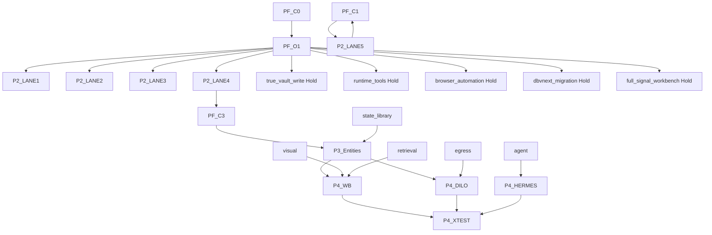

[claim]
# CROSS-CLUSTER-DEPENDENCY-GRAPH-2026-05-07

[claim]
## §1 Graph

[candidate] This dependency graph shows candidate ordering only. It does not open any lane or authorize any worker.

[diagram]

[boundary] The hold nodes are intentionally terminal until a future human-authored gate replaces them. Dispatches can produce evidence adjacent to a hold node, but evidence adjacency is not gate transition.

[claim]
## §2 Cluster dependency rules

[lineage] PF-C0 readback precedes all phases because every later task must know whether it is using repo fact, local pack fact, or candidate inference. PF-O1 precedes risky Phase 2 lanes because five high-risk topics must remain visibly closed.

[lineage] Phase 2 lanes are parallel only in candidate/readback sense. They must not be packed into one worker if any lane attempts production code, runtime tool execution, migration, browser automation, or downstream write.

[lineage] Phase 3 entity promotion depends on Phase 2 docs-only schema fixture and LP-001 recheck. This prevents the system from promoting Signal/Hypothesis/CapturePlan/TopicCard without proof that entries remain scoped.

[lineage] Phase 4 Workbench/Handoff depends on Phase 3 entity readback plus egress/state/retrieval modules. The Workbench can show candidate recommendations, but it must not directly create captures.

[claim]
## §3 Dispatch-level dependency list

[boundary]
- `P2-LANE1-01-vault-write-shadow-mode-spike` depends on `Run-3+4 CHECKPOINT can_open_c4=false acknowledged`, `overflow lane true_vault_write still Hold`.
- `P2-LANE1-02-metadata-only-commit-simulation` depends on `Run-3+4 CHECKPOINT can_open_c4=false acknowledged`, `overflow lane true_vault_write still Hold`, `P2-LANE1-01-vault-write-shadow-mode-spike`.
- `P2-LANE1-03-dry-run-commit-validation-matrix` depends on `Run-3+4 CHECKPOINT can_open_c4=false acknowledged`, `overflow lane true_vault_write still Hold`, `P2-LANE1-02-metadata-only-commit-simulation`.
- `P2-LANE1-04-true-write-gate-decision-packet` depends on `Run-3+4 CHECKPOINT can_open_c4=false acknowledged`, `overflow lane true_vault_write still Hold`, `P2-LANE1-03-dry-run-commit-validation-matrix`.
- `P2-LANE1-05-rollback-rehearsal-no-write` depends on `Run-3+4 CHECKPOINT can_open_c4=false acknowledged`, `overflow lane true_vault_write still Hold`, `P2-LANE1-04-true-write-gate-decision-packet`.
- `P2-LANE2-01-bbdown-metadata-only-legal-recheck` depends on `overflow lane runtime_tools still Hold`, `C-BBD-001 draft-only acknowledged`.
- `P2-LANE2-02-yt-dlp-boundary-and-platform-result-remap` depends on `overflow lane runtime_tools still Hold`, `C-BBD-001 draft-only acknowledged`, `P2-LANE2-01-bbdown-metadata-only-legal-recheck`.
- `P2-LANE2-03-whisper-local-install-preflight` depends on `overflow lane runtime_tools still Hold`, `C-BBD-001 draft-only acknowledged`, `P2-LANE2-02-yt-dlp-boundary-and-platform-result-remap`.
- `P2-LANE2-04-faster-whisper-benchmark-sandbox` depends on `overflow lane runtime_tools still Hold`, `C-BBD-001 draft-only acknowledged`, `P2-LANE2-03-whisper-local-install-preflight`.
- `P2-LANE2-05-voxtral-asr-spike-candidate` depends on `overflow lane runtime_tools still Hold`, `C-BBD-001 draft-only acknowledged`, `P2-LANE2-04-faster-whisper-benchmark-sandbox`.
- `P2-LANE2-06-asr-sandbox-redaction-harness` depends on `overflow lane runtime_tools still Hold`, `C-BBD-001 draft-only acknowledged`, `P2-LANE2-05-voxtral-asr-spike-candidate`.
- `P2-LANE2-07-llm-transcript-normalization-fixture` depends on `overflow lane runtime_tools still Hold`, `C-BBD-001 draft-only acknowledged`, `P2-LANE2-06-asr-sandbox-redaction-harness`.
- `P2-LANE2-08-runtime-tools-dependency-ledger` depends on `overflow lane runtime_tools still Hold`, `C-BBD-001 draft-only acknowledged`, `P2-LANE2-07-llm-transcript-normalization-fixture`.
- `P2-LANE3-01-playwright-sandbox-readonly-probe` depends on `overflow lane browser_automation still Hold`, `Run-2 synthetic UAT partial acknowledged`.
- `P2-LANE3-02-human-screenshot-verdict-packet` depends on `overflow lane browser_automation still Hold`, `Run-2 synthetic UAT partial acknowledged`, `P2-LANE3-01-playwright-sandbox-readonly-probe`.
- `P2-LANE3-03-browser-profile-isolation-contract` depends on `overflow lane browser_automation still Hold`, `Run-2 synthetic UAT partial acknowledged`, `P2-LANE3-02-human-screenshot-verdict-packet`.
- `P2-LANE3-04-login-required-gate-and-consent` depends on `overflow lane browser_automation still Hold`, `Run-2 synthetic UAT partial acknowledged`, `P2-LANE3-03-browser-profile-isolation-contract`.
- `P2-LANE3-05-visual-uat-replay-without-automation` depends on `overflow lane browser_automation still Hold`, `Run-2 synthetic UAT partial acknowledged`, `P2-LANE3-04-login-required-gate-and-consent`.
- `P2-LANE4-01-fixture-migration-rollback-plan` depends on `overflow lane dbvnext_migration still Hold`, `services/api/migrations remains forbidden`.
- `P2-LANE4-02-schema-evolution-v0-candidate` depends on `overflow lane dbvnext_migration still Hold`, `services/api/migrations remains forbidden`, `P2-LANE4-01-fixture-migration-rollback-plan`.
- `P2-LANE4-03-single-migration-script-dry-run` depends on `overflow lane dbvnext_migration still Hold`, `services/api/migrations remains forbidden`, `P2-LANE4-02-schema-evolution-v0-candidate`.
- `P2-LANE4-04-consumer-pin-abandon-decision` depends on `overflow lane dbvnext_migration still Hold`, `services/api/migrations remains forbidden`, `P2-LANE4-03-single-migration-script-dry-run`.
- `P2-LANE4-05-db-vnext-external-audit-packet` depends on `overflow lane dbvnext_migration still Hold`, `services/api/migrations remains forbidden`, `P2-LANE4-04-consumer-pin-abandon-decision`.
- `P2-LANE5-01-url-usefulness-verdict` depends on `overflow lane full_signal_workbench still Hold`, `C1 pass but C2 partial acknowledged`.
- `P2-LANE5-02-readonly-signal-preview` depends on `overflow lane full_signal_workbench still Hold`, `C1 pass but C2 partial acknowledged`, `P2-LANE5-01-url-usefulness-verdict`.
- `P2-LANE5-03-candidate-dispatch-ui-shape` depends on `overflow lane full_signal_workbench still Hold`, `C1 pass but C2 partial acknowledged`, `P2-LANE5-02-readonly-signal-preview`.
- `P2-LANE5-04-lp001-risk-recheck` depends on `overflow lane full_signal_workbench still Hold`, `C1 pass but C2 partial acknowledged`, `P2-LANE5-03-candidate-dispatch-ui-shape`.
- `P2-LANE5-05-signal-workbench-unlock-queue` depends on `overflow lane full_signal_workbench still Hold`, `C1 pass but C2 partial acknowledged`, `P2-LANE5-04-lp001-risk-recheck`.
- `P3-Signal-01-v0-table-creation-fixture` depends on `P2-LANE4-02-schema-evolution-v0-candidate`, `P2-LANE5-04-lp001-risk-recheck`, `Signal v0 contract readback`.
- `P3-Signal-02-sample-backfill-candidate` depends on `P2-LANE4-02-schema-evolution-v0-candidate`, `P2-LANE5-04-lp001-risk-recheck`, `Signal v0 contract readback`, `P3-Signal-01-v0-table-creation-fixture`.
- `P3-Signal-03-migration-test-set` depends on `P2-LANE4-02-schema-evolution-v0-candidate`, `P2-LANE5-04-lp001-risk-recheck`, `Signal v0 contract readback`, `P3-Signal-02-sample-backfill-candidate`.
- `P3-Signal-04-signal-scoring-vocab-promotion` depends on `P2-LANE4-02-schema-evolution-v0-candidate`, `P2-LANE5-04-lp001-risk-recheck`, `Signal v0 contract readback`, `P3-Signal-03-migration-test-set`.
- `P3-Hypothesis-01-v0-table-creation-fixture` depends on `P2-LANE4-02-schema-evolution-v0-candidate`, `P2-LANE5-04-lp001-risk-recheck`, `Hypothesis v0 contract readback`.
- `P3-Hypothesis-02-evidence-source-backfill` depends on `P2-LANE4-02-schema-evolution-v0-candidate`, `P2-LANE5-04-lp001-risk-recheck`, `Hypothesis v0 contract readback`, `P3-Hypothesis-01-v0-table-creation-fixture`.
- `P3-Hypothesis-03-comparison-state-machine-test` depends on `P2-LANE4-02-schema-evolution-v0-candidate`, `P2-LANE5-04-lp001-risk-recheck`, `Hypothesis v0 contract readback`, `P3-Hypothesis-02-evidence-source-backfill`.
- `P3-Hypothesis-04-conflict-resolution-rubric` depends on `P2-LANE4-02-schema-evolution-v0-candidate`, `P2-LANE5-04-lp001-risk-recheck`, `Hypothesis v0 contract readback`, `P3-Hypothesis-03-comparison-state-machine-test`.
- `P3-CapturePlan-01-v0-table-creation-fixture` depends on `P2-LANE4-02-schema-evolution-v0-candidate`, `P2-LANE5-04-lp001-risk-recheck`, `CapturePlan v0 contract readback`.
- `P3-CapturePlan-02-lp001-scope-guard-backfill` depends on `P2-LANE4-02-schema-evolution-v0-candidate`, `P2-LANE5-04-lp001-risk-recheck`, `CapturePlan v0 contract readback`, `P3-CapturePlan-01-v0-table-creation-fixture`.
- `P3-CapturePlan-03-plan-to-capture-dryrun-test` depends on `P2-LANE4-02-schema-evolution-v0-candidate`, `P2-LANE5-04-lp001-risk-recheck`, `CapturePlan v0 contract readback`, `P3-CapturePlan-02-lp001-scope-guard-backfill`.
- `P3-CapturePlan-04-plan-review-state-promotion` depends on `P2-LANE4-02-schema-evolution-v0-candidate`, `P2-LANE5-04-lp001-risk-recheck`, `CapturePlan v0 contract readback`, `P3-CapturePlan-03-plan-to-capture-dryrun-test`.
- `P3-TopicCard-01-lite-v0-to-v1-contract` depends on `P2-LANE4-02-schema-evolution-v0-candidate`, `P2-LANE5-04-lp001-risk-recheck`, `TopicCard v0 contract readback`.
- `P3-TopicCard-02-vault-preview-field-backfill` depends on `P2-LANE4-02-schema-evolution-v0-candidate`, `P2-LANE5-04-lp001-risk-recheck`, `TopicCard v0 contract readback`, `P3-TopicCard-01-lite-v0-to-v1-contract`.
- `P3-TopicCard-03-topic-card-v1-migration-test` depends on `P2-LANE4-02-schema-evolution-v0-candidate`, `P2-LANE5-04-lp001-risk-recheck`, `TopicCard v0 contract readback`, `P3-TopicCard-02-vault-preview-field-backfill`.
- `P3-TopicCard-04-v1-to-v2-output-schema` depends on `P2-LANE4-02-schema-evolution-v0-candidate`, `P2-LANE5-04-lp001-risk-recheck`, `TopicCard v0 contract readback`, `P3-TopicCard-03-topic-card-v1-migration-test`.
- `P3-TopicCard-05-human-edit-cost-regression` depends on `P2-LANE4-02-schema-evolution-v0-candidate`, `P2-LANE5-04-lp001-risk-recheck`, `TopicCard v0 contract readback`, `P3-TopicCard-04-v1-to-v2-output-schema`.
- `P4-WB-01-signal-list-readonly-preview` depends on `P3-TopicCard-05-human-edit-cost-regression`, `P3-Signal-04-signal-scoring-vocab-promotion`, `P2-LANE5-05-signal-workbench-unlock-queue`.
- `P4-WB-02-recommendation-engine-candidate-only` depends on `P3-TopicCard-05-human-edit-cost-regression`, `P3-Signal-04-signal-scoring-vocab-promotion`, `P2-LANE5-05-signal-workbench-unlock-queue`, `P4-WB-01-signal-list-readonly-preview`.
- `P4-WB-03-candidate-dispatch-ui-bounded-flow` depends on `P3-TopicCard-05-human-edit-cost-regression`, `P3-Signal-04-signal-scoring-vocab-promotion`, `P2-LANE5-05-signal-workbench-unlock-queue`, `P4-WB-02-recommendation-engine-candidate-only`.
- `P4-WB-04-batch-capture-scope-gate-enforcement` depends on `P3-TopicCard-05-human-edit-cost-regression`, `P3-Signal-04-signal-scoring-vocab-promotion`, `P2-LANE5-05-signal-workbench-unlock-queue`, `P4-WB-03-candidate-dispatch-ui-bounded-flow`.
- `P4-WB-05-workbench-usefulness-readback` depends on `P3-TopicCard-05-human-edit-cost-regression`, `P3-Signal-04-signal-scoring-vocab-promotion`, `P2-LANE5-05-signal-workbench-unlock-queue`, `P4-WB-04-batch-capture-scope-gate-enforcement`.
- `P4-DILO-01-egress-contract-implementation-plan` depends on `P3-TopicCard-05-human-edit-cost-regression`, `P3-Signal-04-signal-scoring-vocab-promotion`, `P2-LANE5-05-signal-workbench-unlock-queue`.
- `P4-DILO-02-manifest-publish-dry-run` depends on `P3-TopicCard-05-human-edit-cost-regression`, `P3-Signal-04-signal-scoring-vocab-promotion`, `P2-LANE5-05-signal-workbench-unlock-queue`, `P4-DILO-01-egress-contract-implementation-plan`.
- `P4-DILO-03-supersede-protocol-and-tombstone` depends on `P3-TopicCard-05-human-edit-cost-regression`, `P3-Signal-04-signal-scoring-vocab-promotion`, `P2-LANE5-05-signal-workbench-unlock-queue`, `P4-DILO-02-manifest-publish-dry-run`.
- `P4-DILO-04-diloflow-readback-reconciliation` depends on `P3-TopicCard-05-human-edit-cost-regression`, `P3-Signal-04-signal-scoring-vocab-promotion`, `P2-LANE5-05-signal-workbench-unlock-queue`, `P4-DILO-03-supersede-protocol-and-tombstone`.
- `P4-HERMES-01-agent-intent-contract` depends on `P3-TopicCard-05-human-edit-cost-regression`, `P3-Signal-04-signal-scoring-vocab-promotion`, `P2-LANE5-05-signal-workbench-unlock-queue`.
- `P4-HERMES-02-review-queue-coordination` depends on `P3-TopicCard-05-human-edit-cost-regression`, `P3-Signal-04-signal-scoring-vocab-promotion`, `P2-LANE5-05-signal-workbench-unlock-queue`, `P4-HERMES-01-agent-intent-contract`.
- `P4-HERMES-03-tool-truthful-stdout-bridge` depends on `P3-TopicCard-05-human-edit-cost-regression`, `P3-Signal-04-signal-scoring-vocab-promotion`, `P2-LANE5-05-signal-workbench-unlock-queue`, `P4-HERMES-02-review-queue-coordination`.
- `P4-XTEST-01-cross-system-end-to-end-test-set` depends on `P3-TopicCard-05-human-edit-cost-regression`, `P3-Signal-04-signal-scoring-vocab-promotion`, `P2-LANE5-05-signal-workbench-unlock-queue`.
- `MOD-VISUAL-01-visual-asset-table-creation` depends on `U4-U8 strategic-upgrade prompt/output ZIP manually reviewed if available`, `PRD/SRD v3 candidate not promoted unless user says so`.
- `MOD-VISUAL-02-prompt-template-contract` depends on `U4-U8 strategic-upgrade prompt/output ZIP manually reviewed if available`, `PRD/SRD v3 candidate not promoted unless user says so`, `MOD-VISUAL-01-visual-asset-table-creation`.
- `MOD-VISUAL-03-design-token-library-candidate` depends on `U4-U8 strategic-upgrade prompt/output ZIP manually reviewed if available`, `PRD/SRD v3 candidate not promoted unless user says so`, `MOD-VISUAL-02-prompt-template-contract`.
- `MOD-VISUAL-04-pattern-library-index` depends on `U4-U8 strategic-upgrade prompt/output ZIP manually reviewed if available`, `PRD/SRD v3 candidate not promoted unless user says so`, `MOD-VISUAL-03-design-token-library-candidate`.
- `MOD-VISUAL-05-visual-regression-report-gate` depends on `U4-U8 strategic-upgrade prompt/output ZIP manually reviewed if available`, `PRD/SRD v3 candidate not promoted unless user says so`, `MOD-VISUAL-04-pattern-library-index`.
- `MOD-AGENT-01-agent-fleet-ledger` depends on `U4-U8 strategic-upgrade prompt/output ZIP manually reviewed if available`, `PRD/SRD v3 candidate not promoted unless user says so`.
- `MOD-AGENT-02-cost-attribution-ledger` depends on `U4-U8 strategic-upgrade prompt/output ZIP manually reviewed if available`, `PRD/SRD v3 candidate not promoted unless user says so`, `MOD-AGENT-01-agent-fleet-ledger`.
- `MOD-AGENT-03-commander-subagent-handoff` depends on `U4-U8 strategic-upgrade prompt/output ZIP manually reviewed if available`, `PRD/SRD v3 candidate not promoted unless user says so`, `MOD-AGENT-02-cost-attribution-ledger`.
- `MOD-RETRIEVAL-01-visual-dam-object-contract` depends on `U4-U8 strategic-upgrade prompt/output ZIP manually reviewed if available`, `PRD/SRD v3 candidate not promoted unless user says so`.
- `MOD-RETRIEVAL-02-hybrid-search-fixture` depends on `U4-U8 strategic-upgrade prompt/output ZIP manually reviewed if available`, `PRD/SRD v3 candidate not promoted unless user says so`, `MOD-RETRIEVAL-01-visual-dam-object-contract`.
- `MOD-RETRIEVAL-03-source-freshness-router` depends on `U4-U8 strategic-upgrade prompt/output ZIP manually reviewed if available`, `PRD/SRD v3 candidate not promoted unless user says so`, `MOD-RETRIEVAL-02-hybrid-search-fixture`.
- `MOD-RETRIEVAL-04-citation-packaging-contract` depends on `U4-U8 strategic-upgrade prompt/output ZIP manually reviewed if available`, `PRD/SRD v3 candidate not promoted unless user says so`, `MOD-RETRIEVAL-03-source-freshness-router`.
- `MOD-STATE-01-state-library-contract` depends on `U4-U8 strategic-upgrade prompt/output ZIP manually reviewed if available`, `PRD/SRD v3 candidate not promoted unless user says so`.
- `MOD-STATE-02-five-gate-automation` depends on `U4-U8 strategic-upgrade prompt/output ZIP manually reviewed if available`, `PRD/SRD v3 candidate not promoted unless user says so`, `MOD-STATE-01-state-library-contract`.
- `MOD-STATE-03-state-word-drift-audit` depends on `U4-U8 strategic-upgrade prompt/output ZIP manually reviewed if available`, `PRD/SRD v3 candidate not promoted unless user says so`, `MOD-STATE-02-five-gate-automation`.
- `MOD-EGRESS-01-raw-egress-contract` depends on `U4-U8 strategic-upgrade prompt/output ZIP manually reviewed if available`, `PRD/SRD v3 candidate not promoted unless user says so`.
- `MOD-EGRESS-02-diloflow-egress-contract` depends on `U4-U8 strategic-upgrade prompt/output ZIP manually reviewed if available`, `PRD/SRD v3 candidate not promoted unless user says so`, `MOD-EGRESS-01-raw-egress-contract`.
- `MOD-EGRESS-03-obsidian-egress-contract` depends on `U4-U8 strategic-upgrade prompt/output ZIP manually reviewed if available`, `PRD/SRD v3 candidate not promoted unless user says so`, `MOD-EGRESS-02-diloflow-egress-contract`.
- `MOD-EGRESS-04-supersede-egress-contract` depends on `U4-U8 strategic-upgrade prompt/output ZIP manually reviewed if available`, `PRD/SRD v3 candidate not promoted unless user says so`, `MOD-EGRESS-03-obsidian-egress-contract`.

[claim]
## §4 Cycle audit

[audit] The graph is designed as a DAG: baseline/readback → lane packets → entity fixtures → Workbench/handoff → cross-system tests. Module dispatches feed Phase 3/4 but do not depend on Phase 4 outputs, so they do not form cycles.

[audit] A future worker must re-run cycle audit if it adds any prerequisite from P4 back into P2 or P3. The expected verdict in that case is `concern` until the dependency is split into a readback-only note.

[audit] No dependency edge changes `can_open_C4`, `can_open_runtime`, or `can_open_migration`. These fields remain false across the graph.

[claim]
## §5 Amendment trigger

[claim]
[instruction] If a worker finds that a downstream dispatch needs an upstream artifact that was skipped, partial, or missing, it should not improvise. It should emit an amendment trigger with the missing artifact, the reason, and the smallest candidate note needed to repair the chain.

[limitation] This graph used available GitHub and local ZIP evidence. U1-U8 cloud-output ZIPs were not present locally, so module dependencies include explicit manual U4-U8 readback gates.

[boundary]
[detail] Dependency guard: keep partial results visible. A partial C2 RAW handoff can support a PF-V/P4 handoff candidate, but it cannot be silently converted into C4 readiness or migration readiness.

[boundary]
[detail] Dependency guard: keep partial results visible. A partial C2 RAW handoff can support a PF-V/P4 handoff candidate, but it cannot be silently converted into C4 readiness or migration readiness.

[boundary]
[detail] Dependency guard: keep partial results visible. A partial C2 RAW handoff can support a PF-V/P4 handoff candidate, but it cannot be silently converted into C4 readiness or migration readiness.

[boundary]
[detail] Dependency guard: keep partial results visible. A partial C2 RAW handoff can support a PF-V/P4 handoff candidate, but it cannot be silently converted into C4 readiness or migration readiness.

[boundary]
[detail] Dependency guard: keep partial results visible. A partial C2 RAW handoff can support a PF-V/P4 handoff candidate, but it cannot be silently converted into C4 readiness or migration readiness.

[boundary]
[detail] Dependency guard: keep partial results visible. A partial C2 RAW handoff can support a PF-V/P4 handoff candidate, but it cannot be silently converted into C4 readiness or migration readiness.

[boundary]
[detail] Dependency guard: keep partial results visible. A partial C2 RAW handoff can support a PF-V/P4 handoff candidate, but it cannot be silently converted into C4 readiness or migration readiness.

[boundary]
[detail] Dependency guard: keep partial results visible. A partial C2 RAW handoff can support a PF-V/P4 handoff candidate, but it cannot be silently converted into C4 readiness or migration readiness.

[boundary]
[detail] Dependency guard: keep partial results visible. A partial C2 RAW handoff can support a PF-V/P4 handoff candidate, but it cannot be silently converted into C4 readiness or migration readiness.

[boundary]
[detail] Dependency guard: keep partial results visible. A partial C2 RAW handoff can support a PF-V/P4 handoff candidate, but it cannot be silently converted into C4 readiness or migration readiness.

[boundary]
[detail] Dependency guard: keep partial results visible. A partial C2 RAW handoff can support a PF-V/P4 handoff candidate, but it cannot be silently converted into C4 readiness or migration readiness.

[boundary]
[detail] Dependency guard: keep partial results visible. A partial C2 RAW handoff can support a PF-V/P4 handoff candidate, but it cannot be silently converted into C4 readiness or migration readiness.

[boundary]
[detail] Dependency guard: keep partial results visible. A partial C2 RAW handoff can support a PF-V/P4 handoff candidate, but it cannot be silently converted into C4 readiness or migration readiness.

[boundary]
[detail] Dependency guard: keep partial results visible. A partial C2 RAW handoff can support a PF-V/P4 handoff candidate, but it cannot be silently converted into C4 readiness or migration readiness.

[boundary]
[detail] Dependency guard: keep partial results visible. A partial C2 RAW handoff can support a PF-V/P4 handoff candidate, but it cannot be silently converted into C4 readiness or migration readiness.

[boundary]
[detail] Dependency guard: keep partial results visible. A partial C2 RAW handoff can support a PF-V/P4 handoff candidate, but it cannot be silently converted into C4 readiness or migration readiness.

[boundary]
[detail] Dependency guard: keep partial results visible. A partial C2 RAW handoff can support a PF-V/P4 handoff candidate, but it cannot be silently converted into C4 readiness or migration readiness.

[boundary]
[detail] Dependency guard: keep partial results visible. A partial C2 RAW handoff can support a PF-V/P4 handoff candidate, but it cannot be silently converted into C4 readiness or migration readiness.

[boundary]
[detail] Dependency guard: keep partial results visible. A partial C2 RAW handoff can support a PF-V/P4 handoff candidate, but it cannot be silently converted into C4 readiness or migration readiness.

[boundary]
[detail] Dependency guard: keep partial results visible. A partial C2 RAW handoff can support a PF-V/P4 handoff candidate, but it cannot be silently converted into C4 readiness or migration readiness.

[boundary]
[detail] Dependency guard: keep partial results visible. A partial C2 RAW handoff can support a PF-V/P4 handoff candidate, but it cannot be silently converted into C4 readiness or migration readiness.

[boundary]
[detail] Dependency guard: keep partial results visible. A partial C2 RAW handoff can support a PF-V/P4 handoff candidate, but it cannot be silently converted into C4 readiness or migration readiness.

[boundary]
[detail] Dependency guard: keep partial results visible. A partial C2 RAW handoff can support a PF-V/P4 handoff candidate, but it cannot be silently converted into C4 readiness or migration readiness.

[boundary]
[detail] Dependency guard: keep partial results visible. A partial C2 RAW handoff can support a PF-V/P4 handoff candidate, but it cannot be silently converted into C4 readiness or migration readiness.

[boundary]
[detail] Dependency guard: keep partial results visible. A partial C2 RAW handoff can support a PF-V/P4 handoff candidate, but it cannot be silently converted into C4 readiness or migration readiness.

[boundary]
[detail] Dependency guard: keep partial results visible. A partial C2 RAW handoff can support a PF-V/P4 handoff candidate, but it cannot be silently converted into C4 readiness or migration readiness.

[boundary]
[detail] Dependency guard: keep partial results visible. A partial C2 RAW handoff can support a PF-V/P4 handoff candidate, but it cannot be silently converted into C4 readiness or migration readiness.

[boundary]
[detail] Dependency guard: keep partial results visible. A partial C2 RAW handoff can support a PF-V/P4 handoff candidate, but it cannot be silently converted into C4 readiness or migration readiness.

[boundary]
[detail] Dependency guard: keep partial results visible. A partial C2 RAW handoff can support a PF-V/P4 handoff candidate, but it cannot be silently converted into C4 readiness or migration readiness.

[boundary]
[detail] Dependency guard: keep partial results visible. A partial C2 RAW handoff can support a PF-V/P4 handoff candidate, but it cannot be silently converted into C4 readiness or migration readiness.

[boundary]
[detail] Dependency guard: keep partial results visible. A partial C2 RAW handoff can support a PF-V/P4 handoff candidate, but it cannot be silently converted into C4 readiness or migration readiness.

[boundary]
[detail] Dependency guard: keep partial results visible. A partial C2 RAW handoff can support a PF-V/P4 handoff candidate, but it cannot be silently converted into C4 readiness or migration readiness.

[boundary]
[detail] Dependency guard: keep partial results visible. A partial C2 RAW handoff can support a PF-V/P4 handoff candidate, but it cannot be silently converted into C4 readiness or migration readiness.

[boundary]
[detail] Dependency guard: keep partial results visible. A partial C2 RAW handoff can support a PF-V/P4 handoff candidate, but it cannot be silently converted into C4 readiness or migration readiness.

[boundary]
[detail] Dependency guard: keep partial results visible. A partial C2 RAW handoff can support a PF-V/P4 handoff candidate, but it cannot be silently converted into C4 readiness or migration readiness.
