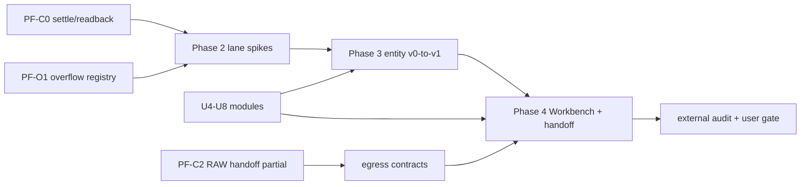

[claim]
# MASTER-ROADMAP-PHASE-2-4-2026-05-07

[claim]
## §1 Executive map

[candidate] This roadmap converts the post-dispatch176 proof-first strategy into a 12-month candidate execution map. It is not a repository authority file and it does not open Phase 2-4 runtime.

[risk]
[evidence] The governing facts are: PRD/SRD v2 keep the live baseline at manual URL metadata-only; contracts-index marks Wave5 and post-frozen surfaces as candidate; overflow-registry holds five high-risk lanes; Run-3+4 shows C1 pass but C2 partial; Run-2 shows synthetic UAT partial; AGENTS keeps single-writer and product-lane caps.

[boundary] All dispatches in this catalog keep `can_open_C4=false`, `can_open_runtime=false`, `can_open_migration=false`, and `write_enabled=false`. The roadmap only orders candidate prompts for later human review.

[diagram]

[claim]
## §2 Count summary

[candidate] Dispatch counts in this ZIP are: Phase 2 = 28, Phase 3 = 17, Phase 4 = 13, Module = 19. The larger-than-requested count is intentional because the prompt had a 11-versus-12 cluster index ambiguity and because U4-U8 modules benefit from separate egress/state/retrieval/agent/visual lanes.

[boundary] The roadmap treats every dispatch as copy-ready only after the user chooses to paste it into a worker. Until that moment, this is a candidate catalog; it does not modify authority files, production code, runtime tools, browser profiles, migrations, RAW vault, or downstream systems.

[claim]
## §3 12-month execution bands

[candidate] Month 0-1 should focus on C0/O1 readback, Phase 2 Lane 5 readonly usefulness, Lane 1 no-write shadow, and Lane 4 docs-only schema fixtures. The goal is not to open runtime; the goal is to make later decisions auditable.

[candidate] Month 2-3 should finish Phase 2 risk packets: runtime_tools legal/preflight, browser human verdict, dbvnext external audit, and signal workbench LP-001 recheck. A lane remains closed when its packet returns partial or concern.

[candidate] Month 4-6 should promote entity candidates only where Phase 2 produced enough fixture evidence. Signal and TopicCard can move earlier because C1 has useful proof. Hypothesis and CapturePlan should wait for LP-001 examples and RAW handoff readback.

[candidate] Month 7-9 should test the Workbench as read-only preview, candidate dispatch UI, and scope gate enforcement. DiloFlow/RAW/Obsidian handoff should remain manifest-based and should not write back into ScoutFlow authority.

[candidate] Month 10-12 should run cross-system test sets, state-word drift audit, retrieval freshness router, and egress supersede protocol. The final decision point is whether the evidence is strong enough for a separate authority-writing amendment outside this ZIP.

[claim]
## §4 Dispatch order

[boundary]
- `P2-LANE1-01-vault-write-shadow-mode-spike` — Vault write shadow-mode spike (Phase 2 / PF-C2 / LANE1)
- `P2-LANE1-02-metadata-only-commit-simulation` — Metadata-only commit simulation (Phase 2 / PF-C2 / LANE1)
- `P2-LANE1-03-dry-run-commit-validation-matrix` — Dry-run commit validation matrix (Phase 2 / PF-C2 / LANE1)
- `P2-LANE1-04-true-write-gate-decision-packet` — True-write gate decision packet (Phase 2 / PF-C2 / LANE1)
- `P2-LANE1-05-rollback-rehearsal-no-write` — Rollback rehearsal without true write (Phase 2 / PF-C2 / LANE1)
- `P2-LANE2-01-bbdown-metadata-only-legal-recheck` — BBDown metadata-only legal recheck (Phase 2 / PF-O1 / LANE2)
- `P2-LANE2-02-yt-dlp-boundary-and-platform-result-remap` — yt-dlp boundary and PlatformResult remap (Phase 2 / PF-O1 / LANE2)
- `P2-LANE2-03-whisper-local-install-preflight` — Whisper local install preflight (Phase 2 / PF-O1 / LANE2)
- `P2-LANE2-04-faster-whisper-benchmark-sandbox` — faster-whisper benchmark sandbox (Phase 2 / PF-O1 / LANE2)
- `P2-LANE2-05-voxtral-asr-spike-candidate` — Voxtral ASR spike candidate (Phase 2 / PF-O1 / LANE2)
- `P2-LANE2-06-asr-sandbox-redaction-harness` — ASR sandbox redaction harness (Phase 2 / PF-O1 / LANE2)
- `P2-LANE2-07-llm-transcript-normalization-fixture` — LLM transcript normalization fixture (Phase 2 / PF-O1 / LANE2)
- `P2-LANE2-08-runtime-tools-dependency-ledger` — Runtime tools dependency ledger (Phase 2 / PF-O1 / LANE2)
- `P2-LANE3-01-playwright-sandbox-readonly-probe` — Playwright sandbox read-only probe (Phase 2 / PF-C4 / LANE3)
- `P2-LANE3-02-human-screenshot-verdict-packet` — Human screenshot verdict packet (Phase 2 / PF-C4 / LANE3)
- `P2-LANE3-03-browser-profile-isolation-contract` — Browser profile isolation contract (Phase 2 / PF-C4 / LANE3)
- `P2-LANE3-04-login-required-gate-and-consent` — Login-required gate and consent (Phase 2 / PF-C4 / LANE3)
- `P2-LANE3-05-visual-uat-replay-without-automation` — Visual UAT replay without automation (Phase 2 / PF-C4 / LANE3)
- `P2-LANE4-01-fixture-migration-rollback-plan` — Fixture migration rollback plan (Phase 2 / PF-C3 / LANE4)
- `P2-LANE4-02-schema-evolution-v0-candidate` — Schema evolution v0 candidate (Phase 2 / PF-C3 / LANE4)
- `P2-LANE4-03-single-migration-script-dry-run` — Single migration script dry-run (Phase 2 / PF-C3 / LANE4)
- `P2-LANE4-04-consumer-pin-abandon-decision` — Consumer pin abandon decision (Phase 2 / PF-C3 / LANE4)
- `P2-LANE4-05-db-vnext-external-audit-packet` — DB vNext external audit packet (Phase 2 / PF-C3 / LANE4)
- `P2-LANE5-01-url-usefulness-verdict` — URL usefulness verdict (Phase 2 / PF-C1 / LANE5)
- `P2-LANE5-02-readonly-signal-preview` — Read-only signal preview (Phase 2 / PF-C1 / LANE5)
- `P2-LANE5-03-candidate-dispatch-ui-shape` — Candidate dispatch UI shape (Phase 2 / PF-C1 / LANE5)
- `P2-LANE5-04-lp001-risk-recheck` — LP-001 risk recheck (Phase 2 / PF-C1 / LANE5)
- `P2-LANE5-05-signal-workbench-unlock-queue` — Signal Workbench unlock queue (Phase 2 / PF-C1 / LANE5)
- `P3-Signal-01-v0-table-creation-fixture` — Signal v0 table creation fixture (Phase 3 / PF-C3 / Signal)
- `P3-Signal-02-sample-backfill-candidate` — Signal sample backfill candidate (Phase 3 / PF-C3 / Signal)
- `P3-Signal-03-migration-test-set` — Signal migration test set (Phase 3 / PF-C3 / Signal)
- `P3-Signal-04-signal-scoring-vocab-promotion` — Signal scoring vocabulary promotion (Phase 3 / PF-C3 / Signal)
- `P3-Hypothesis-01-v0-table-creation-fixture` — Hypothesis v0 table creation fixture (Phase 3 / PF-C3 / Hypothesis)
- `P3-Hypothesis-02-evidence-source-backfill` — Hypothesis evidence source backfill (Phase 3 / PF-C3 / Hypothesis)
- `P3-Hypothesis-03-comparison-state-machine-test` — Hypothesis comparison state-machine test (Phase 3 / PF-C3 / Hypothesis)
- `P3-Hypothesis-04-conflict-resolution-rubric` — Hypothesis conflict resolution rubric (Phase 3 / PF-C3 / Hypothesis)
- `P3-CapturePlan-01-v0-table-creation-fixture` — CapturePlan v0 table creation fixture (Phase 3 / PF-C3 / CapturePlan)
- `P3-CapturePlan-02-lp001-scope-guard-backfill` — CapturePlan LP-001 scope guard backfill (Phase 3 / PF-C3 / CapturePlan)
- `P3-CapturePlan-03-plan-to-capture-dryrun-test` — Plan-to-capture dry-run test (Phase 3 / PF-C3 / CapturePlan)
- `P3-CapturePlan-04-plan-review-state-promotion` — Plan review state promotion (Phase 3 / PF-C3 / CapturePlan)
- `P3-TopicCard-01-lite-v0-to-v1-contract` — TopicCard lite v0 to v1 contract (Phase 3 / PF-C1 / TopicCard)
- `P3-TopicCard-02-vault-preview-field-backfill` — TopicCard vault preview field backfill (Phase 3 / PF-C1 / TopicCard)
- `P3-TopicCard-03-topic-card-v1-migration-test` — TopicCard v1 migration test (Phase 3 / PF-C1 / TopicCard)
- `P3-TopicCard-04-v1-to-v2-output-schema` — TopicCard v1 to v2 output schema (Phase 3 / PF-C1 / TopicCard)
- `P3-TopicCard-05-human-edit-cost-regression` — TopicCard human edit cost regression (Phase 3 / PF-C1 / TopicCard)
- `P4-WB-01-signal-list-readonly-preview` — Signal list read-only preview (Phase 4 / PF-C1 / WB)
- `P4-WB-02-recommendation-engine-candidate-only` — Recommendation engine candidate-only (Phase 4 / PF-O1 / WB)
- `P4-WB-03-candidate-dispatch-ui-bounded-flow` — Candidate dispatch UI bounded flow (Phase 4 / PF-C4 / WB)
- `P4-WB-04-batch-capture-scope-gate-enforcement` — Batch capture scope gate enforcement (Phase 4 / PF-LP / WB)
- `P4-WB-05-workbench-usefulness-readback` — Workbench usefulness readback (Phase 4 / PF-C1 / WB)
- `P4-DILO-01-egress-contract-implementation-plan` — DiloFlow egress contract implementation plan (Phase 4 / egress / DILO)
- `P4-DILO-02-manifest-publish-dry-run` — Manifest publish dry-run (Phase 4 / egress / DILO)
- `P4-DILO-03-supersede-protocol-and-tombstone` — Supersede protocol and tombstone (Phase 4 / egress / DILO)
- `P4-DILO-04-diloflow-readback-reconciliation` — DiloFlow readback reconciliation (Phase 4 / egress / DILO)
- `P4-HERMES-01-agent-intent-contract` — Hermes agent intent contract (Phase 4 / agent / HERMES)
- `P4-HERMES-02-review-queue-coordination` — Hermes review queue coordination (Phase 4 / agent / HERMES)
- `P4-HERMES-03-tool-truthful-stdout-bridge` — Tool truthful stdout bridge (Phase 4 / agent / HERMES)
- `P4-XTEST-01-cross-system-end-to-end-test-set` — Cross-system end-to-end test set (Phase 4 / PF-C4 / XTEST)
- `MOD-VISUAL-01-visual-asset-table-creation` — Visual asset table creation (Module / visual / VISUAL)
- `MOD-VISUAL-02-prompt-template-contract` — Prompt template contract (Module / visual / VISUAL)
- `MOD-VISUAL-03-design-token-library-candidate` — Design token library candidate (Module / visual / VISUAL)
- `MOD-VISUAL-04-pattern-library-index` — Pattern library index (Module / visual / VISUAL)
- `MOD-VISUAL-05-visual-regression-report-gate` — Visual regression report gate (Module / visual / VISUAL)
- `MOD-AGENT-01-agent-fleet-ledger` — Agent fleet ledger (Module / agent / AGENT)
- `MOD-AGENT-02-cost-attribution-ledger` — Cost attribution ledger (Module / agent / AGENT)
- `MOD-AGENT-03-commander-subagent-handoff` — Commander subagent handoff (Module / agent / AGENT)
- `MOD-RETRIEVAL-01-visual-dam-object-contract` — Visual DAM object contract (Module / retrieval / RETRIEVAL)
- `MOD-RETRIEVAL-02-hybrid-search-fixture` — Hybrid search fixture (Module / retrieval / RETRIEVAL)
- `MOD-RETRIEVAL-03-source-freshness-router` — Source freshness router (Module / retrieval / RETRIEVAL)
- `MOD-RETRIEVAL-04-citation-packaging-contract` — Citation packaging contract (Module / retrieval / RETRIEVAL)
- `MOD-STATE-01-state-library-contract` — State library contract (Module / state-library / STATE)
- `MOD-STATE-02-five-gate-automation` — Five-gate automation (Module / state-library / STATE)
- `MOD-STATE-03-state-word-drift-audit` — State word drift audit (Module / state-library / STATE)
- `MOD-EGRESS-01-raw-egress-contract` — RAW egress contract (Module / egress / EGRESS)
- `MOD-EGRESS-02-diloflow-egress-contract` — DiloFlow egress contract (Module / egress / EGRESS)
- `MOD-EGRESS-03-obsidian-egress-contract` — Obsidian egress contract (Module / egress / EGRESS)
- `MOD-EGRESS-04-supersede-egress-contract` — Supersede egress contract (Module / egress / EGRESS)

[claim]
## §5 Phase gates

[gate] Gate A — `P2 readiness`: every Phase 2 dispatch must preserve overflow Hold state and produce a truthful stdout. A clear result opens only the next candidate prompt, not runtime.

[gate] Gate B — `P3 entity readiness`: an entity can start v0→v1 only after schema fixture, LP-001, and candidate contract readback are clear or explicitly partial with bounded follow-up.

[gate] Gate C — `P4 handoff readiness`: Workbench and DiloFlow prompts can run only after entity candidate outputs show evidence depth, source trace, and supersede semantics.

[gate] Gate D — `authority writeback`: none of these files performs authority writeback. If the project needs authority writeback, create a separate dispatch with user-authored authorization and external audit.

[claim]
## §6 Risk burn-down

[audit] Highest-risk items are true vault write, runtime tools, browser automation, db migrations, full signal workbench, and downstream egress. The burn-down method is to separate readback, fixture, dry-run, human gate, and authority gate into different dispatches.

[audit] Medium-risk items are entity promotion, state library, retrieval, visual pattern library, and agent fleet ledger. They stay docs-only until a future code-bearing lane is explicitly authored.

[audit] Low-risk items are index, readback, vendor recap, and self-audit. They still need claim labels and not-authority frontmatter because ScoutFlow treats research notes as non-authority by default.

[claim]
## §7 Known limitations

[limitation] Live vendor evidence was not refreshed in this environment. The vendor recap therefore uses paste-time / local evidence labels and must be refreshed by a later web-enabled reviewer before legal or runtime decisions.

[limitation] The strategic U1-U8 cloud-output ZIPs listed as local `~/Downloads` inputs were not present under `/mnt/data`; module dispatches therefore include a prerequisite requiring U4-U8 prompt/output readback when available.

[limitation] The prompt names an EXTERNAL-AUDIT-REPORT-2026-05-07 file, but the accessible GitHub source used here was Run-3+4 report plus CHECKPOINT-Run3-4-final. This roadmap records that substitution and keeps all gate flags false.

[audit]
[detail] Roadmap guard: a later worker must never compress this month-band ordering into a single execution PR. The project has already seen partial proof remain valuable, so the correct next step after each dispatch is readback, audit, and only then another candidate prompt.

[audit]
[detail] Roadmap guard: a later worker must never compress this month-band ordering into a single execution PR. The project has already seen partial proof remain valuable, so the correct next step after each dispatch is readback, audit, and only then another candidate prompt.

[audit]
[detail] Roadmap guard: a later worker must never compress this month-band ordering into a single execution PR. The project has already seen partial proof remain valuable, so the correct next step after each dispatch is readback, audit, and only then another candidate prompt.

[audit]
[detail] Roadmap guard: a later worker must never compress this month-band ordering into a single execution PR. The project has already seen partial proof remain valuable, so the correct next step after each dispatch is readback, audit, and only then another candidate prompt.

[audit]
[detail] Roadmap guard: a later worker must never compress this month-band ordering into a single execution PR. The project has already seen partial proof remain valuable, so the correct next step after each dispatch is readback, audit, and only then another candidate prompt.

[audit]
[detail] Roadmap guard: a later worker must never compress this month-band ordering into a single execution PR. The project has already seen partial proof remain valuable, so the correct next step after each dispatch is readback, audit, and only then another candidate prompt.

[audit]
[detail] Roadmap guard: a later worker must never compress this month-band ordering into a single execution PR. The project has already seen partial proof remain valuable, so the correct next step after each dispatch is readback, audit, and only then another candidate prompt.

[audit]
[detail] Roadmap guard: a later worker must never compress this month-band ordering into a single execution PR. The project has already seen partial proof remain valuable, so the correct next step after each dispatch is readback, audit, and only then another candidate prompt.

[audit]
[detail] Roadmap guard: a later worker must never compress this month-band ordering into a single execution PR. The project has already seen partial proof remain valuable, so the correct next step after each dispatch is readback, audit, and only then another candidate prompt.

[audit]
[detail] Roadmap guard: a later worker must never compress this month-band ordering into a single execution PR. The project has already seen partial proof remain valuable, so the correct next step after each dispatch is readback, audit, and only then another candidate prompt.

[audit]
[detail] Roadmap guard: a later worker must never compress this month-band ordering into a single execution PR. The project has already seen partial proof remain valuable, so the correct next step after each dispatch is readback, audit, and only then another candidate prompt.

[audit]
[detail] Roadmap guard: a later worker must never compress this month-band ordering into a single execution PR. The project has already seen partial proof remain valuable, so the correct next step after each dispatch is readback, audit, and only then another candidate prompt.

[audit]
[detail] Roadmap guard: a later worker must never compress this month-band ordering into a single execution PR. The project has already seen partial proof remain valuable, so the correct next step after each dispatch is readback, audit, and only then another candidate prompt.

[audit]
[detail] Roadmap guard: a later worker must never compress this month-band ordering into a single execution PR. The project has already seen partial proof remain valuable, so the correct next step after each dispatch is readback, audit, and only then another candidate prompt.

[audit]
[detail] Roadmap guard: a later worker must never compress this month-band ordering into a single execution PR. The project has already seen partial proof remain valuable, so the correct next step after each dispatch is readback, audit, and only then another candidate prompt.

[audit]
[detail] Roadmap guard: a later worker must never compress this month-band ordering into a single execution PR. The project has already seen partial proof remain valuable, so the correct next step after each dispatch is readback, audit, and only then another candidate prompt.

[audit]
[detail] Roadmap guard: a later worker must never compress this month-band ordering into a single execution PR. The project has already seen partial proof remain valuable, so the correct next step after each dispatch is readback, audit, and only then another candidate prompt.

[audit]
[detail] Roadmap guard: a later worker must never compress this month-band ordering into a single execution PR. The project has already seen partial proof remain valuable, so the correct next step after each dispatch is readback, audit, and only then another candidate prompt.

[audit]
[detail] Roadmap guard: a later worker must never compress this month-band ordering into a single execution PR. The project has already seen partial proof remain valuable, so the correct next step after each dispatch is readback, audit, and only then another candidate prompt.

[audit]
[detail] Roadmap guard: a later worker must never compress this month-band ordering into a single execution PR. The project has already seen partial proof remain valuable, so the correct next step after each dispatch is readback, audit, and only then another candidate prompt.

[audit]
[detail] Roadmap guard: a later worker must never compress this month-band ordering into a single execution PR. The project has already seen partial proof remain valuable, so the correct next step after each dispatch is readback, audit, and only then another candidate prompt.

[audit]
[detail] Roadmap guard: a later worker must never compress this month-band ordering into a single execution PR. The project has already seen partial proof remain valuable, so the correct next step after each dispatch is readback, audit, and only then another candidate prompt.

[audit]
[detail] Roadmap guard: a later worker must never compress this month-band ordering into a single execution PR. The project has already seen partial proof remain valuable, so the correct next step after each dispatch is readback, audit, and only then another candidate prompt.

[audit]
[detail] Roadmap guard: a later worker must never compress this month-band ordering into a single execution PR. The project has already seen partial proof remain valuable, so the correct next step after each dispatch is readback, audit, and only then another candidate prompt.

[audit]
[detail] Roadmap guard: a later worker must never compress this month-band ordering into a single execution PR. The project has already seen partial proof remain valuable, so the correct next step after each dispatch is readback, audit, and only then another candidate prompt.

[audit]
[detail] Roadmap guard: a later worker must never compress this month-band ordering into a single execution PR. The project has already seen partial proof remain valuable, so the correct next step after each dispatch is readback, audit, and only then another candidate prompt.

[audit]
[detail] Roadmap guard: a later worker must never compress this month-band ordering into a single execution PR. The project has already seen partial proof remain valuable, so the correct next step after each dispatch is readback, audit, and only then another candidate prompt.

[audit]
[detail] Roadmap guard: a later worker must never compress this month-band ordering into a single execution PR. The project has already seen partial proof remain valuable, so the correct next step after each dispatch is readback, audit, and only then another candidate prompt.

[audit]
[detail] Roadmap guard: a later worker must never compress this month-band ordering into a single execution PR. The project has already seen partial proof remain valuable, so the correct next step after each dispatch is readback, audit, and only then another candidate prompt.

[audit]
[detail] Roadmap guard: a later worker must never compress this month-band ordering into a single execution PR. The project has already seen partial proof remain valuable, so the correct next step after each dispatch is readback, audit, and only then another candidate prompt.

[audit]
[detail] Roadmap guard: a later worker must never compress this month-band ordering into a single execution PR. The project has already seen partial proof remain valuable, so the correct next step after each dispatch is readback, audit, and only then another candidate prompt.

[audit]
[detail] Roadmap guard: a later worker must never compress this month-band ordering into a single execution PR. The project has already seen partial proof remain valuable, so the correct next step after each dispatch is readback, audit, and only then another candidate prompt.

[audit]
[detail] Roadmap guard: a later worker must never compress this month-band ordering into a single execution PR. The project has already seen partial proof remain valuable, so the correct next step after each dispatch is readback, audit, and only then another candidate prompt.

[audit]
[detail] Roadmap guard: a later worker must never compress this month-band ordering into a single execution PR. The project has already seen partial proof remain valuable, so the correct next step after each dispatch is readback, audit, and only then another candidate prompt.

[audit]
[detail] Roadmap guard: a later worker must never compress this month-band ordering into a single execution PR. The project has already seen partial proof remain valuable, so the correct next step after each dispatch is readback, audit, and only then another candidate prompt.

[audit]
[detail] Roadmap guard: a later worker must never compress this month-band ordering into a single execution PR. The project has already seen partial proof remain valuable, so the correct next step after each dispatch is readback, audit, and only then another candidate prompt.

[audit]
[detail] Roadmap guard: a later worker must never compress this month-band ordering into a single execution PR. The project has already seen partial proof remain valuable, so the correct next step after each dispatch is readback, audit, and only then another candidate prompt.

[audit]
[detail] Roadmap guard: a later worker must never compress this month-band ordering into a single execution PR. The project has already seen partial proof remain valuable, so the correct next step after each dispatch is readback, audit, and only then another candidate prompt.

[audit]
[detail] Roadmap guard: a later worker must never compress this month-band ordering into a single execution PR. The project has already seen partial proof remain valuable, so the correct next step after each dispatch is readback, audit, and only then another candidate prompt.

[audit]
[detail] Roadmap guard: a later worker must never compress this month-band ordering into a single execution PR. The project has already seen partial proof remain valuable, so the correct next step after each dispatch is readback, audit, and only then another candidate prompt.

[audit]
[detail] Roadmap guard: a later worker must never compress this month-band ordering into a single execution PR. The project has already seen partial proof remain valuable, so the correct next step after each dispatch is readback, audit, and only then another candidate prompt.

[audit]
[detail] Roadmap guard: a later worker must never compress this month-band ordering into a single execution PR. The project has already seen partial proof remain valuable, so the correct next step after each dispatch is readback, audit, and only then another candidate prompt.

[audit]
[detail] Roadmap guard: a later worker must never compress this month-band ordering into a single execution PR. The project has already seen partial proof remain valuable, so the correct next step after each dispatch is readback, audit, and only then another candidate prompt.

[audit]
[detail] Roadmap guard: a later worker must never compress this month-band ordering into a single execution PR. The project has already seen partial proof remain valuable, so the correct next step after each dispatch is readback, audit, and only then another candidate prompt.

[audit]
[detail] Roadmap guard: a later worker must never compress this month-band ordering into a single execution PR. The project has already seen partial proof remain valuable, so the correct next step after each dispatch is readback, audit, and only then another candidate prompt.

[audit]
[detail] Roadmap guard: a later worker must never compress this month-band ordering into a single execution PR. The project has already seen partial proof remain valuable, so the correct next step after each dispatch is readback, audit, and only then another candidate prompt.

[audit]
[detail] Roadmap guard: a later worker must never compress this month-band ordering into a single execution PR. The project has already seen partial proof remain valuable, so the correct next step after each dispatch is readback, audit, and only then another candidate prompt.

[audit]
[detail] Roadmap guard: a later worker must never compress this month-band ordering into a single execution PR. The project has already seen partial proof remain valuable, so the correct next step after each dispatch is readback, audit, and only then another candidate prompt.

[audit]
[detail] Roadmap guard: a later worker must never compress this month-band ordering into a single execution PR. The project has already seen partial proof remain valuable, so the correct next step after each dispatch is readback, audit, and only then another candidate prompt.

[audit]
[detail] Roadmap guard: a later worker must never compress this month-band ordering into a single execution PR. The project has already seen partial proof remain valuable, so the correct next step after each dispatch is readback, audit, and only then another candidate prompt.

[audit]
[detail] Roadmap guard: a later worker must never compress this month-band ordering into a single execution PR. The project has already seen partial proof remain valuable, so the correct next step after each dispatch is readback, audit, and only then another candidate prompt.

[audit]
[detail] Roadmap guard: a later worker must never compress this month-band ordering into a single execution PR. The project has already seen partial proof remain valuable, so the correct next step after each dispatch is readback, audit, and only then another candidate prompt.

[audit]
[detail] Roadmap guard: a later worker must never compress this month-band ordering into a single execution PR. The project has already seen partial proof remain valuable, so the correct next step after each dispatch is readback, audit, and only then another candidate prompt.

[audit]
[detail] Roadmap guard: a later worker must never compress this month-band ordering into a single execution PR. The project has already seen partial proof remain valuable, so the correct next step after each dispatch is readback, audit, and only then another candidate prompt.

[audit]
[detail] Roadmap guard: a later worker must never compress this month-band ordering into a single execution PR. The project has already seen partial proof remain valuable, so the correct next step after each dispatch is readback, audit, and only then another candidate prompt.

[audit]
[detail] Roadmap guard: a later worker must never compress this month-band ordering into a single execution PR. The project has already seen partial proof remain valuable, so the correct next step after each dispatch is readback, audit, and only then another candidate prompt.

[audit]
[detail] Roadmap guard: a later worker must never compress this month-band ordering into a single execution PR. The project has already seen partial proof remain valuable, so the correct next step after each dispatch is readback, audit, and only then another candidate prompt.

[audit]
[detail] Roadmap guard: a later worker must never compress this month-band ordering into a single execution PR. The project has already seen partial proof remain valuable, so the correct next step after each dispatch is readback, audit, and only then another candidate prompt.

[audit]
[detail] Roadmap guard: a later worker must never compress this month-band ordering into a single execution PR. The project has already seen partial proof remain valuable, so the correct next step after each dispatch is readback, audit, and only then another candidate prompt.

[audit]
[detail] Roadmap guard: a later worker must never compress this month-band ordering into a single execution PR. The project has already seen partial proof remain valuable, so the correct next step after each dispatch is readback, audit, and only then another candidate prompt.

[audit]
[detail] Roadmap guard: a later worker must never compress this month-band ordering into a single execution PR. The project has already seen partial proof remain valuable, so the correct next step after each dispatch is readback, audit, and only then another candidate prompt.

[audit]
[detail] Roadmap guard: a later worker must never compress this month-band ordering into a single execution PR. The project has already seen partial proof remain valuable, so the correct next step after each dispatch is readback, audit, and only then another candidate prompt.

[audit]
[detail] Roadmap guard: a later worker must never compress this month-band ordering into a single execution PR. The project has already seen partial proof remain valuable, so the correct next step after each dispatch is readback, audit, and only then another candidate prompt.

[audit]
[detail] Roadmap guard: a later worker must never compress this month-band ordering into a single execution PR. The project has already seen partial proof remain valuable, so the correct next step after each dispatch is readback, audit, and only then another candidate prompt.

[audit]
[detail] Roadmap guard: a later worker must never compress this month-band ordering into a single execution PR. The project has already seen partial proof remain valuable, so the correct next step after each dispatch is readback, audit, and only then another candidate prompt.

[audit]
[detail] Roadmap guard: a later worker must never compress this month-band ordering into a single execution PR. The project has already seen partial proof remain valuable, so the correct next step after each dispatch is readback, audit, and only then another candidate prompt.

[audit]
[detail] Roadmap guard: a later worker must never compress this month-band ordering into a single execution PR. The project has already seen partial proof remain valuable, so the correct next step after each dispatch is readback, audit, and only then another candidate prompt.

[audit]
[detail] Roadmap guard: a later worker must never compress this month-band ordering into a single execution PR. The project has already seen partial proof remain valuable, so the correct next step after each dispatch is readback, audit, and only then another candidate prompt.

[audit]
[detail] Roadmap guard: a later worker must never compress this month-band ordering into a single execution PR. The project has already seen partial proof remain valuable, so the correct next step after each dispatch is readback, audit, and only then another candidate prompt.

[audit]
[detail] Roadmap guard: a later worker must never compress this month-band ordering into a single execution PR. The project has already seen partial proof remain valuable, so the correct next step after each dispatch is readback, audit, and only then another candidate prompt.

[audit]
[detail] Roadmap guard: a later worker must never compress this month-band ordering into a single execution PR. The project has already seen partial proof remain valuable, so the correct next step after each dispatch is readback, audit, and only then another candidate prompt.

[audit]
[detail] Roadmap guard: a later worker must never compress this month-band ordering into a single execution PR. The project has already seen partial proof remain valuable, so the correct next step after each dispatch is readback, audit, and only then another candidate prompt.
