[claim]
# PF-C1 Cluster Index — Product proof pair and TopicCard

[claim]
## §1 Mission

[candidate] 围绕 topic-card-lite / usefulness / edit-cost 建立产品证明，再决定是否扩展 Workbench。

[boundary] This index is not a dispatch authorization. It lists candidate prompt order, prerequisite logic, and cross-cluster gates while keeping C4, runtime, and migration closed.

[claim]
## §2 Current state readback

[claim]
[evidence] Current ScoutFlow baseline remains Phase 1A metadata-only plus receipt/trust trace. Post-frozen C1 has useful proof, C2 remains partial, and five overflow lanes are held. This index treats those facts as boundary inputs.

[plan]
[evidence] Relevant proof posture: C1 pass can support usefulness/read-only prompt design; C2 partial can support handoff candidate design but not true write; Run-2 synthetic UAT partial warns against browser-proof overclaim.

[claim]
## §3 Dispatch list and order

[table]
| Dispatch | Phase | Lane | Title | First prerequisites |
|---|---|---|---|---|
| `P2-LANE5-01-url-usefulness-verdict` | Phase 2 | LANE5 | URL usefulness verdict | `overflow lane full_signal_workbench still Hold`, `C1 pass but C2 partial acknowledged` |
| `P2-LANE5-02-readonly-signal-preview` | Phase 2 | LANE5 | Read-only signal preview | `overflow lane full_signal_workbench still Hold`, `C1 pass but C2 partial acknowledged` |
| `P2-LANE5-03-candidate-dispatch-ui-shape` | Phase 2 | LANE5 | Candidate dispatch UI shape | `overflow lane full_signal_workbench still Hold`, `C1 pass but C2 partial acknowledged` |
| `P2-LANE5-04-lp001-risk-recheck` | Phase 2 | LANE5 | LP-001 risk recheck | `overflow lane full_signal_workbench still Hold`, `C1 pass but C2 partial acknowledged` |
| `P2-LANE5-05-signal-workbench-unlock-queue` | Phase 2 | LANE5 | Signal Workbench unlock queue | `overflow lane full_signal_workbench still Hold`, `C1 pass but C2 partial acknowledged` |
| `P3-TopicCard-01-lite-v0-to-v1-contract` | Phase 3 | TopicCard | TopicCard lite v0 to v1 contract | `P2-LANE4-02-schema-evolution-v0-candidate`, `P2-LANE5-04-lp001-risk-recheck` |
| `P3-TopicCard-02-vault-preview-field-backfill` | Phase 3 | TopicCard | TopicCard vault preview field backfill | `P2-LANE4-02-schema-evolution-v0-candidate`, `P2-LANE5-04-lp001-risk-recheck` |
| `P3-TopicCard-03-topic-card-v1-migration-test` | Phase 3 | TopicCard | TopicCard v1 migration test | `P2-LANE4-02-schema-evolution-v0-candidate`, `P2-LANE5-04-lp001-risk-recheck` |
| `P3-TopicCard-04-v1-to-v2-output-schema` | Phase 3 | TopicCard | TopicCard v1 to v2 output schema | `P2-LANE4-02-schema-evolution-v0-candidate`, `P2-LANE5-04-lp001-risk-recheck` |
| `P3-TopicCard-05-human-edit-cost-regression` | Phase 3 | TopicCard | TopicCard human edit cost regression | `P2-LANE4-02-schema-evolution-v0-candidate`, `P2-LANE5-04-lp001-risk-recheck` |
| `P4-WB-01-signal-list-readonly-preview` | Phase 4 | WB | Signal list read-only preview | `P3-TopicCard-05-human-edit-cost-regression`, `P3-Signal-04-signal-scoring-vocab-promotion` |
| `P4-WB-05-workbench-usefulness-readback` | Phase 4 | WB | Workbench usefulness readback | `P3-TopicCard-05-human-edit-cost-regression`, `P3-Signal-04-signal-scoring-vocab-promotion` |

[diagram]

```mermaid
flowchart TD
  PF_C1 --> P2_LANE5_01_url_usefulness_verdict
  PF_C1 --> P2_LANE5_02_readonly_signal_preview
  PF_C1 --> P2_LANE5_03_candidate_dispatch_ui_shape
  PF_C1 --> P2_LANE5_04_lp001_risk_recheck
  PF_C1 --> P2_LANE5_05_signal_workbench_unlock_queue
  PF_C1 --> P3_TopicCard_01_lite_v0_to_v1_contract
  PF_C1 --> P3_TopicCard_02_vault_preview_field_backfill
  PF_C1 --> P3_TopicCard_03_topic_card_v1_migration_test
  PF_C1 --> P3_TopicCard_04_v1_to_v2_output_schema
  PF_C1 --> P3_TopicCard_05_human_edit_cost_regression
  PF_C1 --> P4_WB_01_signal_list_readonly_preview
  PF_C1 --> P4_WB_05_workbench_usefulness_readback
  PF_C1 --> AUDIT_PF_C1[readback + boundary audit]
```

[claim]
## §4 Cross-cluster dependencies

[lineage] Upstream dependencies are PRD/SRD v2, AGENTS, contracts-index, overflow-registry, Run-2/Run-3+4 receipts, and the post176 roadmap. If one upstream source is missing, the cluster should emit concern rather than inventing gate state.

[lineage] Downstream dependencies must cite both the dispatch output and this cluster index. A downstream prompt may continue from a clear docs-only artifact, but it cannot infer authority, runtime, migration, or true-write readiness.

[lineage] Module dependencies are treated as supporting surfaces. Visual, agent, retrieval, state-library, and egress modules feed Phase 3/4 only after their own candidate readback is complete.

[claim]
## §5 can_open gating

[boundary] `can_open_C4=false` for this cluster index. C4 hardening can only be discussed as controlled candidate work and must not start browser automation or production-code expansion from this file.

[boundary] `can_open_runtime=false` for this cluster index. Runtime tools, ASR, media, and browser work remain blocked unless a separate human-authored gate exists.

[boundary] `can_open_migration=false` for this cluster index. DB vNext wording is fixture/candidate only and must not write migration files.

[claim]
## §6 Reviewer checklist

[audit] Check 1: verify that each dispatch in this cluster has candidate/not-authority frontmatter. Check 2: verify all can_open fields remain false. Check 3: verify no dispatch in this cluster writes authority files. Check 4: verify no dispatch silently depends on unavailable U1-U8 output. Check 5: verify partial proof remains visible.

[audit] Check 6: verify that any claim about vendor/pattern freshness points to the vendor recap and says not-live-refreshed. Check 7: verify all egress/downstream claims remain manifest or readback only. Check 8: verify LP-001 still blocks recommendation/keyword/RAW gap direct capture.

[claim]
## §7 Known limitations

[limitation] This index is built from accessible GitHub/local sources and the U9 prompt. It does not prove that every strategic U1-U8 output has landed; module dispatches therefore keep manual readback prerequisites.

[limitation] This index deliberately repeats boundaries. The repetition is a safety feature, because future workers may copy a single dispatch without reading the full ZIP.

[claim]
[detail] PF-C1 sequencing guard: the next worker should prefer a smaller concern report over a larger speculative artifact when evidence is missing. ScoutFlow's current discipline rewards accurate partial states because they prevent unsafe lane expansion.

[claim]
[detail] PF-C1 sequencing guard: the next worker should prefer a smaller concern report over a larger speculative artifact when evidence is missing. ScoutFlow's current discipline rewards accurate partial states because they prevent unsafe lane expansion.

[claim]
[detail] PF-C1 sequencing guard: the next worker should prefer a smaller concern report over a larger speculative artifact when evidence is missing. ScoutFlow's current discipline rewards accurate partial states because they prevent unsafe lane expansion.

[claim]
[detail] PF-C1 sequencing guard: the next worker should prefer a smaller concern report over a larger speculative artifact when evidence is missing. ScoutFlow's current discipline rewards accurate partial states because they prevent unsafe lane expansion.

[claim]
[detail] PF-C1 sequencing guard: the next worker should prefer a smaller concern report over a larger speculative artifact when evidence is missing. ScoutFlow's current discipline rewards accurate partial states because they prevent unsafe lane expansion.

[claim]
[detail] PF-C1 sequencing guard: the next worker should prefer a smaller concern report over a larger speculative artifact when evidence is missing. ScoutFlow's current discipline rewards accurate partial states because they prevent unsafe lane expansion.

[claim]
[detail] PF-C1 sequencing guard: the next worker should prefer a smaller concern report over a larger speculative artifact when evidence is missing. ScoutFlow's current discipline rewards accurate partial states because they prevent unsafe lane expansion.

[claim]
[detail] PF-C1 sequencing guard: the next worker should prefer a smaller concern report over a larger speculative artifact when evidence is missing. ScoutFlow's current discipline rewards accurate partial states because they prevent unsafe lane expansion.

[claim]
[detail] PF-C1 sequencing guard: the next worker should prefer a smaller concern report over a larger speculative artifact when evidence is missing. ScoutFlow's current discipline rewards accurate partial states because they prevent unsafe lane expansion.

[claim]
[detail] PF-C1 sequencing guard: the next worker should prefer a smaller concern report over a larger speculative artifact when evidence is missing. ScoutFlow's current discipline rewards accurate partial states because they prevent unsafe lane expansion.

[claim]
[detail] PF-C1 sequencing guard: the next worker should prefer a smaller concern report over a larger speculative artifact when evidence is missing. ScoutFlow's current discipline rewards accurate partial states because they prevent unsafe lane expansion.

[claim]
[detail] PF-C1 sequencing guard: the next worker should prefer a smaller concern report over a larger speculative artifact when evidence is missing. ScoutFlow's current discipline rewards accurate partial states because they prevent unsafe lane expansion.

[claim]
[detail] PF-C1 sequencing guard: the next worker should prefer a smaller concern report over a larger speculative artifact when evidence is missing. ScoutFlow's current discipline rewards accurate partial states because they prevent unsafe lane expansion.

[claim]
[detail] PF-C1 sequencing guard: the next worker should prefer a smaller concern report over a larger speculative artifact when evidence is missing. ScoutFlow's current discipline rewards accurate partial states because they prevent unsafe lane expansion.

[claim]
[detail] PF-C1 sequencing guard: the next worker should prefer a smaller concern report over a larger speculative artifact when evidence is missing. ScoutFlow's current discipline rewards accurate partial states because they prevent unsafe lane expansion.

[claim]
[detail] PF-C1 sequencing guard: the next worker should prefer a smaller concern report over a larger speculative artifact when evidence is missing. ScoutFlow's current discipline rewards accurate partial states because they prevent unsafe lane expansion.

[claim]
[detail] PF-C1 sequencing guard: the next worker should prefer a smaller concern report over a larger speculative artifact when evidence is missing. ScoutFlow's current discipline rewards accurate partial states because they prevent unsafe lane expansion.

[claim]
[detail] PF-C1 sequencing guard: the next worker should prefer a smaller concern report over a larger speculative artifact when evidence is missing. ScoutFlow's current discipline rewards accurate partial states because they prevent unsafe lane expansion.

[claim]
[detail] PF-C1 sequencing guard: the next worker should prefer a smaller concern report over a larger speculative artifact when evidence is missing. ScoutFlow's current discipline rewards accurate partial states because they prevent unsafe lane expansion.

[claim]
[detail] PF-C1 sequencing guard: the next worker should prefer a smaller concern report over a larger speculative artifact when evidence is missing. ScoutFlow's current discipline rewards accurate partial states because they prevent unsafe lane expansion.

[claim]
[detail] PF-C1 sequencing guard: the next worker should prefer a smaller concern report over a larger speculative artifact when evidence is missing. ScoutFlow's current discipline rewards accurate partial states because they prevent unsafe lane expansion.

[claim]
[detail] PF-C1 sequencing guard: the next worker should prefer a smaller concern report over a larger speculative artifact when evidence is missing. ScoutFlow's current discipline rewards accurate partial states because they prevent unsafe lane expansion.

[claim]
[detail] PF-C1 sequencing guard: the next worker should prefer a smaller concern report over a larger speculative artifact when evidence is missing. ScoutFlow's current discipline rewards accurate partial states because they prevent unsafe lane expansion.

[claim]
[detail] PF-C1 sequencing guard: the next worker should prefer a smaller concern report over a larger speculative artifact when evidence is missing. ScoutFlow's current discipline rewards accurate partial states because they prevent unsafe lane expansion.

[claim]
[detail] PF-C1 sequencing guard: the next worker should prefer a smaller concern report over a larger speculative artifact when evidence is missing. ScoutFlow's current discipline rewards accurate partial states because they prevent unsafe lane expansion.

[claim]
[detail] PF-C1 sequencing guard: the next worker should prefer a smaller concern report over a larger speculative artifact when evidence is missing. ScoutFlow's current discipline rewards accurate partial states because they prevent unsafe lane expansion.

[claim]
[detail] PF-C1 sequencing guard: the next worker should prefer a smaller concern report over a larger speculative artifact when evidence is missing. ScoutFlow's current discipline rewards accurate partial states because they prevent unsafe lane expansion.

[claim]
[detail] PF-C1 sequencing guard: the next worker should prefer a smaller concern report over a larger speculative artifact when evidence is missing. ScoutFlow's current discipline rewards accurate partial states because they prevent unsafe lane expansion.

[claim]
[detail] PF-C1 sequencing guard: the next worker should prefer a smaller concern report over a larger speculative artifact when evidence is missing. ScoutFlow's current discipline rewards accurate partial states because they prevent unsafe lane expansion.

[claim]
[detail] PF-C1 sequencing guard: the next worker should prefer a smaller concern report over a larger speculative artifact when evidence is missing. ScoutFlow's current discipline rewards accurate partial states because they prevent unsafe lane expansion.

[claim]
[detail] PF-C1 sequencing guard: the next worker should prefer a smaller concern report over a larger speculative artifact when evidence is missing. ScoutFlow's current discipline rewards accurate partial states because they prevent unsafe lane expansion.

[claim]
[detail] PF-C1 sequencing guard: the next worker should prefer a smaller concern report over a larger speculative artifact when evidence is missing. ScoutFlow's current discipline rewards accurate partial states because they prevent unsafe lane expansion.

[claim]
[detail] PF-C1 sequencing guard: the next worker should prefer a smaller concern report over a larger speculative artifact when evidence is missing. ScoutFlow's current discipline rewards accurate partial states because they prevent unsafe lane expansion.

[claim]
[detail] PF-C1 sequencing guard: the next worker should prefer a smaller concern report over a larger speculative artifact when evidence is missing. ScoutFlow's current discipline rewards accurate partial states because they prevent unsafe lane expansion.

[claim]
[detail] PF-C1 sequencing guard: the next worker should prefer a smaller concern report over a larger speculative artifact when evidence is missing. ScoutFlow's current discipline rewards accurate partial states because they prevent unsafe lane expansion.

[claim]
[detail] PF-C1 sequencing guard: the next worker should prefer a smaller concern report over a larger speculative artifact when evidence is missing. ScoutFlow's current discipline rewards accurate partial states because they prevent unsafe lane expansion.

[claim]
[detail] PF-C1 sequencing guard: the next worker should prefer a smaller concern report over a larger speculative artifact when evidence is missing. ScoutFlow's current discipline rewards accurate partial states because they prevent unsafe lane expansion.

[claim]
[detail] PF-C1 sequencing guard: the next worker should prefer a smaller concern report over a larger speculative artifact when evidence is missing. ScoutFlow's current discipline rewards accurate partial states because they prevent unsafe lane expansion.

[claim]
[detail] PF-C1 sequencing guard: the next worker should prefer a smaller concern report over a larger speculative artifact when evidence is missing. ScoutFlow's current discipline rewards accurate partial states because they prevent unsafe lane expansion.

[claim]
[detail] PF-C1 sequencing guard: the next worker should prefer a smaller concern report over a larger speculative artifact when evidence is missing. ScoutFlow's current discipline rewards accurate partial states because they prevent unsafe lane expansion.
