[claim]
# PF-C4 Cluster Index — Controlled technical hardening

[claim]
## §1 Mission

[candidate] 只在 proof 足够后处理 browser/frontend/runtime-adjacent hardening，且每次都带 external audit。

[boundary] This index is not a dispatch authorization. It lists candidate prompt order, prerequisite logic, and cross-cluster gates while keeping C4, runtime, and migration closed.

[claim]
## §2 Current state readback

[claim]
[evidence] Current ScoutFlow baseline remains Phase 1A metadata-only plus receipt/trust trace. Post-frozen C1 has useful proof, C2 remains partial, and five overflow lanes are held. This index treats those facts as boundary inputs.

[plan]
[evidence] Relevant proof posture: C1 pass can support usefulness/read-only prompt design; C2 partial can support handoff candidate design but not true write; Run-2 synthetic UAT partial warns against browser-proof overclaim.

[claim]
## §3 Dispatch list and order

[table]
| Dispatch | Phase | Lane | Title | First prerequisites |
|---|---|---|---|---|
| `P2-LANE3-01-playwright-sandbox-readonly-probe` | Phase 2 | LANE3 | Playwright sandbox read-only probe | `overflow lane browser_automation still Hold`, `Run-2 synthetic UAT partial acknowledged` |
| `P2-LANE3-02-human-screenshot-verdict-packet` | Phase 2 | LANE3 | Human screenshot verdict packet | `overflow lane browser_automation still Hold`, `Run-2 synthetic UAT partial acknowledged` |
| `P2-LANE3-03-browser-profile-isolation-contract` | Phase 2 | LANE3 | Browser profile isolation contract | `overflow lane browser_automation still Hold`, `Run-2 synthetic UAT partial acknowledged` |
| `P2-LANE3-04-login-required-gate-and-consent` | Phase 2 | LANE3 | Login-required gate and consent | `overflow lane browser_automation still Hold`, `Run-2 synthetic UAT partial acknowledged` |
| `P2-LANE3-05-visual-uat-replay-without-automation` | Phase 2 | LANE3 | Visual UAT replay without automation | `overflow lane browser_automation still Hold`, `Run-2 synthetic UAT partial acknowledged` |
| `P4-WB-03-candidate-dispatch-ui-bounded-flow` | Phase 4 | WB | Candidate dispatch UI bounded flow | `P3-TopicCard-05-human-edit-cost-regression`, `P3-Signal-04-signal-scoring-vocab-promotion` |
| `P4-XTEST-01-cross-system-end-to-end-test-set` | Phase 4 | XTEST | Cross-system end-to-end test set | `P3-TopicCard-05-human-edit-cost-regression`, `P3-Signal-04-signal-scoring-vocab-promotion` |

[diagram]

```mermaid
flowchart TD
  PF_C4 --> P2_LANE3_01_playwright_sandbox_readonly_probe
  PF_C4 --> P2_LANE3_02_human_screenshot_verdict_packet
  PF_C4 --> P2_LANE3_03_browser_profile_isolation_contract
  PF_C4 --> P2_LANE3_04_login_required_gate_and_consent
  PF_C4 --> P2_LANE3_05_visual_uat_replay_without_automation
  PF_C4 --> P4_WB_03_candidate_dispatch_ui_bounded_flow
  PF_C4 --> P4_XTEST_01_cross_system_end_to_end_test_set
  PF_C4 --> AUDIT_PF_C4[readback + boundary audit]
```

[claim]
## §4 Cross-cluster dependencies

[lineage] Upstream dependencies are PRD/SRD v2, AGENTS, contracts-index, overflow-registry, Run-2/Run-3+4 receipts, and the post176 roadmap. If one upstream source is missing, the cluster should emit concern rather than inventing gate state.

[lineage] Downstream dependencies must cite both the dispatch output and this cluster index. A downstream prompt may continue from a clear docs-only artifact, but it cannot infer authority, runtime, migration, or true-write readiness.

[lineage] Module dependencies are treated as supporting surfaces. Visual, agent, retrieval, state-library, and egress modules feed Phase 3/4 only after their own candidate readback is complete.

[claim]
## §5 can_open gating

[boundary] `can_open_C4=false` for this cluster index. C4 hardening can only be discussed as controlled candidate work and must not start browser automation or production-code expansion from this file.

[boundary] `can_open_runtime=false` for this cluster index. Runtime tools, ASR, media, and browser work remain blocked unless a separate human-authored gate exists.

[boundary] `can_open_migration=false` for this cluster index. DB vNext wording is fixture/candidate only and must not write migration files.

[claim]
## §6 Reviewer checklist

[audit] Check 1: verify that each dispatch in this cluster has candidate/not-authority frontmatter. Check 2: verify all can_open fields remain false. Check 3: verify no dispatch in this cluster writes authority files. Check 4: verify no dispatch silently depends on unavailable U1-U8 output. Check 5: verify partial proof remains visible.

[audit] Check 6: verify that any claim about vendor/pattern freshness points to the vendor recap and says not-live-refreshed. Check 7: verify all egress/downstream claims remain manifest or readback only. Check 8: verify LP-001 still blocks recommendation/keyword/RAW gap direct capture.

[claim]
## §7 Known limitations

[limitation] This index is built from accessible GitHub/local sources and the U9 prompt. It does not prove that every strategic U1-U8 output has landed; module dispatches therefore keep manual readback prerequisites.

[limitation] This index deliberately repeats boundaries. The repetition is a safety feature, because future workers may copy a single dispatch without reading the full ZIP.

[claim]
[detail] PF-C4 sequencing guard: the next worker should prefer a smaller concern report over a larger speculative artifact when evidence is missing. ScoutFlow's current discipline rewards accurate partial states because they prevent unsafe lane expansion.

[claim]
[detail] PF-C4 sequencing guard: the next worker should prefer a smaller concern report over a larger speculative artifact when evidence is missing. ScoutFlow's current discipline rewards accurate partial states because they prevent unsafe lane expansion.

[claim]
[detail] PF-C4 sequencing guard: the next worker should prefer a smaller concern report over a larger speculative artifact when evidence is missing. ScoutFlow's current discipline rewards accurate partial states because they prevent unsafe lane expansion.

[claim]
[detail] PF-C4 sequencing guard: the next worker should prefer a smaller concern report over a larger speculative artifact when evidence is missing. ScoutFlow's current discipline rewards accurate partial states because they prevent unsafe lane expansion.

[claim]
[detail] PF-C4 sequencing guard: the next worker should prefer a smaller concern report over a larger speculative artifact when evidence is missing. ScoutFlow's current discipline rewards accurate partial states because they prevent unsafe lane expansion.

[claim]
[detail] PF-C4 sequencing guard: the next worker should prefer a smaller concern report over a larger speculative artifact when evidence is missing. ScoutFlow's current discipline rewards accurate partial states because they prevent unsafe lane expansion.

[claim]
[detail] PF-C4 sequencing guard: the next worker should prefer a smaller concern report over a larger speculative artifact when evidence is missing. ScoutFlow's current discipline rewards accurate partial states because they prevent unsafe lane expansion.

[claim]
[detail] PF-C4 sequencing guard: the next worker should prefer a smaller concern report over a larger speculative artifact when evidence is missing. ScoutFlow's current discipline rewards accurate partial states because they prevent unsafe lane expansion.

[claim]
[detail] PF-C4 sequencing guard: the next worker should prefer a smaller concern report over a larger speculative artifact when evidence is missing. ScoutFlow's current discipline rewards accurate partial states because they prevent unsafe lane expansion.

[claim]
[detail] PF-C4 sequencing guard: the next worker should prefer a smaller concern report over a larger speculative artifact when evidence is missing. ScoutFlow's current discipline rewards accurate partial states because they prevent unsafe lane expansion.

[claim]
[detail] PF-C4 sequencing guard: the next worker should prefer a smaller concern report over a larger speculative artifact when evidence is missing. ScoutFlow's current discipline rewards accurate partial states because they prevent unsafe lane expansion.

[claim]
[detail] PF-C4 sequencing guard: the next worker should prefer a smaller concern report over a larger speculative artifact when evidence is missing. ScoutFlow's current discipline rewards accurate partial states because they prevent unsafe lane expansion.

[claim]
[detail] PF-C4 sequencing guard: the next worker should prefer a smaller concern report over a larger speculative artifact when evidence is missing. ScoutFlow's current discipline rewards accurate partial states because they prevent unsafe lane expansion.

[claim]
[detail] PF-C4 sequencing guard: the next worker should prefer a smaller concern report over a larger speculative artifact when evidence is missing. ScoutFlow's current discipline rewards accurate partial states because they prevent unsafe lane expansion.

[claim]
[detail] PF-C4 sequencing guard: the next worker should prefer a smaller concern report over a larger speculative artifact when evidence is missing. ScoutFlow's current discipline rewards accurate partial states because they prevent unsafe lane expansion.

[claim]
[detail] PF-C4 sequencing guard: the next worker should prefer a smaller concern report over a larger speculative artifact when evidence is missing. ScoutFlow's current discipline rewards accurate partial states because they prevent unsafe lane expansion.

[claim]
[detail] PF-C4 sequencing guard: the next worker should prefer a smaller concern report over a larger speculative artifact when evidence is missing. ScoutFlow's current discipline rewards accurate partial states because they prevent unsafe lane expansion.

[claim]
[detail] PF-C4 sequencing guard: the next worker should prefer a smaller concern report over a larger speculative artifact when evidence is missing. ScoutFlow's current discipline rewards accurate partial states because they prevent unsafe lane expansion.

[claim]
[detail] PF-C4 sequencing guard: the next worker should prefer a smaller concern report over a larger speculative artifact when evidence is missing. ScoutFlow's current discipline rewards accurate partial states because they prevent unsafe lane expansion.

[claim]
[detail] PF-C4 sequencing guard: the next worker should prefer a smaller concern report over a larger speculative artifact when evidence is missing. ScoutFlow's current discipline rewards accurate partial states because they prevent unsafe lane expansion.

[claim]
[detail] PF-C4 sequencing guard: the next worker should prefer a smaller concern report over a larger speculative artifact when evidence is missing. ScoutFlow's current discipline rewards accurate partial states because they prevent unsafe lane expansion.

[claim]
[detail] PF-C4 sequencing guard: the next worker should prefer a smaller concern report over a larger speculative artifact when evidence is missing. ScoutFlow's current discipline rewards accurate partial states because they prevent unsafe lane expansion.

[claim]
[detail] PF-C4 sequencing guard: the next worker should prefer a smaller concern report over a larger speculative artifact when evidence is missing. ScoutFlow's current discipline rewards accurate partial states because they prevent unsafe lane expansion.

[claim]
[detail] PF-C4 sequencing guard: the next worker should prefer a smaller concern report over a larger speculative artifact when evidence is missing. ScoutFlow's current discipline rewards accurate partial states because they prevent unsafe lane expansion.

[claim]
[detail] PF-C4 sequencing guard: the next worker should prefer a smaller concern report over a larger speculative artifact when evidence is missing. ScoutFlow's current discipline rewards accurate partial states because they prevent unsafe lane expansion.

[claim]
[detail] PF-C4 sequencing guard: the next worker should prefer a smaller concern report over a larger speculative artifact when evidence is missing. ScoutFlow's current discipline rewards accurate partial states because they prevent unsafe lane expansion.

[claim]
[detail] PF-C4 sequencing guard: the next worker should prefer a smaller concern report over a larger speculative artifact when evidence is missing. ScoutFlow's current discipline rewards accurate partial states because they prevent unsafe lane expansion.

[claim]
[detail] PF-C4 sequencing guard: the next worker should prefer a smaller concern report over a larger speculative artifact when evidence is missing. ScoutFlow's current discipline rewards accurate partial states because they prevent unsafe lane expansion.

[claim]
[detail] PF-C4 sequencing guard: the next worker should prefer a smaller concern report over a larger speculative artifact when evidence is missing. ScoutFlow's current discipline rewards accurate partial states because they prevent unsafe lane expansion.

[claim]
[detail] PF-C4 sequencing guard: the next worker should prefer a smaller concern report over a larger speculative artifact when evidence is missing. ScoutFlow's current discipline rewards accurate partial states because they prevent unsafe lane expansion.

[claim]
[detail] PF-C4 sequencing guard: the next worker should prefer a smaller concern report over a larger speculative artifact when evidence is missing. ScoutFlow's current discipline rewards accurate partial states because they prevent unsafe lane expansion.

[claim]
[detail] PF-C4 sequencing guard: the next worker should prefer a smaller concern report over a larger speculative artifact when evidence is missing. ScoutFlow's current discipline rewards accurate partial states because they prevent unsafe lane expansion.

[claim]
[detail] PF-C4 sequencing guard: the next worker should prefer a smaller concern report over a larger speculative artifact when evidence is missing. ScoutFlow's current discipline rewards accurate partial states because they prevent unsafe lane expansion.

[claim]
[detail] PF-C4 sequencing guard: the next worker should prefer a smaller concern report over a larger speculative artifact when evidence is missing. ScoutFlow's current discipline rewards accurate partial states because they prevent unsafe lane expansion.

[claim]
[detail] PF-C4 sequencing guard: the next worker should prefer a smaller concern report over a larger speculative artifact when evidence is missing. ScoutFlow's current discipline rewards accurate partial states because they prevent unsafe lane expansion.

[claim]
[detail] PF-C4 sequencing guard: the next worker should prefer a smaller concern report over a larger speculative artifact when evidence is missing. ScoutFlow's current discipline rewards accurate partial states because they prevent unsafe lane expansion.

[claim]
[detail] PF-C4 sequencing guard: the next worker should prefer a smaller concern report over a larger speculative artifact when evidence is missing. ScoutFlow's current discipline rewards accurate partial states because they prevent unsafe lane expansion.

[claim]
[detail] PF-C4 sequencing guard: the next worker should prefer a smaller concern report over a larger speculative artifact when evidence is missing. ScoutFlow's current discipline rewards accurate partial states because they prevent unsafe lane expansion.

[claim]
[detail] PF-C4 sequencing guard: the next worker should prefer a smaller concern report over a larger speculative artifact when evidence is missing. ScoutFlow's current discipline rewards accurate partial states because they prevent unsafe lane expansion.

[claim]
[detail] PF-C4 sequencing guard: the next worker should prefer a smaller concern report over a larger speculative artifact when evidence is missing. ScoutFlow's current discipline rewards accurate partial states because they prevent unsafe lane expansion.

[claim]
[detail] PF-C4 sequencing guard: the next worker should prefer a smaller concern report over a larger speculative artifact when evidence is missing. ScoutFlow's current discipline rewards accurate partial states because they prevent unsafe lane expansion.

[claim]
[detail] PF-C4 sequencing guard: the next worker should prefer a smaller concern report over a larger speculative artifact when evidence is missing. ScoutFlow's current discipline rewards accurate partial states because they prevent unsafe lane expansion.
