[claim]
# PF-O1 Cluster Index — Overflow and blocked lanes

[claim]
## §1 Mission

[candidate] 维护五条 high-risk overflow lane 的 Hold 状态，任何 spike 都只能产出 candidate proof 与 audit packet。

[boundary] This index is not a dispatch authorization. It lists candidate prompt order, prerequisite logic, and cross-cluster gates while keeping C4, runtime, and migration closed.

[claim]
## §2 Current state readback

[claim]
[evidence] Current ScoutFlow baseline remains Phase 1A metadata-only plus receipt/trust trace. Post-frozen C1 has useful proof, C2 remains partial, and five overflow lanes are held. This index treats those facts as boundary inputs.

[plan]
[evidence] Relevant proof posture: C1 pass can support usefulness/read-only prompt design; C2 partial can support handoff candidate design but not true write; Run-2 synthetic UAT partial warns against browser-proof overclaim.

[claim]
## §3 Dispatch list and order

[table]
| Dispatch | Phase | Lane | Title | First prerequisites |
|---|---|---|---|---|
| `P2-LANE2-01-bbdown-metadata-only-legal-recheck` | Phase 2 | LANE2 | BBDown metadata-only legal recheck | `overflow lane runtime_tools still Hold`, `C-BBD-001 draft-only acknowledged` |
| `P2-LANE2-02-yt-dlp-boundary-and-platform-result-remap` | Phase 2 | LANE2 | yt-dlp boundary and PlatformResult remap | `overflow lane runtime_tools still Hold`, `C-BBD-001 draft-only acknowledged` |
| `P2-LANE2-03-whisper-local-install-preflight` | Phase 2 | LANE2 | Whisper local install preflight | `overflow lane runtime_tools still Hold`, `C-BBD-001 draft-only acknowledged` |
| `P2-LANE2-04-faster-whisper-benchmark-sandbox` | Phase 2 | LANE2 | faster-whisper benchmark sandbox | `overflow lane runtime_tools still Hold`, `C-BBD-001 draft-only acknowledged` |
| `P2-LANE2-05-voxtral-asr-spike-candidate` | Phase 2 | LANE2 | Voxtral ASR spike candidate | `overflow lane runtime_tools still Hold`, `C-BBD-001 draft-only acknowledged` |
| `P2-LANE2-06-asr-sandbox-redaction-harness` | Phase 2 | LANE2 | ASR sandbox redaction harness | `overflow lane runtime_tools still Hold`, `C-BBD-001 draft-only acknowledged` |
| `P2-LANE2-07-llm-transcript-normalization-fixture` | Phase 2 | LANE2 | LLM transcript normalization fixture | `overflow lane runtime_tools still Hold`, `C-BBD-001 draft-only acknowledged` |
| `P2-LANE2-08-runtime-tools-dependency-ledger` | Phase 2 | LANE2 | Runtime tools dependency ledger | `overflow lane runtime_tools still Hold`, `C-BBD-001 draft-only acknowledged` |
| `P4-WB-02-recommendation-engine-candidate-only` | Phase 4 | WB | Recommendation engine candidate-only | `P3-TopicCard-05-human-edit-cost-regression`, `P3-Signal-04-signal-scoring-vocab-promotion` |

[diagram]

```mermaid
flowchart TD
  PF_O1 --> P2_LANE2_01_bbdown_metadata_only_legal_recheck
  PF_O1 --> P2_LANE2_02_yt_dlp_boundary_and_platform_result_remap
  PF_O1 --> P2_LANE2_03_whisper_local_install_preflight
  PF_O1 --> P2_LANE2_04_faster_whisper_benchmark_sandbox
  PF_O1 --> P2_LANE2_05_voxtral_asr_spike_candidate
  PF_O1 --> P2_LANE2_06_asr_sandbox_redaction_harness
  PF_O1 --> P2_LANE2_07_llm_transcript_normalization_fixture
  PF_O1 --> P2_LANE2_08_runtime_tools_dependency_ledger
  PF_O1 --> P4_WB_02_recommendation_engine_candidate_only
  PF_O1 --> AUDIT_PF_O1[readback + boundary audit]
```

[claim]
## §4 Cross-cluster dependencies

[lineage] Upstream dependencies are PRD/SRD v2, AGENTS, contracts-index, overflow-registry, Run-2/Run-3+4 receipts, and the post176 roadmap. If one upstream source is missing, the cluster should emit concern rather than inventing gate state.

[lineage] Downstream dependencies must cite both the dispatch output and this cluster index. A downstream prompt may continue from a clear docs-only artifact, but it cannot infer authority, runtime, migration, or true-write readiness.

[lineage] Module dependencies are treated as supporting surfaces. Visual, agent, retrieval, state-library, and egress modules feed Phase 3/4 only after their own candidate readback is complete.

[claim]
## §5 can_open gating

[boundary] `can_open_C4=false` for this cluster index. C4 hardening can only be discussed as controlled candidate work and must not start browser automation or production-code expansion from this file.

[boundary] `can_open_runtime=false` for this cluster index. Runtime tools, ASR, media, and browser work remain blocked unless a separate human-authored gate exists.

[boundary] `can_open_migration=false` for this cluster index. DB vNext wording is fixture/candidate only and must not write migration files.

[claim]
## §6 Reviewer checklist

[audit] Check 1: verify that each dispatch in this cluster has candidate/not-authority frontmatter. Check 2: verify all can_open fields remain false. Check 3: verify no dispatch in this cluster writes authority files. Check 4: verify no dispatch silently depends on unavailable U1-U8 output. Check 5: verify partial proof remains visible.

[audit] Check 6: verify that any claim about vendor/pattern freshness points to the vendor recap and says not-live-refreshed. Check 7: verify all egress/downstream claims remain manifest or readback only. Check 8: verify LP-001 still blocks recommendation/keyword/RAW gap direct capture.

[claim]
## §7 Known limitations

[limitation] This index is built from accessible GitHub/local sources and the U9 prompt. It does not prove that every strategic U1-U8 output has landed; module dispatches therefore keep manual readback prerequisites.

[limitation] This index deliberately repeats boundaries. The repetition is a safety feature, because future workers may copy a single dispatch without reading the full ZIP.

[claim]
[detail] PF-O1 sequencing guard: the next worker should prefer a smaller concern report over a larger speculative artifact when evidence is missing. ScoutFlow's current discipline rewards accurate partial states because they prevent unsafe lane expansion.

[claim]
[detail] PF-O1 sequencing guard: the next worker should prefer a smaller concern report over a larger speculative artifact when evidence is missing. ScoutFlow's current discipline rewards accurate partial states because they prevent unsafe lane expansion.

[claim]
[detail] PF-O1 sequencing guard: the next worker should prefer a smaller concern report over a larger speculative artifact when evidence is missing. ScoutFlow's current discipline rewards accurate partial states because they prevent unsafe lane expansion.

[claim]
[detail] PF-O1 sequencing guard: the next worker should prefer a smaller concern report over a larger speculative artifact when evidence is missing. ScoutFlow's current discipline rewards accurate partial states because they prevent unsafe lane expansion.

[claim]
[detail] PF-O1 sequencing guard: the next worker should prefer a smaller concern report over a larger speculative artifact when evidence is missing. ScoutFlow's current discipline rewards accurate partial states because they prevent unsafe lane expansion.

[claim]
[detail] PF-O1 sequencing guard: the next worker should prefer a smaller concern report over a larger speculative artifact when evidence is missing. ScoutFlow's current discipline rewards accurate partial states because they prevent unsafe lane expansion.

[claim]
[detail] PF-O1 sequencing guard: the next worker should prefer a smaller concern report over a larger speculative artifact when evidence is missing. ScoutFlow's current discipline rewards accurate partial states because they prevent unsafe lane expansion.

[claim]
[detail] PF-O1 sequencing guard: the next worker should prefer a smaller concern report over a larger speculative artifact when evidence is missing. ScoutFlow's current discipline rewards accurate partial states because they prevent unsafe lane expansion.

[claim]
[detail] PF-O1 sequencing guard: the next worker should prefer a smaller concern report over a larger speculative artifact when evidence is missing. ScoutFlow's current discipline rewards accurate partial states because they prevent unsafe lane expansion.

[claim]
[detail] PF-O1 sequencing guard: the next worker should prefer a smaller concern report over a larger speculative artifact when evidence is missing. ScoutFlow's current discipline rewards accurate partial states because they prevent unsafe lane expansion.

[claim]
[detail] PF-O1 sequencing guard: the next worker should prefer a smaller concern report over a larger speculative artifact when evidence is missing. ScoutFlow's current discipline rewards accurate partial states because they prevent unsafe lane expansion.

[claim]
[detail] PF-O1 sequencing guard: the next worker should prefer a smaller concern report over a larger speculative artifact when evidence is missing. ScoutFlow's current discipline rewards accurate partial states because they prevent unsafe lane expansion.

[claim]
[detail] PF-O1 sequencing guard: the next worker should prefer a smaller concern report over a larger speculative artifact when evidence is missing. ScoutFlow's current discipline rewards accurate partial states because they prevent unsafe lane expansion.

[claim]
[detail] PF-O1 sequencing guard: the next worker should prefer a smaller concern report over a larger speculative artifact when evidence is missing. ScoutFlow's current discipline rewards accurate partial states because they prevent unsafe lane expansion.

[claim]
[detail] PF-O1 sequencing guard: the next worker should prefer a smaller concern report over a larger speculative artifact when evidence is missing. ScoutFlow's current discipline rewards accurate partial states because they prevent unsafe lane expansion.

[claim]
[detail] PF-O1 sequencing guard: the next worker should prefer a smaller concern report over a larger speculative artifact when evidence is missing. ScoutFlow's current discipline rewards accurate partial states because they prevent unsafe lane expansion.

[claim]
[detail] PF-O1 sequencing guard: the next worker should prefer a smaller concern report over a larger speculative artifact when evidence is missing. ScoutFlow's current discipline rewards accurate partial states because they prevent unsafe lane expansion.

[claim]
[detail] PF-O1 sequencing guard: the next worker should prefer a smaller concern report over a larger speculative artifact when evidence is missing. ScoutFlow's current discipline rewards accurate partial states because they prevent unsafe lane expansion.

[claim]
[detail] PF-O1 sequencing guard: the next worker should prefer a smaller concern report over a larger speculative artifact when evidence is missing. ScoutFlow's current discipline rewards accurate partial states because they prevent unsafe lane expansion.

[claim]
[detail] PF-O1 sequencing guard: the next worker should prefer a smaller concern report over a larger speculative artifact when evidence is missing. ScoutFlow's current discipline rewards accurate partial states because they prevent unsafe lane expansion.

[claim]
[detail] PF-O1 sequencing guard: the next worker should prefer a smaller concern report over a larger speculative artifact when evidence is missing. ScoutFlow's current discipline rewards accurate partial states because they prevent unsafe lane expansion.

[claim]
[detail] PF-O1 sequencing guard: the next worker should prefer a smaller concern report over a larger speculative artifact when evidence is missing. ScoutFlow's current discipline rewards accurate partial states because they prevent unsafe lane expansion.

[claim]
[detail] PF-O1 sequencing guard: the next worker should prefer a smaller concern report over a larger speculative artifact when evidence is missing. ScoutFlow's current discipline rewards accurate partial states because they prevent unsafe lane expansion.

[claim]
[detail] PF-O1 sequencing guard: the next worker should prefer a smaller concern report over a larger speculative artifact when evidence is missing. ScoutFlow's current discipline rewards accurate partial states because they prevent unsafe lane expansion.

[claim]
[detail] PF-O1 sequencing guard: the next worker should prefer a smaller concern report over a larger speculative artifact when evidence is missing. ScoutFlow's current discipline rewards accurate partial states because they prevent unsafe lane expansion.

[claim]
[detail] PF-O1 sequencing guard: the next worker should prefer a smaller concern report over a larger speculative artifact when evidence is missing. ScoutFlow's current discipline rewards accurate partial states because they prevent unsafe lane expansion.

[claim]
[detail] PF-O1 sequencing guard: the next worker should prefer a smaller concern report over a larger speculative artifact when evidence is missing. ScoutFlow's current discipline rewards accurate partial states because they prevent unsafe lane expansion.

[claim]
[detail] PF-O1 sequencing guard: the next worker should prefer a smaller concern report over a larger speculative artifact when evidence is missing. ScoutFlow's current discipline rewards accurate partial states because they prevent unsafe lane expansion.

[claim]
[detail] PF-O1 sequencing guard: the next worker should prefer a smaller concern report over a larger speculative artifact when evidence is missing. ScoutFlow's current discipline rewards accurate partial states because they prevent unsafe lane expansion.

[claim]
[detail] PF-O1 sequencing guard: the next worker should prefer a smaller concern report over a larger speculative artifact when evidence is missing. ScoutFlow's current discipline rewards accurate partial states because they prevent unsafe lane expansion.

[claim]
[detail] PF-O1 sequencing guard: the next worker should prefer a smaller concern report over a larger speculative artifact when evidence is missing. ScoutFlow's current discipline rewards accurate partial states because they prevent unsafe lane expansion.

[claim]
[detail] PF-O1 sequencing guard: the next worker should prefer a smaller concern report over a larger speculative artifact when evidence is missing. ScoutFlow's current discipline rewards accurate partial states because they prevent unsafe lane expansion.

[claim]
[detail] PF-O1 sequencing guard: the next worker should prefer a smaller concern report over a larger speculative artifact when evidence is missing. ScoutFlow's current discipline rewards accurate partial states because they prevent unsafe lane expansion.

[claim]
[detail] PF-O1 sequencing guard: the next worker should prefer a smaller concern report over a larger speculative artifact when evidence is missing. ScoutFlow's current discipline rewards accurate partial states because they prevent unsafe lane expansion.

[claim]
[detail] PF-O1 sequencing guard: the next worker should prefer a smaller concern report over a larger speculative artifact when evidence is missing. ScoutFlow's current discipline rewards accurate partial states because they prevent unsafe lane expansion.

[claim]
[detail] PF-O1 sequencing guard: the next worker should prefer a smaller concern report over a larger speculative artifact when evidence is missing. ScoutFlow's current discipline rewards accurate partial states because they prevent unsafe lane expansion.

[claim]
[detail] PF-O1 sequencing guard: the next worker should prefer a smaller concern report over a larger speculative artifact when evidence is missing. ScoutFlow's current discipline rewards accurate partial states because they prevent unsafe lane expansion.

[claim]
[detail] PF-O1 sequencing guard: the next worker should prefer a smaller concern report over a larger speculative artifact when evidence is missing. ScoutFlow's current discipline rewards accurate partial states because they prevent unsafe lane expansion.

[claim]
[detail] PF-O1 sequencing guard: the next worker should prefer a smaller concern report over a larger speculative artifact when evidence is missing. ScoutFlow's current discipline rewards accurate partial states because they prevent unsafe lane expansion.

[claim]
[detail] PF-O1 sequencing guard: the next worker should prefer a smaller concern report over a larger speculative artifact when evidence is missing. ScoutFlow's current discipline rewards accurate partial states because they prevent unsafe lane expansion.

[claim]
[detail] PF-O1 sequencing guard: the next worker should prefer a smaller concern report over a larger speculative artifact when evidence is missing. ScoutFlow's current discipline rewards accurate partial states because they prevent unsafe lane expansion.
