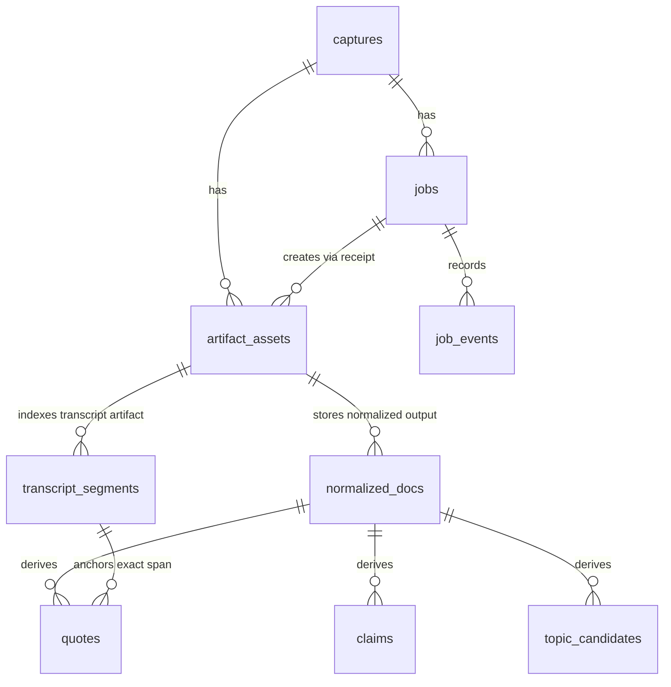

# T-P1A-025 DB / Evidence Ledger vNext Proposal

> Status: **research / candidate** - not schema authority; not migration approval; not runtime approval.
> Date: 2026-05-04
> Depends on: T-P1A-017 merged; T-P1A-018 merged as PR #39.
> Scope: candidate DB and evidence-ledger shape for transcript and normalized-document artifacts.

---

## 1. Boundary

This note is a design input for a future schema dispatch. It does not change
SQLite migrations, API code, receipt DTOs, state words, or authority docs.

Allowed current task output:

- candidate table and relation proposal
- artifact FS relation proposal
- idempotency and provenance questions
- deletion / supersession design options
- Phase 2+ outline boundaries

Not approved by this note:

- any `services/api/migrations/**` edit
- any `services/**` or `tests/**` edit
- new worker runtime
- BBDown live runtime
- media download
- ffmpeg
- ASR
- `audio_transcript` runtime
- Phase 2-4 product runtime

---

## 2. Current Facts Used

T-P1A-018 is merged as PR #39, merge commit
`a1f965bdf22d027f173683ae324d2b2acd0a9f19`. Therefore this proposal can use
the final T-P1A-018 storage shape without marking those references pending.

Current SQLite baseline:

- `captures`: one row per Phase 1A capture, currently unique on
  `(platform, platform_item_id)`.
- `jobs`: one row per job, with `job_type`, `status`, `dedupe_key`,
  timestamps, and `platform_result`.
- `job_events`: append-style event JSON rows linked to `jobs`.
- `artifact_assets`: current evidence ledger, unique on `(capture_id, file_path)`.

Current T-P1A-018 enqueue shape:

- `POST /captures/{capture_id}/metadata-fetch/jobs` creates or replays a
  `metadata_fetch` job.
- Final enqueue dedupe key shape:
  `bilibili:{platform_item_id}:metadata_fetch`.
- Enqueue does not create `artifact_assets` rows and does not create
  `job_events` rows.
- Receipt completion remains the write path that maps produced files into
  `artifact_assets`.

Current FS relation:

- API receives worker `relative_path` values such as
  `bundle/safe-metadata-evidence.json`.
- API maps them to ledger paths such as
  `data/artifacts/bilibili/{capture_id}/bundle/safe-metadata-evidence.json`.
- `artifact_assets.metadata_json` carries provenance fields such as producer,
  engine, `created_by_job`, `job_attempt`, `dedupe_key`, `platform_result`,
  redaction fields, and evidence-source fields.

Current hard boundary:

- Phase 1A effective state loop only reaches `metadata_fetched`, receipt
  ledger, and Trust Trace.
- Future lifecycle names such as `transcript_ready`, `doc_ready`, `indexed`,
  `linked`, `archived`, and `superseded` exist as PRD outline only. This note
  does not modify them.

---

## 3. Candidate State Machine

The DB vNext should stay append-friendly and make version choice explicit.
This is a candidate machine for artifact versions, not a replacement for the
current capture lifecycle.

```text
artifact_missing
  -> artifact_registered
     gate: file exists, sha256/bytes verified, artifact_assets row inserted

artifact_registered
  -> derived_indexed
     gate: transcript_segments or normalized_docs rows point to a verified artifact_asset

derived_indexed
  -> superseded
     gate: newer artifact version is verified and selected as current candidate

superseded
  -> archived
     gate: user or retention policy keeps old version queryable but hidden by default

artifact_registered / derived_indexed
  -> purged
     gate: secret, rights, consent, or PII removal requires physical deletion
```

Default recommendation: prefer append + supersession over physical deletion.
Physical purge should stay exceptional because evidence reproducibility depends
on preserving the artifact hash and the job lineage.

---

## 4. Candidate ERD

This ERD is conceptual. It is not a migration script.



Design rule:

- `artifact_assets` remains the file authority.
- New structured tables should index and project artifacts, not replace the
  artifact ledger.
- Workers still should not write SQLite directly; durable writes should go
  through API-side validation and receipt ingestion.

---

## 5. Table Proposals

### 5.1 `captures`

Why needed:

- Current anchor for platform identity, artifact root, manifest path, and
  lifecycle state.
- Future transcript / normalized artifacts should remain grouped under the
  same capture rather than creating a second top-level object.

Relation to FS path:

- Current `artifact_root_path` points to
  `data/artifacts/{platform}/{capture_id}`.
- Future transcript and normalized files should stay under the same capture
  root, likely `transcript/**` and `normalized/**` zones.

Provenance fields:

- Existing: `platform`, `platform_item_id`, `canonical_url`, `source_kind`,
  `capture_mode`, `created_by_path`, `manifest_path`, `created_at`.
- Candidate future: no immediate column required; richer source provenance can
  continue to live in `artifact_assets.metadata_json` until a schema dispatch
  proves query pressure.

Idempotency keys:

- Current capture uniqueness is `(platform, platform_item_id)`.
- Future reprocessing should not create a second capture for the same platform
  item. It should create new jobs and new artifacts under the same capture.

Deletion / supersession:

- Capture-level deletion is expensive because it owns all artifacts.
- Default should be capture retained, child artifacts superseded.
- Capture physical purge should be reserved for secrets, rights, consent, or
  PII removal.

Phase 2+ outline:

- Capture plans, RAW links, and recommendation sources remain future scope.
- This note does not approve non-manual capture creation.

### 5.2 `jobs`

Why needed:

- Current durable unit for enqueue, retry, receipt completion, and
  idempotency.
- Transcript and normalization work should be modeled as new job types rather
  than ad hoc writes.

Relation to FS path:

- Jobs do not own file paths directly.
- Produced files are registered through `artifact_assets`; `job_events` can
  record the list of ledger paths for audit projection.

Provenance fields:

- Existing: `job_id`, `capture_id`, `job_type`, `status`, `dedupe_key`,
  timestamps, `platform_result`, `last_error_json`.
- Candidate future: richer execution metadata should first stay in receipt
  payload and `job_events.event_json`. Add columns only when query paths prove
  they need indexed fields.

Idempotency keys:

- Current metadata fetch:
  `bilibili:{platform_item_id}:metadata_fetch`.
- Candidate transcript:
  `capture:{capture_id}:transcript:{source_asset_sha256}:{engine}:{engine_version}`.
- Candidate normalize:
  `capture:{capture_id}:normalize:{transcript_asset_sha256}:{schema_version}:{producer_version}`.
- Candidate extraction:
  `capture:{capture_id}:extract:{normalized_doc_sha256}:{extractor}:{prompt_version}`.

Deletion / supersession:

- Jobs should remain audit history even when artifacts are superseded.
- If a physical purge is required, retain a redacted job event explaining the
  purge reason without retaining sensitive payload.

Phase 2+ outline:

- New job types such as `transcribe`, `normalize`, `extract_claims`, or
  `suggest_topics` need a separate dispatch and API contract.
- This note does not change the current `metadata_fetch`-only route behavior.

### 5.3 `artifact_assets`

Why needed:

- Current evidence ledger and file-authority table.
- Future transcript, normalized document, claim, quote, and topic files should
  be registered here before any structured projection table treats them as
  queryable.

Relation to FS path:

- Keep `file_path` as the durable ledger path.
- Candidate deterministic zones:
  - `transcript/transcript-{job_id}.json`
  - `transcript/transcript-{job_id}.vtt`
  - `normalized/doc-{job_id}.md`
  - `normalized/doc-{job_id}.json`
  - `links/derived-{job_id}.json`
- File names are candidate examples only. A future FS amendment should choose
  exact names.

Provenance fields:

- Existing `metadata_json` already carries producer, engine, redaction,
  idempotency, source URL, job attempt, dedupe key, and platform result.
- Candidate future metadata keys:
  - `schema_version`
  - `source_artifact_asset_id`
  - `source_artifact_sha256`
  - `supersedes_artifact_asset_id`
  - `is_current_candidate`
  - `language`
  - `model_provider`
  - `model_name`
  - `prompt_version`

Idempotency keys:

- Current uniqueness is `(capture_id, file_path)`.
- Versioned file names should make repeated runs deterministic enough that
  receipt replay can compare `artifact_kind`, `size_bytes`, and `sha256`.
- If the same logical output can be regenerated with different bytes, create a
  new file path and explicitly supersede the prior artifact.

Deletion / supersession:

- Add supersession metadata before adding a separate version table.
- Physical delete should require a tombstone event and should not silently leave
  dangling rows in structured projection tables.

Phase 2+ outline:

- A real migration may eventually add indexed columns for `created_by_job`,
  `artifact_version`, or `superseded_by`.
- Until query pressure exists, keep those as metadata keys plus tests.

### 5.4 `transcript_segments`

Why needed:

- Transcript artifacts are large and segment-level queries are central for
  quote lookup, claim grounding, and topic evidence.
- Storing only a whole transcript file would make downstream grounding depend
  on repeated JSON parsing.

Relation to FS path:

- Each row should point back to the transcript artifact registered in
  `artifact_assets`.
- Full raw transcript payload remains in FS; rows are a query index.

Candidate fields:

- `segment_id`
- `capture_id`
- `transcript_artifact_asset_id`
- `segment_index`
- `start_ms`
- `end_ms`
- `speaker_label`
- `text`
- `language`
- `confidence`
- `source_engine`
- `source_engine_version`
- `created_by_job`
- `text_sha256`
- `provenance_json`
- `superseded_by_transcript_artifact_asset_id`
- `created_at`

Provenance fields:

- `transcript_artifact_asset_id` links to the file hash and path.
- `created_by_job` links to job history.
- `provenance_json` can carry ASR provider metadata and redaction policy, but
  should not carry credentials, signed URLs, or raw tool logs.

Idempotency keys:

- Candidate unique key:
  `(transcript_artifact_asset_id, segment_index)`.
- Candidate conflict check:
  `text_sha256`, `start_ms`, and `end_ms` must match on replay.

Deletion / supersession:

- Prefer superseding all segments by transcript artifact version.
- Avoid per-segment physical delete unless required by a purge gate.
- If a transcript artifact is superseded, default queries should select only
  rows where `superseded_by_transcript_artifact_asset_id` is null.

Phase 2+ outline:

- Single table is the better first candidate.
- Partition by capture is a later scale option if transcript volume or purge
  cost becomes measurable.
- ASR execution itself remains blocked until a future explicit gate.

### 5.5 `normalized_docs`

Why needed:

- Normalized documents are the bridge between transcript evidence and user-facing
  research / writing workflows.
- They need version, source, prompt, and model provenance; otherwise later
  claims and topic suggestions cannot be audited.

Relation to FS path:

- The normalized document file should be registered as an `artifact_assets` row
  in `zone=normalized`.
- The DB row should point to both source artifact and output artifact.

Candidate fields:

- `normalized_doc_id`
- `capture_id`
- `source_artifact_asset_id`
- `output_artifact_asset_id`
- `doc_kind`
- `schema_version`
- `language`
- `content_sha256`
- `producer`
- `producer_version`
- `model_provider`
- `model_name`
- `prompt_version`
- `created_by_job`
- `supersedes_normalized_doc_id`
- `created_at`

Provenance fields:

- `source_artifact_asset_id` should usually point to transcript JSON or
  metadata evidence.
- `output_artifact_asset_id` points to Markdown / JSON output in FS.
- Model and prompt fields should be explicit enough for rerun comparison.

Idempotency keys:

- Candidate key:
  `(capture_id, source_artifact_asset_id, schema_version, producer_version, prompt_version)`.
- Replay must compare `content_sha256` and `output_artifact_asset_id`.

Deletion / supersession:

- A newer normalization should supersede the previous normalized doc instead of
  overwriting it.
- Claims, quotes, and topic candidates should point to a specific
  `normalized_doc_id`, not just to the latest doc.

Phase 2+ outline:

- Markdown vs JSON dual-output should be settled by a future contract.
- Embedding/vector fields should not be added until search/indexing scope is
  approved.

### 5.6 Optional `claims`

Why needed:

- Claims are structured assertions extracted from normalized docs.
- They are useful for topic framing and source-grounded writing, but they are
  derived evidence, not source authority.

Relation to FS path:

- A claim extraction JSON artifact should be registered in `artifact_assets`.
- `claims` rows should point to `normalized_doc_id` and optionally to an
  extraction artifact asset.

Candidate fields:

- `claim_id`
- `capture_id`
- `normalized_doc_id`
- `claim_text`
- `claim_kind`
- `source_quote_id`
- `source_segment_id`
- `confidence`
- `created_by_job`
- `extractor_version`
- `prompt_version`
- `created_at`

Provenance fields:

- `normalized_doc_id`, `source_quote_id`, and `source_segment_id` should make
  every claim traceable to exact text.
- `confidence` is model confidence, not truth.

Idempotency keys:

- Candidate key:
  `(normalized_doc_id, claim_text_sha256, extractor_version, prompt_version)`.

Deletion / supersession:

- Claims should be superseded when the normalized doc is superseded.
- Default queries should hide claims tied to superseded normalized docs.

Phase 2+ outline:

- Start as a derived table only after normalized docs are stable.
- A view may be enough at first if claims are infrequently queried.

### 5.7 Optional `quotes`

Why needed:

- Quotes preserve exact text spans used by claims or writing drafts.
- They are the safest human-review unit because they can be checked against a
  transcript segment and timestamp.

Relation to FS path:

- Quote extraction JSON can be registered in `artifact_assets`.
- The DB table should point to transcript segments and/or normalized docs.

Candidate fields:

- `quote_id`
- `capture_id`
- `normalized_doc_id`
- `segment_id`
- `start_ms`
- `end_ms`
- `quote_text`
- `char_start`
- `char_end`
- `created_by_job`
- `quote_text_sha256`
- `created_at`

Provenance fields:

- `segment_id` and offsets are more important than a free-form source label.
- If a quote comes from normalized text rather than transcript, the row must
  state that in provenance metadata.

Idempotency keys:

- Candidate key:
  `(segment_id, char_start, char_end, quote_text_sha256)`.

Deletion / supersession:

- Quotes tied to superseded transcript segments should be hidden by default.
- If a quote text needs purge, derived claims that depend on it must also be
  hidden or purged.

Phase 2+ outline:

- This table should wait until transcript segment anchoring is stable.
- It should not become a general notes table.

### 5.8 Optional `topic_candidates`

Why needed:

- Topic candidates are derived planning suggestions for future content work.
- They should not be confused with capture creation or source authority.

Relation to FS path:

- Topic candidate batch output can be registered in `artifact_assets`, likely
  under `normalized/` or `links/` depending on future IA.
- Rows should point to `normalized_doc_id` and optionally supporting claim IDs.

Candidate fields:

- `topic_candidate_id`
- `capture_id`
- `normalized_doc_id`
- `candidate_title`
- `candidate_summary`
- `supporting_claim_ids_json`
- `score_json`
- `producer`
- `producer_version`
- `prompt_version`
- `created_by_job`
- `created_at`

Provenance fields:

- `supporting_claim_ids_json` is acceptable as candidate storage at first.
- If topic workflow becomes central, normalize support links into a join table
  later.

Idempotency keys:

- Candidate key:
  `(normalized_doc_id, candidate_title_sha256, producer_version, prompt_version)`.

Deletion / supersession:

- Topic candidates should be easy to discard because they are planning
  artifacts.
- Do not let a topic candidate create capture directly; LP-001 still applies.

Phase 2+ outline:

- Treat as derived ledger rows first, not final planning authority.
- Embeddings and ranking indexes are future scope.

---

## 6. Recommended vNext Shape

Minimal future migration candidate:

1. Keep `captures`, `jobs`, `job_events`, and `artifact_assets` as the core.
2. Add `transcript_segments` only after transcript artifact contract is
   approved.
3. Add `normalized_docs` only after normalized output contract is approved.
4. Treat `claims`, `quotes`, and `topic_candidates` as optional derived tables.
5. Do not add vector columns in the first migration; store embedding artifacts
   or defer until indexing scope is approved.

Rationale:

- `artifact_assets` already solves durable file anchoring.
- New rows should improve queryability, not duplicate whole artifact payloads.
- Supersession should be explicit before any destructive replacement exists.
- A narrow migration is easier to audit than a broad Phase 2 schema jump.

---

## 7. Human Brainstorm Gate

Questions for PR review and future Wave 3+ migration design:

1. Should `transcript_segments` start as one table with `capture_id` index, or
   should it partition by capture from the beginning?
2. Should `normalized_docs` join to `artifact_assets` only, or duplicate
   frequently-read fields such as `content_sha256`, `schema_version`, and
   `prompt_version`?
3. Are `claims`, `quotes`, and `topic_candidates` durable ledger tables, or
   derived views over normalized artifact JSON?
4. Should supersession preserve old artifacts by default, with physical purge
   reserved for secrets / rights / consent / PII?
5. Should embedding/vector fields be reserved entirely for an indexing dispatch,
   instead of being included in the DB vNext migration?

Candidate defaults for discussion:

- `transcript_segments`: one table first; partition later only if needed.
- `normalized_docs`: join to `artifact_assets`, duplicate only stable query
  keys.
- `claims` / `quotes` / `topic_candidates`: derived tables after normalized
  docs stabilize.
- Supersession: append by default, purge by explicit gate.
- Embeddings: no vector column in the first migration.

---

## 8. Revision Plan

T-P1A-018 is already merged, so this note does not need M4 pending labels for
the enqueue path.

Before a future schema migration dispatch, re-check:

- `jobs` final shape if T-P1A-019 changes orchestration semantics.
- `artifact_assets.metadata_json` fields if T-P1A-020 changes Trust Trace
  projection requirements.
- Whether new artifact kinds have been admitted by receipt contract.
- Whether `audio_transcript` remains blocked or receives explicit user
  approval in a separate dispatch.

Sections to revisit after those gates:

- §5.2 for job type and dedupe keys.
- §5.3 for artifact metadata keys and version naming.
- §5.4 for transcript segment shape.
- §5.5 for normalized document shape.
- §6 for minimal migration order.

---

## 9. Boundary Confirmation

- No migration file changed.
- No product code changed.
- No authority document changed.
- No state word changed.
- No `PlatformResult` enum changed.
- No receipt schema changed.
- No `audio_transcript` runtime approval implied.
- No credentials, raw responses, QR material, auth sidecars, or local-only paths
  are included.

---

## 10. References

| Source | Used for |
|---|---|
| `docs/PRD-v2-2026-05-04.md` | Authority-first L0 framing, future lifecycle outline, `audio_transcript` blocker |
| `docs/SRD-v2-2026-05-04.md` | receipt / artifact ledger boundary, API / worker split, Phase 2 entity outline |
| `docs/specs/worker-receipt-contract.md` | current receipt fields, artifact zones, API-side ledger mapping |
| `docs/specs/platform-adapter-risk-contract.md` | `PlatformResult` boundary and retry categories |
| `docs/specs/raw-response-redaction.md` | evidence redaction and credential exclusion rules |
| `services/api/migrations/001_phase1a_capture_creation.sql` | current `captures` and `artifact_assets` SQLite baseline |
| `services/api/migrations/002_phase1a_jobs_receipt.sql` | current `jobs`, `job_events`, and ledger indexes baseline |
| `services/api/scoutflow_api/storage.py` | current enqueue, receipt completion, artifact path mapping, Trust Trace projection |
| `services/api/scoutflow_api/models.py` | current `ArtifactZone`, `WorkerReceipt`, `MetadataFetchJobResponse`, Trust Trace DTOs |
| `services/api/scoutflow_api/metadata_probe_receipt_bridge.py` | current safe metadata evidence artifact paths and receipt construction |
| `tests/api/test_captures_discover.py` | T-P1A-018 enqueue idempotency and no-side-effect behavior |
| `tests/api/test_capture_trust_trace.py` | Trust Trace layered projection and `audio_transcript` blocked evidence |
| `tests/contracts/test_worker_receipt_contract.py` | artifact kind and receipt contract guards |
