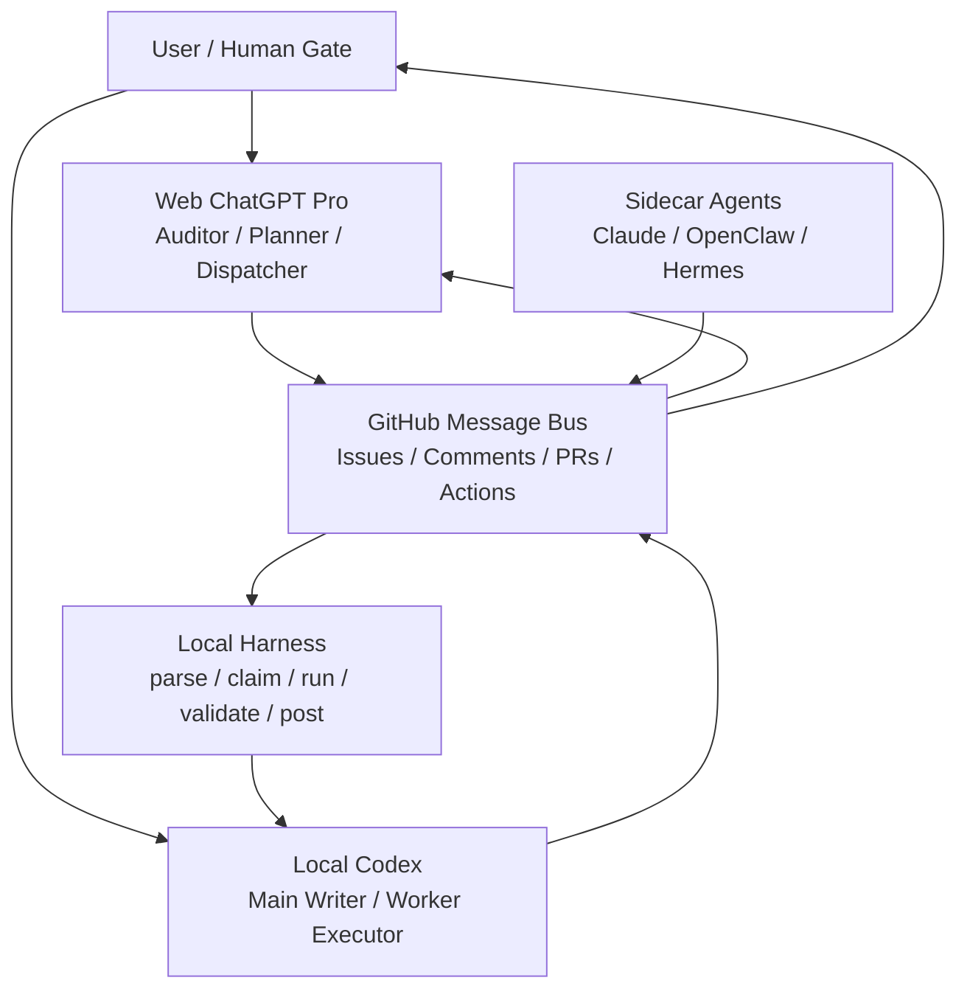
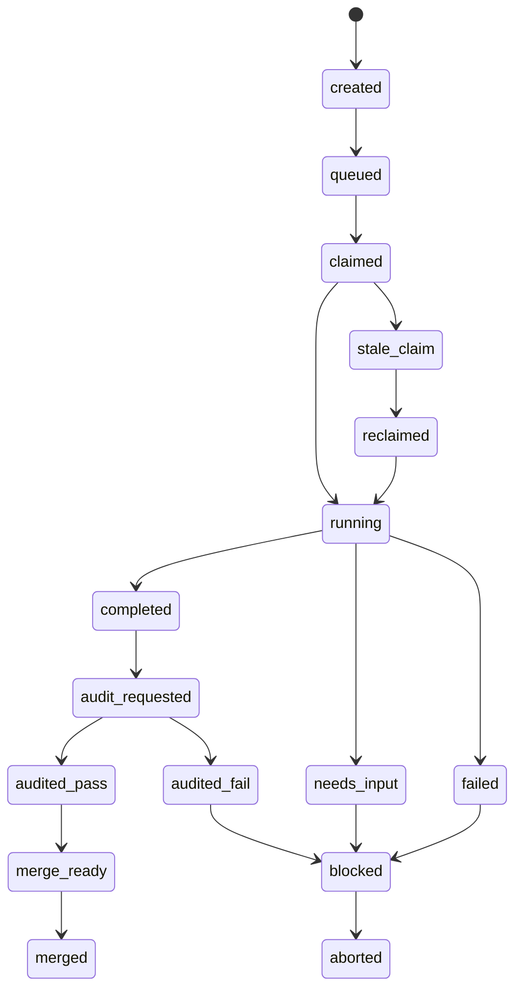

# ScoutFlow Scheme C GitHub Queue Harness SRD

> Status: `draft-candidate`
> Phase scope: `Step0 / Phase 0 only`
> Location rationale: 先落在 `example/`，作为 smoke 之后的前置开发规范，不直接提升为主线 contract。
> Document type choice: 选择 `SRD` 而不是 `PRD`，因为当前问题的核心是技术通信契约、执行边界、队列对象模型、审计链路和 harness 行为，不是产品市场需求。
> Product-code approval: `No`
> Real capture approval: `No`
> Browser automation approval: `No`

## 1. 文档目标

本文件定义 ScoutFlow 在 Step0 / Phase 0 阶段采用的 `Scheme C: GitHub-as-Queue Harness` 技术方案，用于建立：

1. 网页版 `ChatGPT Pro` 与本地 `Codex` 之间的稳定协作通信面。
2. GitHub Issue / Comment / Branch / PR / Actions 作为任务总线、事件日志、审计真源和合并凭据的统一规则。
3. 本地 harness 在不进入产品代码的前提下，对任务入队、认领、幂等、审计回写、失败恢复和权限边界的最小可执行要求。

本文件的直接服务对象不是未来的 ScoutFlow API / worker / Console，而是：

- `example/` 中的 smoke runner 和后续 harness 原型。
- 本地 `Codex` 作为主写入执行器。
- 网页版 `ChatGPT Pro` 作为外部审计与 prompt 派发层。
- 其他 sidecar agent 作为 review / research / patch suggestion 提供者。

## 2. 背景与问题定义

### 2.1 已验证事实

`T-P0-004` 已在 `example/` 中验证一条真实闭环：

```text
enqueue issue
  -> local runner claim
  -> local runner completed comment
  -> inspect reads issue + comments
  -> rerun returns already_completed
```

该闭环说明以下假设成立：

1. GitHub Issue 可以承载结构化任务消息。
2. GitHub Issue Comment 可以承载 append-only 事件流。
3. 本地 `Codex` / runner 可以稳定执行真实写入、测试、`gh` 操作和 PR 流程。
4. 网页版 `ChatGPT Pro` 可以稳定承担外部审计、prompt 派发、状态解释和修复建议生成，即使其写 GitHub 的连接器能力在不同会话中不稳定。

### 2.2 要解决的核心问题

ScoutFlow 当前不缺“能不能让某个 agent 写一条 comment”的能力，缺的是以下稳定机制：

1. 一个不依赖网页 ChatGPT 写权限暴露状态的主链路。
2. 一个对多 agent 协作可审计、可恢复、可重放、可幂等的队列总线。
3. 一个能把“聊天建议”降级为“GitHub 真源事实”的协议层。
4. 一个能约束 `Single Writer`、`No Sidecar Authority Writes`、`Human Gate` 的技术执行层。

### 2.3 不采用“网页 ChatGPT 直接写 repo 作为主通道”的原因

过去路径已经证明，网页版 ChatGPT 的 GitHub 工具存在如下不稳定性：

1. 有时能读 repo，但不能建 PR。
2. 有时能建文件，但不能写 comment。
3. 不同会话中的工具暴露集可能变化。
4. 就算工具可用，也难以保证它承担长期稳定主写入。

因此本方案明确规定：

```text
网页版 ChatGPT Pro 不是稳定主写入者。
本地 Codex + gh + harness 才是稳定执行主链路。
```

## 3. 方案结论

推荐架构定为：

```text
GitHub Issue Queue
  + Issue Comment Event Log
  + Local Codex Worker
  + PR Artifact
  + Web ChatGPT Auditor
  + Harness Guardrails
```

该方案在 ScoutFlow 中的角色不是“替代主产品架构”，而是：

1. 作为 Step0 / Phase 0 的协作前置层。
2. 作为未来更大规模 agent orchestration 的验证底座。
3. 作为 authority-first 治理下的“执行前通信层”和“外部审计层”。

## 4. 适用范围与非目标

### 4.1 当前适用范围

本 SRD 只适用于以下范围：

1. `example/` 目录中的 smoke / harness 原型。
2. Step0 / Phase 0 的文档、协议、审计、分支治理和任务派发。
3. GitHub 上的 issue / comments / branches / PR / workflow run。
4. 本地 Codex 的任务执行、测试、commit、push、PR、comment 回写。

### 4.2 当前明确非目标

以下内容不在本文件的当前落地范围内：

1. ScoutFlow API 实现。
2. ScoutFlow worker 实现。
3. ScoutFlow Console / UI 实现。
4. 真实采集逻辑。
5. 浏览器自动化。
6. 平台 adapter 真逻辑。
7. Phase 1A 产品代码交付。
8. 让任意 agent 直接改写 authority docs 作为默认路径。

### 4.3 Promotion 规则

本文件先作为 `example/` 范围内的候选规范存在。只有在以下条件满足时，才允许升格为主线 contract：

1. user 明确批准将其提升为正式 contract。
2. 与现有 `docs/current.md`、`docs/task-index.md`、`docs/project-context.md`、amendment 中的 authority / hard gate 规则对齐。
3. 至少完成一轮 `T-P0-005` 级别的 harness hardening 验证。

## 5. 名词与角色定义

### 5.1 名词定义

| 名词 | 定义 |
|---|---|
| `Task Issue` | 承载结构化任务 JSON 的 GitHub Issue |
| `Event Comment` | 以 marker + JSON 形式写入 Issue 的 append-only 事件 |
| `Harness` | 本地执行层，负责 parse/claim/run/validate/comment/pr |
| `Worker` | 被 harness 驱动的实际执行者，默认是本地 Codex |
| `Audit Source` | GitHub issue / comment / commit / PR / workflow run |
| `Authority` | 当前阶段仍以本地文档和后续 SQLite + FS + state words 为主，不由 sidecar 直接写入 |
| `Single Writer` | 同一任务只有一个主写入执行器 |
| `Sidecar` | 只做 review / research / patch suggestion 的辅助 agent |
| `Human Gate` | user 对 approve / merge / phase advance 的最终裁决权 |

### 5.2 角色定义

| 角色 | 当前职责 | 当前不能做 |
|---|---|---|
| `user` | 最终授权、merge、阶段推进、越界判断 | 不需要亲自维护低层事件流 |
| `Codex Desktop` | 主写入、任务执行、分支/PR、验证、回写结果 | 不应绕过 task/PR/audit 链路偷偷直写主线 |
| `Web ChatGPT Pro` | 外部审计、prompt architect、queue message designer、状态解释 | 不作为稳定主写入者 |
| `Claude/OpenClaw/Hermes` | 审读、research、风险反驳、长上下文归纳 | 默认不直写 authority |
| `GitHub Actions` | 验证 proof、状态证明 | 不承担业务 worker |

## 6. 顶层架构



### 6.1 架构原则

1. GitHub 在此处首先是协作总线和审计真源，其次才是代码仓库。
2. 本地 Codex 是稳定主写入层。
3. 网页版 ChatGPT Pro 是外部脑和外部审计层，不是默认 writer。
4. 所有关键状态变化都必须能在 GitHub 真源中重建。
5. Sidecar 不得默认直写 authority。

## 7. 设计目标

### 7.1 功能目标

1. 任务可以通过 GitHub Issue 结构化入队。
2. 本地 runner 可以从 issue 中解析任务并进行 claim。
3. 任务执行状态可通过 issue comments 形成 append-only event log。
4. 本地 Codex 可以对任务进行验证、commit、push、创建 PR。
5. 网页版 ChatGPT Pro 可以仅基于 GitHub 真源完成外部审计。
6. 任务重复执行时能判断 `already_completed`，避免重复交付。

### 7.2 非功能目标

1. 幂等：重复 run 不应创建重复 completed 事件或重复 PR。
2. 可恢复：中断后可以通过 issue + comments 恢复状态。
3. 可审计：任何“通过”“失败”“需拍板”都能映射到 GitHub 真源。
4. 最小权限：不同工具尽量只拿到完成其职责所需的最小权限。
5. 安全：不允许把 token、cookie、raw response 直接写入 GitHub。
6. 窄边界：Issue 只允许结构化任务契约，不允许携带任意 shell。

## 8. 方案对比与取舍

### 8.1 候选方案

| 方案 | 描述 | 优点 | 缺点 | 结论 |
|---|---|---|---|---|
| `Scheme A` | 网页 ChatGPT 直接写 repo / PR / comments | 交互快，表面简洁 | 工具暴露不稳定，主链路不可依赖 | 不作为主链路 |
| `Scheme B` | 聊天文本 + 本地人工复制执行 | 实现最简单 | 不可审计，状态漂移严重，重复劳动高 | 只作为临时兜底 |
| `Scheme C` | GitHub Issue Queue + Local Harness + PR Artifact | 可审计、可幂等、可恢复、可并行治理 | 初期协议设计成本更高 | 采用 |

### 8.2 采用理由

`Scheme C` 的关键价值不只是“能跑”，而是它同时满足：

1. 主写入稳定。
2. 审计真源清晰。
3. Sidecar 接入简单。
4. 与现有 authority-first、Single Writer、Human Gate 规则兼容。
5. 可以逐步从 `example/` 升级到 `tools/`，而不需要一次性重构。

## 9. GitHub 对象模型

### 9.1 Issue 作为任务消息

每个可执行任务一个 Issue。Issue body 必须由：

1. marker
2. 结构化 JSON payload

组成。

推荐 marker：

```text
<!-- scoutflow-task:v1 -->
```

Issue title 推荐格式：

```text
[sfq] <TASK-ID> <short-title>
```

### 9.2 Issue Task Payload Schema

| 字段 | 类型 | 必填 | 说明 |
|---|---|---|---|
| `task_id` | `string` | 是 | 稳定任务 ID，如 `T-P0-005` |
| `type` | `string` | 是 | 当前建议 `codex_exec` / `audit_request` / `docs_only` |
| `title` | `string` | 是 | 人类可读标题 |
| `goal` | `string` | 是 | 当前任务目标 |
| `priority` | `string` | 是 | `P0/P1/P2` |
| `source` | `string` | 是 | 任务来源，如 `web-chatgpt-pro` |
| `owner` | `string` | 是 | 期望主执行器，如 `codex-local` |
| `mode` | `string` | 是 | 例如 `single-writer + sidecar-review` |
| `base_branch` | `string` | 是 | 默认 `main` |
| `branch` | `string` | 否 | 建议任务分支 |
| `allowed_paths` | `string[]` | 是 | 允许写入路径 |
| `forbidden_paths` | `string[]` | 是 | 禁止写入路径 |
| `read_first` | `string[]` | 否 | 执行前需先读文件 |
| `validation` | `string[]` | 是 | 允许 runner 执行的验证命令 |
| `deliverables` | `string[]` | 否 | 任务交付物 |
| `stop_the_line` | `string[]` | 是 | 停线条件 |
| `idempotency_key` | `string` | 是 | 同一逻辑任务的幂等键 |
| `requires_user_approval` | `boolean` | 否 | 是否要求用户拍板后推进下一阶段 |

### 9.3 标准 Task Issue 示例

```md
<!-- scoutflow-task:v1 -->
{
  "task_id": "T-P0-005",
  "type": "codex_exec",
  "title": "GitHub Queue Harness Hardening",
  "goal": "Harden Scheme C smoke into a reusable queue harness without entering product code.",
  "priority": "P0",
  "source": "web-chatgpt-pro",
  "owner": "codex-local",
  "mode": "single-writer + sidecar-review",
  "base_branch": "main",
  "branch": "task/T-P0-005-github-queue-harness",
  "allowed_paths": [
    "example/",
    "docs/",
    "tools/"
  ],
  "forbidden_paths": [
    "apps/",
    "services/",
    "workers/",
    "packages/",
    "data/",
    "referencerepo/",
    "candidates/",
    "dispatches/",
    "audits/"
  ],
  "read_first": [
    "docs/current.md",
    "docs/task-index.md",
    "docs/project-context.md"
  ],
  "validation": [
    "python3 -m unittest example.test_github_queue_smoke",
    "python3 tools/check-docs-redlines.py"
  ],
  "deliverables": [
    "code changes",
    "PR",
    "validation summary",
    "queue event comments"
  ],
  "stop_the_line": [
    "authority conflict",
    "product code before approval",
    "secret exposure",
    "forbidden path write"
  ],
  "idempotency_key": "T-P0-005:github-queue-harness:v1",
  "requires_user_approval": true
}
```

### 9.4 Issue Comments 作为事件日志

Issue comments 必须 append-only。禁止覆盖历史事件来“修正状态”。

推荐 marker：

```text
<!-- scoutflow-event:v1 -->
```

### 9.5 Event Payload Schema

公共字段：

| 字段 | 类型 | 必填 | 说明 |
|---|---|---|---|
| `task_id` | `string` | 是 | 对应任务 ID |
| `event` | `string` | 是 | 事件类型 |
| `worker` | `string` | 是 | 当前执行器标识 |
| `timestamp` | `string` | 是 | ISO8601 UTC 时间 |

不同事件附加字段：

| 事件 | 附加字段 |
|---|---|
| `claimed` | `claim_token`, `lease_until`, `note` |
| `running` | `branch`, `runner_pid` 可选, `note` |
| `completed` | `branch`, `commit`, `pr`, `validation`, `summary` |
| `failed` | `reason`, `details`, `next_action` |
| `needs_input` | `question`, `blocking_decision` |
| `audited` | `reviewer`, `result`, `blocking_issues`, `summary` |
| `reclaimed` | `previous_claim_token`, `reason`, `lease_until` |
| `aborted` | `reason`, `summary` |

### 9.6 标准 Event 示例

Claimed:

```md
<!-- scoutflow-event:v1 -->
{
  "task_id": "T-P0-005",
  "event": "claimed",
  "worker": "codex-local-wanglei-mbp",
  "timestamp": "2026-05-03T09:00:00Z",
  "claim_token": "claim_T-P0-005_20260503_090000Z",
  "lease_until": "2026-05-03T09:30:00Z",
  "note": "worker claimed task after validating allowed paths"
}
```

Completed:

```md
<!-- scoutflow-event:v1 -->
{
  "task_id": "T-P0-005",
  "event": "completed",
  "worker": "codex-local-wanglei-mbp",
  "timestamp": "2026-05-03T09:15:00Z",
  "branch": "task/T-P0-005-github-queue-harness",
  "commit": "abc123",
  "pr": 4,
  "validation": [
    {
      "cmd": "python3 -m unittest example.test_github_queue_smoke",
      "result": "passed"
    },
    {
      "cmd": "python3 tools/check-docs-redlines.py",
      "result": "passed"
    }
  ],
  "summary": "Harness hardening completed; no product code."
}
```

Failed:

```md
<!-- scoutflow-event:v1 -->
{
  "task_id": "T-P0-005",
  "event": "failed",
  "worker": "codex-local-wanglei-mbp",
  "timestamp": "2026-05-03T09:10:00Z",
  "reason": "validation_failed",
  "details": "docs redline check failed: forbidden root dir detected",
  "next_action": "requires human review"
}
```

### 9.7 Labels 作为索引

Labels 只做索引，不做事实源。

推荐 label 集：

```text
sfq/state:queued
sfq/state:claimed
sfq/state:running
sfq/state:completed
sfq/state:failed
sfq/needs:audit
sfq/needs:user
sfq/agent:codex
sfq/agent:chatgpt
sfq/type:docs
sfq/type:code
sfq/type:audit
```

事实源优先级必须是：

```text
Issue body + Event comments + Commit + PR + Workflow run
```

### 9.8 Branch 作为隔离写入区

每个任务默认单独一个 branch：

```text
task/<TASK-ID>-<slug>
```

例如：

```text
task/T-P0-005-github-queue-harness
```

Archive 分支允许存在，但只应用于：

1. 审计归档。
2. prompt dispatch 归档。
3. draft PR 的参考材料。

不允许长期把 archive 分支当作产品主线。

### 9.9 PR 作为审计 artifact

PR 不是可选物，而是主写入任务的标准交付物。

PR body 至少应包含：

1. Task ID
2. Issue link
3. Branch
4. Changed files
5. Validation result
6. Forbidden path check
7. Product-code boundary
8. Commit SHA
9. Workflow run
10. User decisions needed

### 9.10 GitHub Actions 作为验证 proof

Actions 不承担业务执行，但承担验证证明：

1. docs redline check
2. unit tests
3. queue schema checks
4. event payload checks
5. forbidden path checks

## 10. Web ChatGPT Pro 与 Local Codex 的通信协议

### 10.1 通信原则

网页版 ChatGPT Pro 与本地 Codex 的主通信面不是聊天文本，而是：

```text
GitHub Issue
GitHub Comment
GitHub PR
GitHub Workflow run
```

聊天内容只用于：

1. 生成结构化任务。
2. 解释真源状态。
3. 给出审计意见。
4. 生成本地需要执行的 `gh` / harness 命令。

### 10.2 ChatGPT Pro 具备写权限时

可选优化路径：

1. 直接创建 Issue。
2. 直接写审计 comment。
3. 直接创建 research note 或 prompt note。

但这不是主链路要求。

### 10.3 ChatGPT Pro 不具备写权限时

主链路仍可成立：

1. ChatGPT Pro 输出标准 Issue JSON 或 `gh issue create` 命令。
2. 本地 harness / Codex 执行该命令。
3. ChatGPT Pro 读取 PR / issue / workflow 进行审计。
4. 若不能直接写 PR comment，则输出标准 comment body，由本地 harness 代发。

### 10.4 ChatGPT 到 Codex 的标准任务传递载体

允许的传递载体：

1. GitHub Issue JSON。
2. Harness 生成的 prompt 文件。
3. 标准 `gh` 命令行。

不允许的传递载体：

1. “你自己判断要跑什么 shell”的模糊指令。
2. 未经白名单约束的任意命令字符串。
3. 仅靠聊天上下文维持状态而不回写 GitHub。

### 10.5 Harness 生成 Prompt，而不是 Issue 直接携带 Shell

Issue 只允许结构化任务契约。真正给 Codex 的 prompt 必须由 harness 生成。

原因：

1. 防止 prompt 注入演变成 shell 注入。
2. 保持命令集合可控。
3. 保证 `allowed_paths` / `forbidden_paths` / `validation` 可被白名单化处理。

## 11. 生命周期状态机



### 11.1 状态定义

| 状态 | 含义 |
|---|---|
| `created` | Issue 已创建但尚未正式排队 |
| `queued` | 可被 worker 领取 |
| `claimed` | 有 worker 持有 lease |
| `running` | worker 正在执行 |
| `completed` | worker 完成执行并回写 commit/PR/validation |
| `audit_requested` | 需要外部审计 |
| `audited_pass` | 审计通过，无 blocking issue |
| `audited_fail` | 审计发现 blocking issue |
| `merge_ready` | 可进入 user merge 决策 |
| `merged` | PR 已合并 |
| `failed` | 执行失败 |
| `needs_input` | 缺少 user 决策 |
| `blocked` | 触发停线或待拍板 |
| `stale_claim` | claim 过期 |
| `reclaimed` | 被新 worker 重领 |
| `aborted` | 任务终止 |

### 11.2 状态来源优先级

状态判定优先级必须固定为：

1. `completed` / `failed` / `aborted` event comment
2. PR merged state
3. labels
4. issue open/closed state

不得只靠 labels 判定状态。

## 12. Claim、Lease 与幂等

### 12.1 最小 claim 机制

bootstrap 阶段允许以下顺序：

```text
read issue
  -> if completed exists, return already_completed
  -> write claimed
  -> write running
  -> execute
  -> write completed or failed
```

适合单 worker 或低并发环境。

### 12.2 Lease 机制

每个 `claimed` 事件必须带：

1. `claim_token`
2. `lease_until`

inspect 逻辑：

1. 若已存在 `completed`，返回 `already_completed`
2. 若存在未过期 `claimed` 且无更终态事件，返回 `already_claimed`
3. 若 claim 过期，允许 `reclaimed`
4. 若当前 worker 已持有有效 claim，可继续执行

### 12.3 强 claim 机制：Claim Ref

多 worker 场景推荐增加 Git ref 锁：

```text
refs/heads/queue/claims/<task_id>
```

获取方式：

```bash
git push origin HEAD:refs/heads/queue/claims/T-P0-005
```

失败说明已有别人持锁。

释放方式：

```bash
git push origin :refs/heads/queue/claims/T-P0-005
```

### 12.4 幂等规则

至少实现以下规则：

1. 同一 `task_id + idempotency_key` 且已有 `completed` 事件时，返回 `already_completed`
2. 同一 branch 已存在且 commit 未变化时，不重复创建分支
3. 同一 PR 已存在时，不重复创建 PR
4. 已有 `failed` 但无 user 解锁时，不自动无限重试
5. 重复写 `completed` 事件前必须再次检查最新 issue comments

## 13. Harness CLI 设计

### 13.1 当前阶段目标

CLI 的目标不是立即做成“全功能调度系统”，而是提供窄而稳定的操作集。

### 13.2 建议命令集

```bash
python3 -m tools.github_queue enqueue --file docs/tasks/T-P0-005.json
python3 -m tools.github_queue inspect --issue 3
python3 -m tools.github_queue claim --issue 3 --worker codex-local
python3 -m tools.github_queue run --issue 3
python3 -m tools.github_queue complete --issue 3 --commit <sha> --pr <num>
python3 -m tools.github_queue fail --issue 3 --reason validation_failed
python3 -m tools.github_queue audit-request --pr 4
python3 -m tools.github_queue post-comment --issue 3 --file /tmp/comment.md
python3 -m tools.github_queue run-codex --issue 3
```

### 13.3 `run` 内部流程

`run` 至少应按以下顺序工作：

1. fetch issue
2. parse marker JSON
3. validate task schema
4. validate allowed/forbidden path policy
5. inspect event log
6. check idempotency
7. claim lease
8. generate Codex prompt
9. invoke executor or adapter
10. run validation commands
11. create/update branch and PR
12. write completed/failed event
13. update labels if configured

## 14. Codex Adapter 设计

### 14.1 当前边界

第一阶段不直接接真实“任意命令执行”的 `codex exec`。先只定义 adapter seam 或 dry-run adapter。

### 14.2 禁止 Issue 直接携带命令

以下字段设计禁止出现：

```json
{
  "shell": "...",
  "cmd": "...",
  "command": "..."
}
```

原因：

1. 这会把 Issue 从任务契约退化成远程 shell。
2. 无法阻断 prompt 注入 / 命令注入。
3. 会让网页端或 sidecar 具备过宽执行面。

### 14.3 Harness 生成标准 Codex Prompt

建议模板：

```md
You are Codex Desktop worker for ScoutFlow.

Task ID: T-P0-005
Mode: single writer
Branch: task/T-P0-005-github-queue-harness

Read first:
- docs/current.md
- docs/task-index.md
- docs/project-context.md

Goal:
Harden GitHub queue harness based on smoke issue #3.

Allowed paths:
- example/
- docs/
- tools/

Forbidden paths:
- apps/
- services/
- workers/
- packages/
- data/
- referencerepo/
- candidates/
- dispatches/
- audits/

Validation:
- python3 -m unittest example.test_github_queue_smoke
- python3 tools/check-docs-redlines.py

Stop the line if:
- forbidden path write
- authority conflict
- product code before approval
- credential exposure

Required output:
- commit
- PR
- validation summary
- queue completed event
```

### 14.4 Adapter 输入输出契约

输入：

1. 结构化 task payload
2. 固定 prompt template
3. 已解析的 validation commands
4. branch / base_branch / allowed_paths / forbidden_paths

输出：

1. `status`
2. `summary`
3. `changed_files`
4. `validation_results`
5. `commit` 可选
6. `pr` 可选
7. `failure_reason` 可选

## 15. 审计协议

### 15.1 审计真源

审计不得基于聊天摘要，而必须基于：

1. Issue body
2. Issue comments
3. PR diff
4. Commit SHA
5. Workflow run

### 15.2 Web ChatGPT Pro 标准审计输入

以后审计任务至少应提供：

```text
Repo
Issue
PR
Branch
Commit
Workflow run
Question
```

### 15.3 标准审计输出格式

```md
# GPT Pro Audit

Task:
Issue:
PR:
Commit:
Workflow:

## Result

PASS / PASS_WITH_NOTES / BLOCKING

## Evidence

- Issue event log:
- PR diff:
- Workflow:
- Changed files:

## Blocking issues

None / list

## Non-blocking observations

...

## Required next action

- user merge
- codex fix
- sidecar review
- close issue
```

### 15.4 ChatGPT 无法直接写 comment 时的兜底

若网页 ChatGPT 无写 comment 能力，应输出：

1. comment body
2. 本地可执行 `gh pr comment` 命令

本地 harness 负责代发，而不是让审计卡死。

## 16. 失败处理与恢复

### 16.1 标准失败分类

| 失败类 | 含义 | 推荐动作 |
|---|---|---|
| `schema_invalid` | issue payload 不合法 | fail + needs human fix |
| `forbidden_write` | 发现禁止路径写入 | fail + stop-the-line |
| `validation_failed` | 测试或 lint 失败 | fail + review |
| `claim_conflict` | 任务已被他人持锁 | skip / already_claimed |
| `stale_claim` | 老 claim 过期 | reclaim |
| `executor_failed` | Codex adapter 执行失败 | fail + attach summary |
| `audit_blocking` | 审计发现阻塞问题 | block before merge |
| `needs_input` | 缺少 user 决策 | write needs_input event |

### 16.2 恢复策略

1. 通过 issue comments 重建状态。
2. 通过 branch / PR 重建交付物状态。
3. 通过 workflow run 重建验证状态。
4. 通过 claim lease 判断是否可以 reclaim。
5. 通过 `idempotency_key` 防止重复交付。

### 16.3 不允许的失败处理方式

1. 清空原有事件 comment 重写历史。
2. 直接删除 issue 隐藏失败。
3. 让 sidecar 越权修改 authority docs 来“补状态”。
4. 在 comment 中输出原始凭据、cookie、token 或完整 raw response。

## 17. 安全与权限边界

### 17.1 Token 分层建议

| Token | 主要用途 | 建议权限 |
|---|---|---|
| `local codex token` | branch/commit/PR/issue comment | repo write |
| `web chatgpt connector` | read, optional comment | read + optional comment |
| `sidecar token` | comment/research note | comment only if possible |

### 17.2 Redaction 要求

所有写回 GitHub 的内容必须先过 redaction：

```text
ghp_***
github_pat_***
sk-***
Bearer ***
AWS_SECRET_ACCESS_KEY
COOKIE
SESSION
TOKEN
```

### 17.3 路径防护

执行前后建议至少跑：

```bash
git diff --name-only
git ls-files | grep -E '^(data|referencerepo)/'
find . -maxdepth 1 -type d | grep -E './(apps|services|workers|packages|candidates|dispatches|audits)$'
```

### 17.4 Stop-the-line 触发条件

以下情况必须立即停线：

1. worker 试图旁路 authority
2. 任务试图落产品代码
3. Issue JSON 包含 shell/command
4. 凭据或 raw response 将被写入 issue / comment / PR
5. forbidden path 被创建或修改

## 18. 验证矩阵

### 18.1 当前最小验证

| 验证项 | 命令 | 目的 |
|---|---|---|
| smoke unit tests | `python3 -m unittest example.test_github_queue_smoke` | 保证 marker / parse / summarize 不回退 |
| docs redline | `python3 tools/check-docs-redlines.py` | 保证当前治理边界未回退 |
| real inspect | `python3 -m example.github_queue_smoke inspect --repo ... --issue ...` | 保证 issue/event 真源可读 |

### 18.2 后续应补测试

| 测试类 | 需要覆盖 |
|---|---|
| schema tests | task/event payload schema 校验 |
| idempotency tests | completed exists -> already_completed |
| lease tests | valid claim skip / expired claim reclaim |
| forbidden path tests | 写入禁区时报错 |
| redaction tests | token / secret 被掩码 |
| audit relay tests | ChatGPT comment body fallback 可被本地代发 |

## 19. 目录与演进计划

### 19.1 当前阶段

继续留在 `example/`：

```text
example/
  README.md
  github_queue_smoke.py
  smoke_task.json
  test_github_queue_smoke.py
  scheme-c-github-queue-harness-srd.md
```

### 19.2 下一阶段

若 `T-P0-005` 验证通过，可迁到：

```text
tools/github_queue/
  __init__.py
  cli.py
  schema.py
  events.py
  runner.py
  codex_adapter.py
  pr_client.py
  redaction.py
  locks.py
  inspect.py
```

但在 user 明确批准前，不应提前在当前仓库中创建完整产品化目录树。

## 20. 前置开发任务拆解

### 20.1 `T-P0-005` 建议定义

任务标题：

```text
GitHub Queue Harness Hardening
```

目标：

1. 把 `example/github_queue_smoke.py` 从 smoke 提升为最小复用 harness 原型。
2. 增加 schema 校验。
3. 增加 lease 字段。
4. 增加 failed event 支持。
5. 增加 redaction helper。
6. 增加 README / SRD 说明。
7. 仍不接真实产品代码。

### 20.2 `T-P0-006` 建议定义

任务标题：

```text
GitHub Queue Codex Exec Adapter
```

目标：

1. 在 harness 中接入受控的 Codex adapter seam。
2. 保持 prompt 由 harness 生成。
3. 保持 validation 白名单。
4. 保持 no product code 越界防护。

### 20.3 `T-P0-007` 可选后续

任务标题：

```text
GitHub Queue Audit Relay and Claim Ref Hardening
```

目标：

1. 把 audit relay 标准化。
2. 增加 claim ref 锁。
3. 补齐 reclaim / stale claim 流程。

## 21. 明确的验收标准

本 SRD 对应方案进入“可推进 T-P0-005”的最低验收标准是：

1. Issue task payload schema 明确。
2. Event comment schema 明确。
3. Claim / lease / idempotency 规则明确。
4. Web ChatGPT Pro 与 local Codex 的通信面明确。
5. ChatGPT 无写权限时的 fallback 明确。
6. 安全、redaction、forbidden path、stop-the-line 规则明确。
7. 当前范围明确写明：不进入产品代码。

若后续 `T-P0-005` 通过，则说明该通信前置层已具备最小开发条件。

## 22. 当前开放问题

以下问题当前故意保持未锁定：

1. claim ref 锁是否在 `T-P0-005` 就落，还是延后到 `T-P0-007`
2. future `tools/github_queue` 是否直接放入主线，还是继续保持 `example/` 过渡
3. ChatGPT 审计 comment 是否必须本地代发，还是允许 connector 写 comment 作为优化路径
4. archive branch 的 steady-state 生命周期是否需要单独写成 branch governance contract

这些问题在当前阶段属于 `candidate / user decision`，不应伪装成已锁定事实。

## 23. 一句话结论

本 SRD 将 ScoutFlow 的“网页版 ChatGPT Pro 与本地 Codex 通讯前置开发任务”定义为一个 GitHub 总线化、append-only 事件化、Single Writer 化、Human Gate 化的窄 harness 层：网页 GPT 负责外部脑和审计，本地 Codex 负责稳定执行与回写，GitHub 负责真源、队列、事件、PR 和验证证明。
